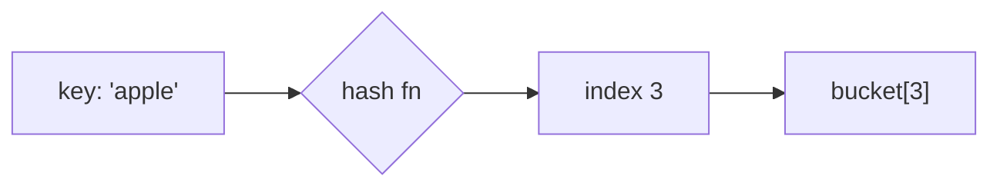

# Content spec — Prepperly learning material

Every topic file follows this. The goal is that all 60 read as one coherent
course, not sixty separate articles.

## The reader

**A beginner who wants to actually learn the topic, then answer interview
questions about it.** Not a CS graduate revising. If a sentence would lose
someone who has never studied this, rewrite it.

## Structure — a learning journey, not a summary

Target **1200–1800 words** of prose. Follow this order; it is a path from
"never heard of it" to "can discuss it in an interview".

```markdown
## Before you start
[Prerequisites, one line each. What must the reader already know? Link to the
sibling topic slug if it is in this repo. If nothing is required, say so —
that is reassuring, not filler.]

## In one sentence
[No jargon. If a term is unavoidable, define it in the same sentence.]

## Why it matters
[What breaks without it, or what it unlocks. Concrete, not abstract.]

## The intuition
[An analogy that genuinely fits. Build the mental model BEFORE any mechanics.
Do not force an analogy where none fits — a clear plain explanation beats a
strained metaphor.]

## How it actually works
[The mechanics. Short paragraphs, simple to less simple. This is the core.]

## Worked example
```js
// Runnable Node.js. Comment the line that matters.
```
[Walk through what happens, step by step. Show OUTPUT, not just code.]

## A second example — when it gets harder
[A case that breaks the naive understanding: an edge case, a bigger input, a
common variation. This is where real understanding forms.]

## Quick reference
| ... | ... |
[Complexities, trade-offs, or a decision guide. Highest value per pixel when
revising.]

## Common mistakes
- [What beginners actually get wrong, and what to do instead]

## What interviewers ask
- **[Question]** — [short answer, and what they are really testing]

## Practice
[2–3 concrete exercises, increasing in difficulty. Describe the problem; do
not give the solution.]

## Where to go next
[Which topic slug follows naturally, and why.]
```

## Diagrams — every topic gets at least one

Include a **Mermaid diagram** where it genuinely explains something a
paragraph cannot: a flow, a structure, a sequence, a state machine. The app
renders ```mermaid fences as real diagrams.

````

````

Guidance:
- **Put it in "How it actually works" or "The intuition"** — a diagram earns
  its place when it makes the mechanism visible, not as decoration.
- Pick the right type: `flowchart` for processes, `sequenceDiagram` for
  request/response and protocols, `graph` for data structures, `stateDiagram`
  for lifecycles, `erDiagram` for schemas.
- **Keep it small.** Five to ten nodes. A diagram that needs scrolling on a
  phone teaches nothing.
- **Label edges** where the relationship is not obvious from the shape.
- Quote any label containing special characters (`"O(n²)"`, `"key: value"`) or
  Mermaid fails to parse and the block falls back to raw code.
- Do NOT force a diagram where prose is clearer — for a purely conceptual
  topic, one honest table beats a contrived flowchart.

## Rules

- **Every topic gets runnable Node.js.** For non-code topics (System Design,
  Interview Skills) use a concrete equivalent: a config, a worked calculation,
  a scripted answer. Never a fake API.
- **Every topic gets at least one table.**
- Second person, active voice, present tense. Short paragraphs.
- Bold a term on first use only.
- **No filler.** Never "it is important to note", "in the world of computer
  science", "as we all know".

## Links — verified only

`links:` in the frontmatter. **Every URL must be one you have actually
confirmed exists via web search in this session.**

- Prefer stable documentation (MDN, nodejs.org, official project docs) and
  well-known references (Wikipedia).
- **YouTube:** search for the topic, pick a genuinely relevant video from a
  reputable channel, and **use the exact URL the search returned**. Do NOT
  construct a video ID from memory — a fabricated ID renders as "Video
  unavailable" and destroys trust in every other link.
- 3–5 links per topic: at least one video, at least one documentation source.
- Mark each with `kind: video | resource | practice`.
- **Fewer real links beats more invented ones.** If a search returns nothing
  good, give fewer and say so.

## Tags

2–4 per topic, lowercase, hyphenated, **reused across topics**. Prefer an
existing tag over a new one:

`fundamentals` `complexity` `data-structures` `algorithms` `recursion`
`graphs` `trees` `hashing` `sorting` `searching` `dynamic-programming`
`concurrency` `memory` `networking` `http` `databases` `sql` `indexing`
`distributed-systems` `consistency` `caching` `scalability` `system-design`
`api-design` `nodejs` `javascript` `security` `devops` `containers`
`interview-skills` `behavioural`

## Questions

`questions/<slug>.json`, 4–6 per topic, mixed difficulty. Each answer is 3–8
sentences explaining the *why*, not just the fact.
