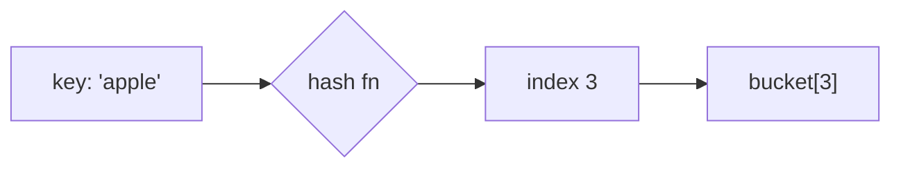

# Content spec — Prepperly learning material

Every topic file follows this. The goal is that all 191 read as one coherent
course, not 191 separate articles.

## The reader

**A beginner who wants to actually learn the topic, then answer interview
questions about it.** Not a CS graduate revising. If a sentence would lose
someone who has never studied this, rewrite it.

## Structure — a learning journey, not a summary

Target **1200–1800 words** of prose for a foundational topic, and up to
**2300** for a dense infrastructure or platform topic that has to carry a lot
of mechanism. Follow this order; it is a path from "never heard of it" to
"can discuss it in an interview".

Measure prose only: exclude frontmatter, code fences, Mermaid blocks and table
rows. Two people counting the same file differently is a real source of
confusion, so state the method when you state a number.

*Known inconsistency, as of the 19-chapter expansion:* chapters 1–15 run to a
median of about 1100 prose words and chapters 16–19 to about 2050. The newer
chapters are denser subjects, but the gap is larger than the subject matter
alone justifies. Do not widen it further; prefer the lower end of the band for
new work, and if you are revising an older topic, growing it toward 1500 is an
improvement.

```markdown
## Before you start
[Prerequisites, one line each. What must the reader already know? Link to the
sibling topic slug if it is in this repo. If nothing is required, say so —
that is reassuring, not filler.]

## In one sentence
[No jargon. If a term is unavoidable, define it in the same sentence.]

## Why it matters
[What breaks without it, or what it unlocks. Concrete, not abstract.]

## The intuition
[An analogy that genuinely fits. Build the mental model BEFORE any mechanics.
Do not force an analogy where none fits — a clear plain explanation beats a
strained metaphor.]

## How it actually works
[The mechanics. Short paragraphs, simple to less simple. This is the core.]

## Worked example
```js
// Runnable Node.js. Comment the line that matters.
```
[Walk through what happens, step by step. Show OUTPUT, not just code.]

## A second example — when it gets harder
[A case that breaks the naive understanding: an edge case, a bigger input, a
common variation. This is where real understanding forms.]

## Quick reference
| ... | ... |
[Complexities, trade-offs, or a decision guide. Highest value per pixel when
revising.]

## Tools & frameworks
| Tool | What it's for | Reach for it when |
[The standard options, each name a link to its docs. Tool-relevant topics
only — see the section below. Omit entirely for algorithms/behavioural.]

## Common mistakes
- [What beginners actually get wrong, and what to do instead]

## What interviewers ask
- **[Question]** — [short answer, and what they are really testing]

## Practice
[2–3 concrete exercises, increasing in difficulty. Describe the problem; do
not give the solution.]

## Where to go next
[Which topic slug follows naturally, and why.]
```

## Diagrams — every topic gets at least one

Include a **Mermaid diagram** where it genuinely explains something a
paragraph cannot: a flow, a structure, a sequence, a state machine. The app
renders ```mermaid fences as real diagrams.

````

````

Guidance:
- **Put it in "How it actually works" or "The intuition"** — a diagram earns
  its place when it makes the mechanism visible, not as decoration.
- Pick the right type: `flowchart` for processes, `sequenceDiagram` for
  request/response and protocols, `graph` for data structures, `stateDiagram`
  for lifecycles, `erDiagram` for schemas.
- **Keep it small.** Five to ten nodes. A diagram that needs scrolling on a
  phone teaches nothing.
- **Label edges** where the relationship is not obvious from the shape.
- Quote any label containing special characters (`"O(n²)"`, `"key: value"`) or
  Mermaid fails to parse and the block falls back to raw code.
- Do NOT force a diagram where prose is clearer — for a purely conceptual
  topic, one honest table beats a contrived flowchart.

## Rules

- **Every topic gets runnable Node.js.** For non-code topics (System Design,
  Interview Skills) use a concrete equivalent: a config, a worked calculation,
  a scripted answer. Never a fake API.
- **Every topic gets at least one table.**
- Second person, active voice, present tense. Short paragraphs.
- Bold a term on first use only.
- **No filler.** Never "it is important to note", "in the world of computer
  science", "as we all know".

## Links — verified only

`links:` in the frontmatter. **Every URL must be one you have actually
confirmed exists via web search in this session.**

- Prefer stable documentation (MDN, nodejs.org, official project docs) and
  well-known references (Wikipedia).
- **YouTube:** search for the topic, pick a genuinely relevant video from a
  reputable channel, and **use the exact URL the search returned**. Do NOT
  construct a video ID from memory — a fabricated ID renders as "Video
  unavailable" and destroys trust in every other link.
- 3–5 links per topic: at least one video, at least one documentation source.
- Mark each with `kind: video | resource | practice`.
- **Fewer real links beats more invented ones.** If a search returns nothing
  good, give fewer and say so.

## Tags

2–4 per topic, lowercase, hyphenated, **reused across topics**. Prefer an
existing tag over a new one:

`fundamentals` `complexity` `data-structures` `algorithms` `recursion`
`graphs` `trees` `hashing` `sorting` `searching` `dynamic-programming`
`concurrency` `memory` `networking` `http` `databases` `sql` `indexing`
`distributed-systems` `consistency` `caching` `scalability` `system-design`
`api-design` `nodejs` `javascript` `security` `devops` `containers`
`interview-skills` `behavioural`

## Tools & frameworks — every tool-relevant topic

Add a `## Tools & frameworks` section between `## Quick reference` and
`## Common mistakes`. It answers "what would I actually use for this, and
which one do I pick?" — the question a learner asks straight after
understanding the concept.

```markdown
## Tools & frameworks

| Tool | What it's for | Reach for it when |
|---|---|---|
| [pgvector](https://github.com/pgvector/pgvector) | Vector similarity inside Postgres | You already run Postgres and have under ~10M vectors |
| [Qdrant](https://qdrant.tech/documentation/) | Dedicated vector database | You need payload filtering at scale |
```

Rules:

- **Every tool name is a markdown link to its official docs**, so the reader
  can navigate straight there and learn. A name with no link is not useful.
- **Every URL must be verified in the session that writes it** — same rule as
  `links:` in the frontmatter. A dead docs link is worse than no link, because
  the reader clicks it *in order to learn*. Some docs hosts legitimately return
  403 to bots; confirm the page is real another way rather than dropping it.
- **3–5 tools.** If a subject has one dominant tool, say so plainly instead of
  padding the table to five.
- **Cover the real spread of choices** where one exists — an embedded option, a
  dedicated service, a managed offering — because "which one and why" is the
  actual interview question.
- **"Reach for it when" must be a genuine trade-off**, not a restatement of the
  description. "When you need a vector database" is useless; "when you need
  payload filtering at scale and can run a separate service" is useful.
- **Node/TypeScript first** where a language choice exists, since this
  curriculum's runnable code is Node. Mention the Python equivalent in one
  clause where Python is the larger ecosystem.
- **Flag anything deprecated or in maintenance mode** rather than recommending
  it silently.
- Prefer a stable docs root over a deep versioned path that will rot.

**Topics that get NO tools section:** CS Fundamentals, Data Structures,
Algorithms, Interview Skills, Behavioural & HR, Situational & Leadership, and
How to Answer Any Question. Big-O and backtracking have no tooling, and
inventing some would be filler. Do not add an empty section to those.

The canonical per-topic tool list lives in `docs/TOOL-MAP.md`. Use it so the
same tool is named and linked identically everywhere it appears.

## Questions

`questions/<slug>.json`, 4–6 per topic, mixed difficulty. Each answer is 3–8
sentences explaining the *why*, not just the fact.
