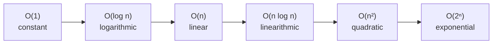

## Before you start

Nothing required — this is the natural starting point for the whole course. You just need to be comfortable reading a `for` loop.

## In one sentence

**Big O notation** is a way to describe how much slower or more memory-hungry your code gets as the input grows, without worrying about the exact machine it runs on.

## Why it matters

Two solutions can both work fine on 10 items but behave completely differently on 10 million. A function that takes a fraction of a second on your laptop's test data can take hours in production once real users show up. Big O lets you predict that difference *before* running the code, so you can pick an approach that won't fall over once the input grows. It's also the shared vocabulary interviewers use to ask "how good is this solution," so without it you can't even discuss trade-offs — you're stuck saying "it feels slow."

## The intuition

Imagine looking for a name in a phone book. Checking every page one by one means doubling the book roughly doubles your work — that's **linear** growth. Flipping to the middle, checking if your name comes before or after, and discarding half the book each time means doubling the book barely adds extra steps — that's **logarithmic** growth. Big O captures exactly this kind of pattern: not how long something takes on one input, but how the time *grows* as the input grows.

The landmark growth shapes rank in a fixed order, from cheapest to most expensive as `n` gets large:



Each step right is strictly worse at large `n` — an O(n) algorithm will eventually always beat an O(n²) one, no matter how much faster the O(n²) one's constant factor is on small inputs.

## How it actually works

We write growth as O(something), where "something" is a function of `n`, the size of the input. A few landmark shapes:

- **O(1)** — constant. The work never grows, no matter how big the input gets. Grabbing `arr[0]` is O(1).
- **O(log n)** — logarithmic. Each step cuts the remaining work roughly in half, like the phone book. Binary search is the classic example.
- **O(n)** — linear. The work grows one-to-one with input size, like scanning every item once.
- **O(n log n)** — a bit worse than linear, common in efficient sorting algorithms.
- **O(n²)** — quadratic. The work grows by the square of the input, common with a loop nested inside another loop.

We only care about growth as `n` gets huge, so two simplifications apply. First, we drop constants: O(2n + 5) is written as O(n), because the "+5" and the "×2" stop mattering once `n` is large. Second, we drop lower-order terms: O(n² + n) is written as O(n²), because the n² term dwarfs the n term at scale.

Big O usually describes the **worst case** — the slowest the algorithm could possibly be for a given input size — because that's the guarantee you can actually rely on. Space complexity uses the same notation to describe extra memory used, rather than time.

## Worked example

```js
// O(1): constant time — doesn't depend on array size
function getFirst(arr) {
  return arr[0];
}

// O(n): linear time — work grows one-to-one with input
function containsValue(arr, target) {
  for (const item of arr) {
    if (item === target) return true; // could scan every element
  }
  return false;
}

// O(n^2): quadratic time — a loop inside a loop
function hasDuplicate(arr) {
  for (let i = 0; i < arr.length; i++) {
    for (let j = i + 1; j < arr.length; j++) {
      if (arr[i] === arr[j]) return true;
    }
  }
  return false;
}

console.log(getFirst([5, 6, 7]));         // 5 — one step, regardless of array size
console.log(containsValue([1, 2, 3], 3)); // true — worst case scans all 3 items
console.log(hasDuplicate([1, 2, 3, 2]));  // true — found by re-scanning on i=1
```

`getFirst` never touches more than one element, so it stays O(1) even for a million-item array. `containsValue` walks the array once, so its cost tracks `n` directly. The nested loop in `hasDuplicate` is the line that matters: for every element it re-scans the rest of the array, so 10x more input means roughly 100x more comparisons.

## A second example — when it gets harder

Recursive functions are where beginners misjudge complexity, because there's no visible loop to count. Take naive recursive Fibonacci:

```js
function fib(n) {
  if (n <= 1) return n;
  return fib(n - 1) + fib(n - 2); // each call spawns two more calls
}

console.log(fib(5)); // 5
```

There's no `for` loop, but `fib(5)` calls `fib(4)` and `fib(3)`, and each of those spawns two more calls, and so on. Drawing this out as a tree shows the call count roughly doubling at each depth level, down to depth `n` — that's O(2ⁿ), exponential time, dramatically worse than any of the loop-based examples above. Adding a cache that remembers already-computed results (memoization) collapses this to O(n), because each unique subproblem is only ever solved once. The lesson: count *work done*, not lines of code — a five-line recursive function can hide catastrophic growth that a five-line loop never would.

## Quick reference

| Notation | Name | Example | 1,000 items |
|---|---|---|---|
| O(1) | Constant | Array index access | 1 step |
| O(log n) | Logarithmic | Binary search | ~10 steps |
| O(n) | Linear | Simple loop | 1,000 steps |
| O(n log n) | Linearithmic | Merge sort | ~10,000 steps |
| O(n²) | Quadratic | Nested loop | 1,000,000 steps |
| O(2ⁿ) | Exponential | Naive recursive Fibonacci | astronomically large |

## Common mistakes

- Counting the input's own size as the algorithm's cost — O(n) means the algorithm's *work* scales with n, not that reading input is free.
- Forgetting that Big O drops constants: O(500) is still O(1), and O(3n) is still O(n), because only the growth trend at large scale matters.
- Judging a recursive function's complexity by its line count instead of drawing out its call tree — a short recursive function can hide exponential work.

## What interviewers ask

- **What's the time complexity of this function?** — Walk through the loops: one loop over `n` items is O(n); a loop inside a loop is usually O(n²); the interviewer wants to see you trace it, not just guess.
- **What's the difference between time and space complexity?** — Time complexity measures steps taken as input grows; space complexity measures extra memory used, such as a new array or hash map created inside the function.
- **Can you optimize this O(n²) solution?** — Often yes, by trading space for time — using a hash set to remember seen values turns a nested-loop duplicate check into a single O(n) pass.

## Practice

1. Write a function that finds the two largest numbers in an array, and state its time complexity.
2. Take the `hasDuplicate` function above and rewrite it using a `Set` so it runs in O(n) time. Explain the space trade-off you made.
3. Given a sorted array, write a function to check if a target value exists using binary search, then explain why it's O(log n) instead of O(n).

## Where to go next

Big O is the lens you'll use for every other topic in this course. Next is `memory-management` — it introduces the stack and heap, which is what "space complexity" actually refers to under the hood.
