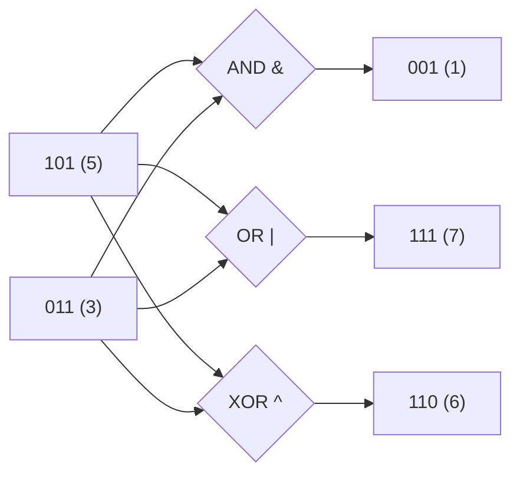

## Before you start

Helpful, not required: `memory-management`, since bits are the lowest-level unit of the memory you just read about — everything in RAM is ultimately a sequence of these.

## In one sentence

**Bit manipulation** means working directly with the individual 0s and 1s (bits) that make up a number, instead of treating the number as a whole.

## Why it matters

Computers store everything as bits, so bit operations are the fastest thing a CPU can do — often a single instruction, versus the multiple steps behind arithmetic like division. Bit tricks let you pack many true/false flags into one number and check or set specific ones efficiently, and they solve certain interview problems using far less memory than the obvious approach.

## The intuition

Every integer is stored as a row of switches, each either off (0) or on (1). The number 5 is `101` in binary: one 4, no 2s, one 1 — add them up and you get 4 + 0 + 1 = 5. Bitwise operators let you combine or inspect these switches directly, position by position, rather than treating the whole number as one unit the way `+` or `*` do.

## How it actually works

`AND` (`&`) compares two numbers bit by bit and keeps a 1 only where *both* numbers have a 1 — useful for checking whether a specific bit is set. `OR` (`|`) keeps a 1 where *either* number has one — useful for turning a flag on without disturbing the others. `XOR` (`^`) keeps a 1 only where the two bits *disagree* — useful for toggling a flag, since a number XORed with itself always produces 0 (every bit agrees with itself).



Same two inputs, three different bit-by-bit comparisons: AND keeps only the position both share (the last bit), OR keeps every position either has, and XOR keeps only the positions where they disagree.

Shifting moves every bit left or right by a fixed number of positions. `<<` shifts left, filling the empty spots with zeros, which multiplies the number by 2 for each position shifted. `>>` does the reverse, dividing by 2 per position. It helps to think of sliding decimal digits: shifting `12` left by one digit gives `120`, which is multiplying by 10 — bit shifts do exactly the same thing, just in base 2 instead of base 10.

A common real use is a **bitmask**: instead of ten separate boolean variables cluttering your code, you use one number where each bit position represents one on/off setting, checked and changed with `AND`, `OR`, and shifts.

## Worked example

```js
const READ = 1 << 0;   // 001
const WRITE = 1 << 1;  // 010
const EXECUTE = 1 << 2; // 100

let permissions = READ | WRITE;             // turn on READ and WRITE: 011

console.log(permissions.toString(2));       // '11'
console.log((permissions & WRITE) !== 0);   // true: WRITE bit is set
console.log((permissions & EXECUTE) !== 0); // false: EXECUTE bit not set

permissions ^= WRITE;                       // toggle WRITE off: 001
console.log(permissions.toString(2));       // '1' — READ only
```

`permissions` starts as `011` (READ and WRITE both on). Checking `permissions & WRITE` isolates just the WRITE bit — nonzero means it's set. XOR-ing `permissions` with `WRITE` flips only that bit, turning `011` into `001`, without disturbing the READ bit. This is a bitmask storing three independent flags in a single number.

## A second example — when it gets harder

A classic interview problem shows why XOR is more than a toggle trick: finding the one number that appears once in an array where every other number appears exactly twice.

```js
function findUnique(nums) {
  let result = 0;
  for (const n of nums) {
    result ^= n; // XOR every element together
  }
  return result;
}

console.log(findUnique([4, 1, 2, 1, 2])); // 4
```

Walk through it: `0 ^ 4 = 4`, `4 ^ 1 = 5`, `5 ^ 2 = 7`, `7 ^ 1 = 6` (the 1 cancels the earlier 1), `6 ^ 2 = 4` (the 2 cancels the earlier 2). Every number that appears twice XORs with itself somewhere in the sequence and vanishes back to 0, because `x ^ x = 0` and `x ^ 0 = x`. What's left is the one number with no partner. This solves a problem that looks like it needs a hash map (O(n) space) in O(1) space instead — the kind of trick that only becomes visible once you think in bits.

XOR's "self-cancelling" property has another classic use: swapping two numbers without a temporary variable.

```js
let a = 5, b = 9;
a = a ^ b;
b = a ^ b; // b becomes original a
a = a ^ b; // a becomes original b
console.log(a, b); // 9 5
```

This works because each line only ever XORs together values that are already combinations of the original `a` and `b`, and XOR is reversible — but it's rarely used in real code today, since a plain temporary variable (or array destructuring, `[a, b] = [b, a]`) is just as fast and far easier for the next person reading it to understand. It's a good example of a bit trick that's clever but not always the right call.

## Quick reference

| Operator | Symbol | Effect | Common use |
|---|---|---|---|
| AND | `&` | 1 only if both bits are 1 | Check if a bit is set |
| OR | `\|` | 1 if either bit is 1 | Turn a flag on |
| XOR | `^` | 1 if bits differ | Toggle a flag, find differences |
| NOT | `~` | Flips every bit | Invert a mask |
| Left shift | `<<` | Shifts left, fills with 0 | Multiply by 2ⁿ |
| Right shift | `>>` | Shifts right | Divide by 2ⁿ |

## Common mistakes

- Confusing logical operators (`&&`, `\|\|`) with bitwise operators (`&`, `\|`) — logical operators work on true/false, bitwise ones work on individual bits, and mixing them up gives silently wrong results instead of an error.
- Forgetting that JavaScript converts numbers to 32-bit integers before a bitwise operation, so bit tricks behave unexpectedly on very large numbers or on floats.

## What interviewers ask

- **How would you check if a number is even or odd using bits?** — Check the last bit with `n & 1`: 0 means even, 1 means odd, since only the last bit determines whether a binary number is a multiple of 2.
- **How do you find the number that appears once in an array where every other number appears twice?** — XOR every element together; since `x ^ x = 0` and `x ^ 0 = x`, all pairs cancel and only the unique number remains, giving O(n) time and O(1) space.
- **What does `n & (n - 1)` do?** — It clears the lowest set bit of `n`, useful for counting set bits or checking if a number is a power of two, since a power of two has exactly one set bit.

## Practice

1. Write a function that counts how many bits are set to 1 in a number, using `n & (n - 1)` to clear the lowest set bit each iteration.
2. Write a function `isPowerOfTwo(n)` using only bitwise operators, and explain why it works.
3. Using a bitmask, model a settings object with four independent boolean flags (e.g. notifications, dark mode, auto-save, beta features) in a single number, with functions to turn any one flag on, off, or toggle it.

## Where to go next

Next is `computer-architecture` — it explains *why* bit operations are so fast: they map almost directly onto what the CPU's hardware does natively.
