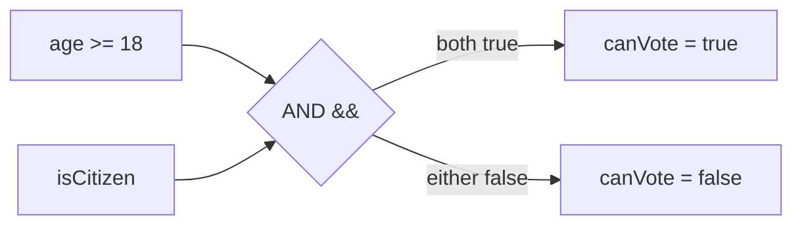

## Before you start

Nothing required. If `if` statements and arrays feel familiar, you already have the raw material this topic gives names to.

## In one sentence

**Discrete math** is the branch of math dealing with distinct, separate values — like whole numbers and true/false logic — rather than smoothly changing quantities, and it's the math that underlies how computers actually think.

## Why it matters

Every `if` statement, every database query, every list of unique users rests on discrete math ideas like logic and sets, whether or not anyone calls them that. You don't need to be a mathematician to write code, but recognizing these patterns explicitly makes you faster at simplifying tangled conditionals, deduplicating data correctly, and understanding *why* certain algorithms and data structures behave the way they do. It's easy to feel intimidated by the name "discrete math" — but if you've ever written `if (a && b)`, you've already been doing it.

## The intuition

Think of a light switch versus a dimmer. A dimmer moves smoothly between 0% and 100% — that's the world of continuous math (calculus, geometry with curves). A light switch is either fully on or fully off, nothing in between — that's the world of discrete math. Computers are built entirely out of switches, so the math that describes exact, separate, countable things — true/false, distinct items in a group, whole-number counts — is the math computers speak natively.

## How it actually works

**Boolean logic** is the math of true and false. `AND` is true only when both sides are true; `OR` is true when at least one side is true; `NOT` flips true to false and back. Every `if (a && b)` in your code is a small piece of boolean logic, and simplifying a complicated condition is really just simplifying a boolean expression using the same rules algebra uses for numbers.



`canVote` only reaches the `true` branch when both inputs are true — change either one to false and the whole expression collapses to false, which is exactly what the truth table for AND says.

A **set** is a collection of distinct items with no duplicates and, usually, no particular order — like a bag of unique marbles where having two identical red marbles is the same as having one. Two core operations combine sets: **union** (everything in either set, combined into one) and **intersection** (only the items present in both sets). If you've ever deduplicated a list, or found items two lists have in common, you've already used set theory without naming it.

**Truth tables** systematically list every possible combination of true/false inputs to a condition and what each combination produces. They're useful for verifying that a complicated condition actually does what you think it does for *every* case, not just the handful you happened to test by hand.

Discrete math also covers **combinatorics** — counting how many ways something can happen, like how many possible passwords exist given certain rules. This comes up whenever you need to reason about how large a search space is, or why brute-forcing a solution is, or isn't, actually feasible.

## Worked example

```js
// Boolean logic: a condition combining AND
function canVote(age, isCitizen) {
  return age >= 18 && isCitizen; // AND: both conditions must hold
}

console.log(canVote(20, true));  // true
console.log(canVote(20, false)); // false — fails the AND
console.log(canVote(15, true));  // false — fails the AND

// Set theory: using JavaScript's Set to remove duplicates and find overlap
const groupA = new Set([1, 2, 3, 4]);
const groupB = new Set([3, 4, 5, 6]);

const union = new Set([...groupA, ...groupB]);
const intersection = new Set([...groupA].filter(x => groupB.has(x)));

console.log([...union]);        // [1, 2, 3, 4, 5, 6]
console.log([...intersection]); // [3, 4]
```

The `Set` object naturally enforces uniqueness — spreading two sets together and wrapping the result in `new Set()` gives the union with duplicates automatically removed, and filtering one set by membership in another gives exactly the intersection.

## A second example — when it gets harder

Boolean logic gets genuinely confusing once conditions are negated and nested — which is exactly where **De Morgan's laws** earn their keep. Say you want to reject a user if they are *not* both logged in and verified:

```js
function isRejected(loggedIn, verified) {
  // naive: negate the whole compound condition
  return !(loggedIn && verified);
}

// De Morgan's law: !(a && b) is always equal to !a || !b
function isRejectedRewritten(loggedIn, verified) {
  return !loggedIn || !verified;
}

console.log(isRejected(true, false), isRejectedRewritten(true, false));   // true true
console.log(isRejected(true, true), isRejectedRewritten(true, true));     // false false
console.log(isRejected(false, false), isRejectedRewritten(false, false)); // true true
```

Both functions agree on every input, because `!(a && b)` is mathematically identical to `!a || !b` — that's De Morgan's law. This matters in practice because deeply nested negated conditions (`!(a && (b || !c))`) are genuinely hard to read at a glance, while their De Morgan-expanded form is often much clearer. Knowing the law means you can confidently rewrite a condition into whichever form is easier to reason about, without accidentally changing its behavior.

## Quick reference

| Concept | Meaning | Everyday example |
|---|---|---|
| AND (`&&`) | True only if both are true | Old enough AND has a license |
| OR (`\|\|`) | True if at least one is true | Has a coupon OR is a member |
| NOT (`!`) | Flips true/false | Not logged in |
| Union | Combine, no duplicates | All students in either class |
| Intersection | Only what's in both | Students in both classes |
| De Morgan's law | `!(a && b) = !a \|\| !b` | Rewriting a negated compound condition |

## Common mistakes

- Writing nested `if` statements instead of recognizing they're a single boolean expression that can be simplified with `&&`, `||`, and De Morgan's laws.
- Using an array and `.includes()` for repeated membership checks on large data — this is O(n) per check, while a `Set`'s `.has()` is O(1), which matters a lot as the data grows.
- Manually negating a compound condition term-by-term without flipping the connector — `!(a && b)` is `!a || !b`, not `!a && !b`; skipping this flip is the single most common De Morgan mistake.

## What interviewers ask

- **How would you simplify this compound boolean condition?** — Apply boolean algebra rules like De Morgan's laws, which often turn a confusing nested condition into something much more readable, without changing its behavior.
- **How would you find common elements between two lists efficiently?** — Convert one list into a `Set` (O(n) to build), then check membership for each item in the other list (O(1) per lookup), giving O(n) total instead of the O(n²) of comparing every pair directly.
- **What's the difference between a set and an array?** — A set stores only unique values with no guaranteed order and offers fast membership checks; an array allows duplicates, preserves insertion order, and checking membership means scanning through it.

## Practice

1. Simplify `!(isAdmin || isModerator)` using De Morgan's law, then verify both forms agree on all four combinations of true/false inputs.
2. Write a function that returns the symmetric difference of two sets (items in exactly one set, not both), using JavaScript's `Set`.
3. Given a list of user IDs from two different services, write a function that reports how many users appear in both, using only in either, and the total unique count across both — using sets, not nested loops.

## Where to go next

Next is `number-theory` — another branch of discrete math, focused specifically on whole numbers, division, and remainders, which shows up constantly in hashing and cryptography.
