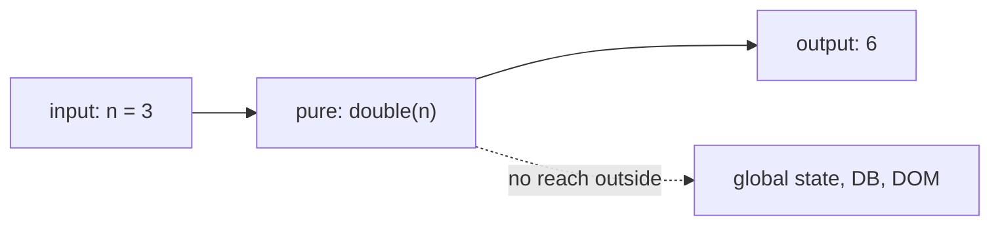

## Before you start

Builds directly on `object-oriented-programming` — this topic is easiest to grasp as a contrast to the class-based, shared-state style you just read about.

## In one sentence

**Functional programming** is a style of writing code where you build programs mainly out of small functions that don't change anything outside themselves, instead of stepping through instructions that update shared state.

## Why it matters

Code that changes shared data from many different places is hard to test and hard to reason about, because a bug could come from anywhere that ever touched that data. Functional style makes bugs much easier to isolate, because a function's behavior depends *only* on its inputs, never on the rest of the program's state. It also underlies patterns you almost certainly already use daily without naming them, like `.map()` and `.filter()`.

## The intuition

Compare two kinds of recipes. One says "take the bowl of dough that's already on the counter, and knead it" — the result depends on whatever happens to already be in that bowl, which might have been altered by someone else. The other says "given 2 cups of flour and 1 cup of water, produce dough" — the same inputs always produce the same dough, and nothing outside the recipe is touched. Functional programming is built entirely out of that second kind of recipe.



Everything a pure function needs comes in through its arguments, and everything it produces goes out through its return value — the dotted line shows the connection that a pure function deliberately never makes.

## How it actually works

A **pure function** always returns the same output for the same input and doesn't change anything outside itself — no modifying a global variable, no changing the argument passed in, no writing to a file. If a function is pure, you can test it completely in isolation and trust it won't cause surprises anywhere else in the program.

The opposite is a function with a **side effect** — something reaching outside its own scope, like updating a database, mutating an argument, or writing to the console. Side effects aren't inherently wrong (a program that produces no observable effect at all is useless), but functional programming pushes them to the edges of a program and keeps the core logic pure.

A **closure** is a function that "remembers" variables from the scope it was created in, even after that scope has already finished running. This is how you create a function with private, persistent state without needing a class at all.

**Immutability** means never changing data after it's created — instead of modifying an array in place, you create a brand new array with the change applied. This avoids an entire category of bug where one part of the code unexpectedly changes data that another part still depends on being unchanged.

## Worked example

```js
// Pure function: same input always gives same output, no side effects
function double(n) {
  return n * 2;
}

// Closure: inner function remembers 'count' from its outer scope
function makeCounter() {
  let count = 0;
  return function () {
    count += 1; // this variable persists between calls, hidden from outside
    return count;
  };
}

const counter = makeCounter();
console.log(counter()); // 1
console.log(counter()); // 2 — count was remembered, not reset

// Immutability: create a new array instead of mutating the original
const original = [1, 2, 3];
const doubled = original.map(double);
console.log(original); // [1, 2, 3] — untouched
console.log(doubled);  // [2, 4, 6] — a brand new array
```

`makeCounter` shows a closure giving `counter` private, persistent state that survives between calls — no class, no `this`, just a remembered variable. `.map()` shows the immutability half: `original` is completely untouched after the call, and `doubled` is a separate new array.

## A second example — when it gets harder

Closures get trickier once you create several of them in a loop, because it's easy to assume each one captures its own independent snapshot of a variable:

```js
function makeMultipliers() {
  const multipliers = [];
  for (var i = 1; i <= 3; i++) {
    multipliers.push(function (x) {
      return x * i; // which 'i' does this refer to?
    });
  }
  return multipliers;
}

const fns = makeMultipliers();
console.log(fns[0](10)); // 40, not 10!
console.log(fns[1](10)); // 40, not 20!
console.log(fns[2](10)); // 40
```

All three functions print `40`, because `var` doesn't create a new `i` for each loop iteration — there's only ever *one* `i`, shared by every closure, and by the time any function runs, the loop has already finished with `i` equal to 4. Switching `var` to `let` fixes it, because `let` creates a fresh binding of `i` for each iteration:

```js
function makeMultipliersFixed() {
  const multipliers = [];
  for (let i = 1; i <= 3; i++) {
    multipliers.push(function (x) {
      return x * i;
    });
  }
  return multipliers;
}

const fixed = makeMultipliersFixed();
console.log(fixed[0](10)); // 10
console.log(fixed[1](10)); // 20
console.log(fixed[2](10)); // 30
```

This is one of the most common real closure bugs, and it's a direct consequence of understanding *what scope a closure actually captures* — not the value at creation time, but a live reference to the variable itself.

## Quick reference

| Concept | Meaning | Example |
|---|---|---|
| Pure function | Same input → same output, no side effects | `n => n * 2` |
| Side effect | Reaches outside the function's own scope | Writing to a database |
| Closure | Function remembers its creation scope's variables | A counter with private state |
| Immutability | Data is never changed after creation | `[...arr, newItem]` not `arr.push()` |

## Common mistakes

- Thinking a function that only reads external variables is impure — a function is impure only if its output is inconsistent for the same input, or it changes something outside itself, not merely because it reads outer scope.
- Overusing closures for state that would be clearer as a class or plain object — closures are powerful but can make debugging harder once the captured state gets complex or evolves over time.
- Assuming each loop iteration gets its own private copy of a `var`-declared variable inside a closure — it doesn't; use `let` for a fresh binding per iteration.

## What interviewers ask

- **What makes a function "pure"?** — Same output for the same input, with no observable side effects like modifying external variables or performing I/O, making it predictable and easy to test in isolation.
- **What is a closure, and when would you use one?** — A function bundled with references to variables from its enclosing scope; a common use is a counter or a memoization cache with private state, without needing a class.
- **Why does functional programming favor immutability?** — Shared mutable data is a common source of bugs, where one part of a program changes data another part relies on staying the same; immutable data removes that entire category of bug.

## Practice

1. Rewrite a function that mutates an array argument in place (using `.push()` or `.splice()`) so that it instead returns a new array, leaving the original untouched.
2. Predict and then verify the output of the `var`-in-a-loop closure example above before reading the explanation.
3. Write a `memoize(fn)` higher-order function that uses a closure to cache results of expensive calls, so repeated calls with the same argument skip recomputation.

## Where to go next

Next is `discrete-math` — the logic operators (`&&`, `||`, `!`) you've been using throughout both OOP and FP examples are themselves a small, formal branch of math, and understanding that formalism sharpens how you simplify conditions.
