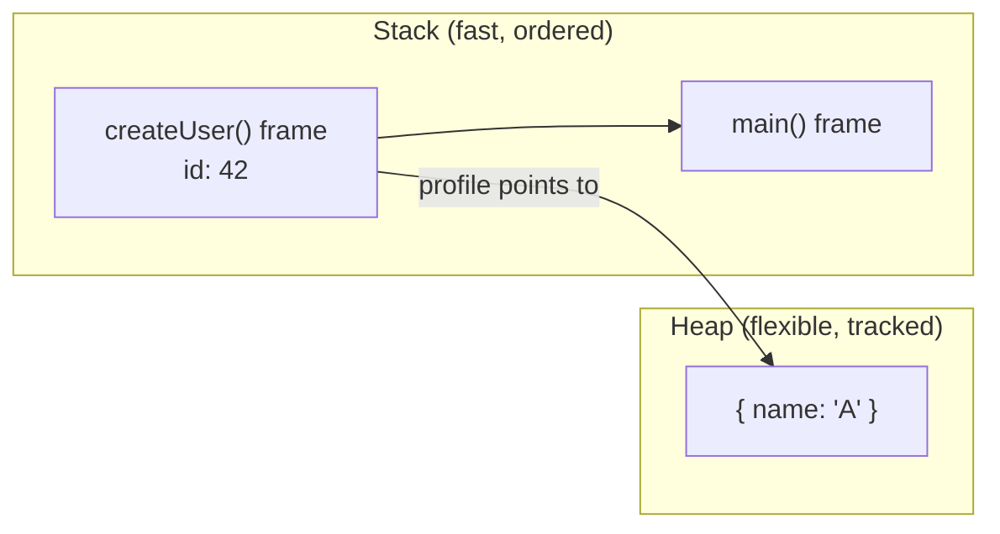

## Before you start

Helpful, not required: `big-o-notation`, since this topic covers *space* complexity — what Big O measures when it isn't counting time.

## In one sentence

**Memory management** is how a program asks for, uses, and gives back the computer's RAM while it runs.

## Why it matters

Every variable, object, and function call needs somewhere to live in memory. Get it wrong and you get a program that crashes from running out of memory, or one that slows down because it's holding onto things it no longer needs. It also explains bugs that look mysterious at first — like changing one variable and watching a completely different one change too, because they were secretly pointing at the same thing.

## The intuition

Picture two very different storage systems. The **stack** is a stack of plates: you add one on top (push) and remove from the top (pop), always in that strict order — you can never grab a plate from the middle. The **heap** is a warehouse: you can store things anywhere, of any size, and fetch them in any order, but someone has to keep track of what's stored where and whether it's still needed.



`id` sits directly in the stack frame because it's a fixed-size primitive, while `profile` in that same frame holds only a reference — a pointer — to the actual object living out in the heap.

## How it actually works

Every function call pushes a new "frame" onto the stack, holding that function's local variables. When the function returns, its frame is popped off and instantly reclaimed — no cleanup work required, because the stack's strict order makes it obvious what can go. This makes the stack extremely fast, but it only works for data whose size is known upfront (like a single number), and its total size is limited.

The heap holds everything else: objects, arrays, and anything that must outlive the function that created it. It's flexible but slower to manage, because nothing automatically tells the system when heap memory is safe to reclaim.

That's the job of **garbage collection** in languages like JavaScript and Java: it periodically scans the heap, traces which objects are still reachable from your running code, and frees the ones that aren't. Languages like C skip this — you free memory yourself, and forgetting creates a **memory leak** (memory that's no longer used but never released), while freeing something twice crashes the program.

The link between the two regions is the **pointer** (called a **reference** in JavaScript): a variable that stores the *location* of a value rather than the value itself. This is how two variables can end up pointing at — and sharing — the exact same object.

## Worked example

```js
function createUser() {
  const id = 42;                 // primitive: copied by value
  const profile = { name: 'A' }; // object: lives on the heap
  return profile;                // only the reference survives
}

const user1 = createUser();
const user2 = user1;             // user2 points to the SAME heap object
user2.name = 'B';
console.log(user1.name);         // 'B'
console.log(user2.name);         // 'B'
```

Output: both lines print `'B'`, even though only `user2` was changed. `user1` and `user2` are two separate variables holding the same heap reference, so mutating the object through either name changes what both see. Primitives like `id` are copied by value — a completely independent copy — but objects are shared by reference.

## A second example — when it gets harder

The reference-sharing behavior above is a feature once you understand it, but it becomes a real bug source with **closures** holding onto more than you intend:

```js
function attachHandlers() {
  const hugeCache = new Array(1_000_000).fill('data'); // large heap allocation
  let clickCount = 0;

  return function onClick() {
    clickCount++; // this closure only needs clickCount...
    console.log(`Clicked ${clickCount} times`);
    // ...but hugeCache stays reachable as long as onClick exists,
    // because they were declared in the same scope.
  };
}

const handler = attachHandlers();
handler(); // Clicked 1 times
handler(); // Clicked 2 times
```

`onClick` never touches `hugeCache`, but because both variables live in the same enclosing scope, the closure keeps the *entire* scope reachable — including the million-element array. The garbage collector can't free `hugeCache` as long as `handler` exists, because it can't prove you won't use it. This is a common real-world memory leak: something small keeps something huge alive purely by proximity, not by need.

The general rule the garbage collector follows is called **reachability**: starting from a set of known "roots" (global variables, currently-running function frames), it traces every reference outward, and anything it cannot reach from a root is considered garbage and freed. This is why circular references between two objects don't leak in JavaScript the way they do in some older systems — if neither object is reachable from a root, it doesn't matter that they still point at each other; both get collected.

## Deep dive: what "the heap" costs you in practice

It's worth being concrete about *why* heap allocation is slower than stack allocation, not just that it is. Allocating stack space is essentially moving a pointer — the "top of stack" marker — up by a fixed amount, an operation that takes a handful of CPU cycles. Allocating heap space means the memory manager has to search for a free block of the right size, update internal bookkeeping about what's allocated and what's free, and potentially trigger a garbage collection pass if memory is getting tight. None of that is needed for the stack, because the stack's strict last-in-first-out order means there's never any fragmentation to manage.

This is also why languages like Rust make heap allocation an explicit, visible choice (`Box::new`, `Vec::new`), while JavaScript hides it entirely — every object literal, array, and function you write silently allocates on the heap, and the language never makes you think about it. That convenience is exactly why understanding this topic matters: the cost is real even when the syntax hides it.

## Quick reference

| Concept | Stack | Heap |
|---|---|---|
| Speed | Very fast | Slower |
| Size | Small, fixed limit | Large, flexible |
| Lifetime | Ends when function returns | Until nothing references it |
| Stores | Primitives, call frames | Objects, arrays, closures |
| Managed by | Automatic (call/return) | Garbage collector or manual `free` |

## Common mistakes

- Assuming copying an object variable copies its data — it copies the reference; use `{ ...obj }` or `structuredClone` for an actual independent copy.
- Thinking garbage collection makes leaks impossible — you can still leak by keeping a reference alive longer than intended, such as in a growing global array, an unremoved event listener, or a closure capturing more scope than it uses.

## What interviewers ask

- **What's the difference between stack and heap memory?** — The stack holds short-lived, fixed-size data tied to function calls and frees itself automatically; the heap holds longer-lived, variable-sized data that a garbage collector or manual code must reclaim.
- **What causes a memory leak in JavaScript?** — Something you no longer need stays reachable from a live reference, like a forgotten event listener, an ever-growing array, or a closure holding onto more scope than it needs; the collector can only free what it proves is unreachable.
- **What is a stack overflow?** — Too many nested function calls, often from unbounded or incorrect recursion, exhaust the stack's limited space, since each call adds another frame that isn't popped until it returns.

## Practice

1. Write a function that takes an object and returns a true independent copy of it (not just a reference), and explain why `const copy = original` would not work.
2. Write a small script demonstrating a stack overflow with unbounded recursion, then fix it with a base case.
3. Explain, in your own words, why passing an array into a function and pushing to it inside that function affects the original array outside the function.

## Where to go next

Next is `bit-manipulation` — it drops down one more level, to how individual values are represented as bits inside that memory you just learned about.
