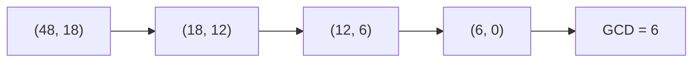

## Before you start

Builds on `discrete-math` — number theory is discrete math narrowed specifically to whole numbers and how they divide.

## In one sentence

**Number theory** is the study of whole numbers and the relationships between them, especially division, remainders, and prime numbers.

## Why it matters

It sounds academic, but number theory quietly powers things you use every day: hash tables use remainders to spread data evenly across buckets, cryptography (the math behind HTTPS) leans on prime numbers, and a good chunk of interview problems reduce to "find the pattern in how these numbers divide." A little number theory turns those problems from guesswork into a direct calculation.

## The intuition

Picture a 12-hour clock. When the hour hand passes 12, it doesn't keep counting up to 13 — it wraps back around to 1. That wraparound behavior, "go up to a limit, then start over," is the core idea behind **modulo arithmetic**, and it shows up anywhere something needs to cycle: wrapping an array index, spreading data into a fixed number of buckets, or checking whether a number is even.

## How it actually works

A **prime number** is a whole number greater than 1 with no divisors other than 1 and itself — 7 is prime because nothing else divides it evenly, but 8 is not, since 2 and 4 both divide it. Primes matter because every whole number can be built by multiplying primes together in exactly one way (its prime factorization), which is the foundation a lot of cryptography is built on.

**Modulo arithmetic** (the `%` operator) gives the remainder left over after division. `10 % 3` is `1`, because 3 goes into 10 three times with 1 left over. This shows up constantly in real code: checking if a number is even (`n % 2 === 0`), wrapping an index back into bounds for an array (`i % arr.length`), or spreading data evenly across buckets in a hash table.

The **greatest common divisor (GCD)** of two numbers is the largest number that divides both of them evenly — useful for simplifying fractions, or for finding the largest equal-sized groups two quantities can both be split into. The **Euclidean algorithm** computes it efficiently by repeatedly replacing the larger number with the remainder of dividing it by the smaller, continuing until the remainder hits 0.



Each arrow is one step of `(a, b) → (b, a % b)` — the numbers shrink fast, and the moment the second number hits 0, the first number is the answer.

## Worked example

```js
// Modulo: check even/odd and wrap an index around an array
function isEven(n) {
  return n % 2 === 0;
}

function wrapIndex(i, length) {
  return ((i % length) + length) % length; // handles negative i too
}

// Euclidean algorithm: greatest common divisor
function gcd(a, b) {
  while (b !== 0) {
    [a, b] = [b, a % b]; // replace (a, b) with (b, remainder)
  }
  return a;
}

console.log(isEven(7));        // false
console.log(wrapIndex(-1, 5)); // 4 — wraps to the last valid index
console.log(gcd(48, 18));      // 6
```

`gcd(48, 18)` walks: `(48, 18) → (18, 12) → (12, 6) → (6, 0)`. Once `b` hits 0, `a` holds the answer — `6`. Each step keeps taking remainders until nothing is left, finding the two numbers' largest shared factor without ever checking every possible divisor by hand.

## A second example — when it gets harder

The naive way to check if a number is prime — testing every number from 2 up to `n - 1` as a possible divisor — works but wastes a lot of effort. Here's the faster version, and the reasoning behind why it's correct:

```js
function isPrime(n) {
  if (n < 2) return false;
  for (let i = 2; i * i <= n; i++) { // only check up to the square root
    if (n % i === 0) return false;
  }
  return true;
}

console.log(isPrime(97));  // true
console.log(isPrime(91));  // false — 91 = 7 × 13
```

`isPrime(91)` stops at `i = 7`, because `7 * 7 = 49 <= 91` and `91 % 7 === 0`. It never needs to check up to 90. Here's why checking up to the square root is enough: if `n` has a factor larger than its square root, that factor must be paired with a *smaller* factor also less than the square root (their product is `n`), so you'd have already found that smaller factor first. This shrinks the check from O(n) to O(√n) — for a number like a million, that's the difference between a million checks and a thousand. This is a common follow-up in interviews specifically because it tests whether you can justify *why* the optimization is safe, not just recite it.

One more detail worth internalizing: you can skip even numbers greater than 2 entirely in the loop, since any even number other than 2 is automatically divisible by 2 and therefore not prime. Checking `2` separately, then only testing odd divisors from `3` upward, roughly halves the work again — a small tweak, but it's the kind of detail that shows you've actually reasoned about the problem rather than pattern-matched a memorized loop.

## Quick reference

| Concept | Meaning | Example |
|---|---|---|
| Prime number | Divisible only by 1 and itself | 2, 3, 5, 7, 11 |
| Modulo (`%`) | Remainder after division | `17 % 5 = 2` |
| GCD | Largest number dividing both evenly | `gcd(12, 18) = 6` |
| Even/odd check | Uses modulo by 2 | `n % 2 === 0` means even |
| Primality check | Only need divisors up to `√n` | `isPrime(91)` stops checking at 7 |

## Common mistakes

- Forgetting `%` in JavaScript can return a negative result for negative inputs (`-1 % 5` is `-1`, not `4`), which breaks naive array-index wrapping — fix with `((i % n) + n) % n`.
- Checking primality by testing all numbers up to `n` instead of up to the square root of `n`, doing far more work than necessary.
- Assuming 1 is prime — by definition a prime must have *exactly* two distinct divisors (1 and itself), and 1 only has one, so it's excluded.

## What interviewers ask

- **How would you check if a number is prime?** — Try dividing it by every number from 2 up to its square root; if none divide evenly, it's prime, since any larger factor would necessarily have a matching smaller factor you'd already have found.
- **Why do hash tables use the modulo operator?** — To map a huge or unevenly distributed set of hash values into a fixed number of buckets, `hash % numberOfBuckets` gives an index guaranteed to fall within the array's bounds.
- **How does the Euclidean algorithm find the GCD faster than checking every divisor?** — It repeatedly replaces the pair with the smaller number and their remainder, shrinking the numbers quickly at each step, giving logarithmic time instead of checking every number up to the smaller value.

## Practice

1. Write a function that returns the prime factorization of a number as an array (e.g. `primeFactors(12)` returns `[2, 2, 3]`), using the square-root optimization from this topic.
2. Write a function `lcm(a, b)` (least common multiple) using the relationship `lcm(a, b) = (a * b) / gcd(a, b)`.
3. Explain why `((i % n) + n) % n` correctly wraps a negative index, walking through what happens with `i = -7` and `n = 3`.

## Where to go next

Next is `string-manipulation` — a shift from numeric patterns to text, though modulo arithmetic makes a reappearance there too, in how hash functions map strings to array indices.
