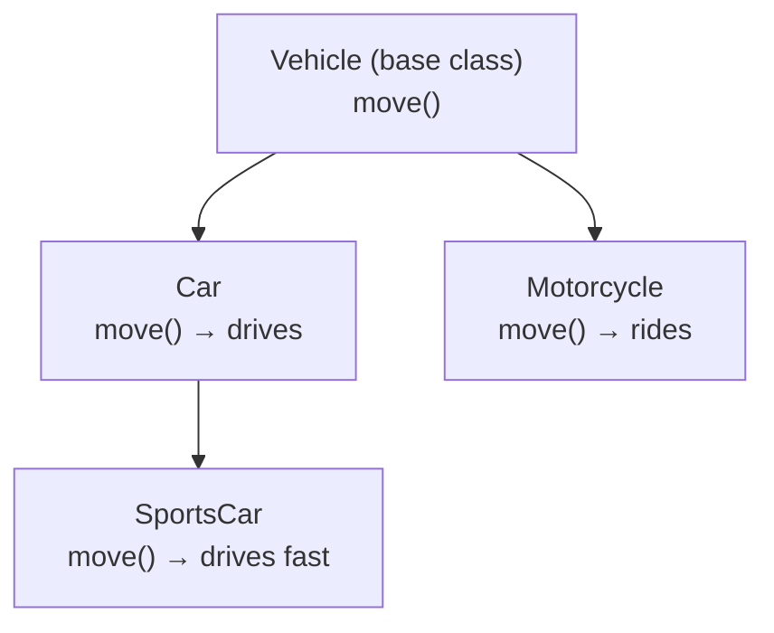

## Before you start

Nothing from this course is required, though `memory-management` helps: understanding that objects live on the heap and are shared by reference explains why mutating an object in one place can affect it everywhere else it's used.

## In one sentence

**Object-oriented programming (OOP)** is a way of organizing code around "objects" that bundle data and the behavior that acts on that data together, instead of keeping data and functions completely separate.

## Why it matters

As programs grow, keeping related data and logic scattered across the codebase makes changes risky and hard to reason about — a change in one file can silently break behavior three files away. OOP gives you a way to model real-world things (a user, an order, a car) as self-contained units, so you can change how something works internally without breaking every piece of code that uses it from the outside.

## The intuition

Think of a car. As a driver, you interact with a small, simple interface: a steering wheel, pedals, a gear shift. You don't need to know how the engine converts fuel into motion, or how the transmission decides which gear to use — that complexity is hidden behind the dashboard. OOP models software the same way: bundle the messy internal details of something together, and expose only a clean, simple interface for the rest of the program to use.

## How it actually works

A **class** is a blueprint — it describes what properties and methods every object built from it will have, without being an actual object itself. An **object** (or instance) is a specific thing created from that blueprint, with its own concrete values. If `Car` is the class, `myRedCar` is one object made from it; you could make a thousand cars from the same class, each with different values.

**Encapsulation** means keeping an object's internal details private and only exposing what other code actually needs, through defined methods — like the dashboard hiding the engine's mechanics behind a simple set of controls. This protects data from being changed in unexpected ways by code that shouldn't be touching it directly.

**Inheritance** lets one class build on another, reusing its properties and methods instead of rewriting them from scratch. A `SportsCar` class could inherit from `Car` and automatically get everything a regular car has, adding its own extra behavior like a turbo boost on top.

**Polymorphism** means different classes can respond to the same method call in their own way. If both `Car` and `Motorcycle` have a `move()` method, you can call `.move()` on either without caring which one it actually is — each handles it according to its own internal logic. This is what lets you write code that works generically across a whole family of related objects, without a long pile of `if`/`else` checks for every possible type.



`SportsCar` inherits everything `Car` has, then overrides `move()` with its own version — calling `.move()` on any of these four objects runs different code, but the caller never needs to know which one it has.

## Worked example

```js
class Animal {
  constructor(name) {
    this.name = name; // encapsulated on the object
  }
  speak() {
    return `${this.name} makes a sound`;
  }
}

class Dog extends Animal { // inheritance: Dog reuses Animal's setup
  speak() {                // polymorphism: Dog overrides speak()
    return `${this.name} barks`;
  }
}

const animals = [new Animal('Generic'), new Dog('Rex')];
animals.forEach(a => console.log(a.speak()));
```

Output:
```
Generic makes a sound
Rex barks
```

The loop calls `.speak()` identically on every object in the array, but `Dog` and `Animal` each answer differently — the loop never checks "is this a Dog?" anywhere. That's polymorphism doing the work that an `if`/`else` chain would otherwise have to do explicitly.

## A second example — when it gets harder

Inheritance looks clean with one level (`Dog extends Animal`), but it gets fragile once you're several levels deep or the relationship isn't a clean "is-a." Consider modeling a `Penguin`:

```js
class Bird {
  fly() {
    return 'flying through the air';
  }
}

class Penguin extends Bird {
  // Penguins can't fly — but they inherited fly() anyway
}

const penguin = new Penguin();
console.log(penguin.fly()); // 'flying through the air' — wrong!
```

`Penguin extends Bird` compiles and runs fine, but it's semantically broken: a penguin inherited a behavior it doesn't actually have. This is the classic sign that a class hierarchy is forcing a relationship that doesn't truly hold. A better model uses **composition**: give `Bird` a `canFly` capability, or split flight into its own behavior that only flying birds include, rather than assuming every subclass of `Bird` can do everything a generic bird can:

```js
const canFly = {
  fly() { return 'flying through the air'; }
};
const canSwim = {
  swim() { return 'swimming through the water'; }
};

class Sparrow {
  constructor() { Object.assign(this, canFly); }
}
class Penguin {
  constructor() { Object.assign(this, canSwim); } // no fly() at all
}

console.log(new Sparrow().fly());  // 'flying through the air'
console.log(new Penguin().swim()); // 'swimming through the water'
console.log(typeof new Penguin().fly); // 'undefined' — correctly has no fly()
```

Now a `Penguin` simply has no `fly` method to call incorrectly, because it was only given the behaviors it actually has. This is why experienced developers often say "favor composition over inheritance" — inheritance should model genuine specialization, not just a convenient way to reuse code, and composition lets you mix in exactly the capabilities each object needs without forcing a rigid single-parent hierarchy.

## Quick reference

| Pillar | What it means | Everyday analogy |
|---|---|---|
| Encapsulation | Hide internal details, expose a clean interface | A car's dashboard hides its engine |
| Inheritance | Reuse another class's behavior | A sports car is still a car |
| Polymorphism | Same method call, different behavior per type | Both dogs and cats "speak" differently |
| Abstraction | Model only the relevant details | A car interface ignores engine internals |

## Common mistakes

- Using inheritance just to share code, even when the relationship isn't truly "is-a" — this leads to fragile, surprising hierarchies like a `Penguin` that can `fly()`; prefer composition (an object *has* a helper) when the relationship isn't a genuine subtype.
- Making every property public "just in case" — this defeats encapsulation and lets other code depend on internal details that should be free to change later without breaking anything.

## What interviewers ask

- **What is the difference between a class and an object?** — A class is a blueprint defining structure and behavior; an object is a concrete instance created from that blueprint with actual values, and you can create many objects from one class.
- **What is polymorphism, and why is it useful?** — It's the ability for different classes to implement the same method differently, letting you write code that works generically across related types without checking which specific type you have.
- **When would you favor composition over inheritance?** — When the "is-a" relationship doesn't genuinely hold (like a Penguin inheriting `fly()` from Bird), or when inheritance chains get deep and fragile; composition tends to be more flexible than forcing everything into a rigid class hierarchy.

## Practice

1. Model a `Shape` class with `Circle` and `Rectangle` subclasses, each implementing its own `area()` method, then write a function that sums the area of a mixed array of shapes without checking each one's type.
2. Take the `Penguin`/`Bird` example above and refactor it using composition instead of inheritance, so only birds that can actually fly get flight behavior.
3. Explain, using a concrete example from a codebase you've worked in (or imagine one), when encapsulation prevented a bug versus when it got in your way.

## Where to go next

Next is `functional-programming` — a genuinely different way to organize code, built around functions and immutable data instead of objects and shared internal state. Comparing the two directly is one of the most common ways this material gets tested in interviews.
