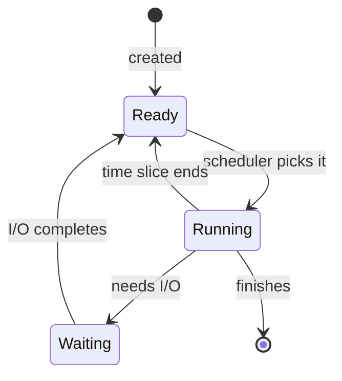

## Before you start

Builds on `computer-architecture` — you now know a CPU executes one instruction at a time; this topic covers how the OS makes that one CPU look like it's running many programs simultaneously.

## In one sentence

An **operating system** is the software that manages a computer's hardware and decides which program gets to use the CPU, memory, and other resources, and when.

## Why it matters

Your code never talks directly to hardware — the OS sits between your program and the machine, sharing one CPU and one pool of memory across every running program on the system. Understanding processes and threads explains why your Node.js server can handle many requests at once despite JavaScript being single-threaded, why race conditions happen in other languages, and what actually happens on your machine when you run a command.

## The intuition

Picture a single chef (the CPU) in a kitchen with many orders (programs) waiting. The chef can only cook one dish at a time, but by working on each order in tiny bursts and switching rapidly between them, all the orders *appear* to be progressing simultaneously to anyone watching. That illusion of simultaneity from rapid switching is exactly what a computer with more running programs than CPU cores does every second.

## How it actually works

A **process** is a running program with its own private memory space. Running `node server.js` twice creates two separate processes, each with its own copy of variables, fully isolated from the other — one process cannot accidentally read or corrupt another's memory.

A **thread** is a smaller unit of execution *inside* a process. A process can have multiple threads, and unlike separate processes, threads inside the same process share that process's memory. This makes threads lighter and faster to create than processes, but it also means two threads can accidentally read or write the same memory at the same time — a bug called a **race condition**, where the outcome depends unpredictably on which thread happens to run first.

Since a computer usually has far fewer CPU cores than running processes and threads combined, the OS performs **scheduling**: it rapidly switches which process or thread gets the CPU, giving each a small time slice before moving to the next. This switching happens so fast it looks simultaneous even on a single core — that illusion is **concurrency**. True **parallelism** — actually executing at the exact same instant — only happens when there are multiple cores to run on.

A single process moves through a small set of states as the scheduler works through its queue:



A process spends most of its life bouncing between **Ready** (waiting its turn) and **Running** (actually on the CPU), dropping into **Waiting** whenever it needs something slow like a disk read — which is exactly the gap Node.js fills with the event loop instead of blocking the whole process.

JavaScript is famously **single-threaded**: your code runs on exactly one thread, so your own JS logic can never produce a race condition the way multi-threaded code can. Yet Node.js still achieves concurrency for slow operations like file reads or network requests, by handing that work off to the operating system and resuming your code later via the **event loop** once the result is ready.

## Worked example

```js
// Node.js is single-threaded for your code, but I/O runs concurrently
console.log('1: starts first');

setTimeout(() => {
  console.log('3: runs after the main thread is free');
}, 0);

console.log('2: runs before the timeout, even with a 0ms delay');
```

Output, in order: `1: starts first`, `2: runs before the timeout, even with a 0ms delay`, `3: runs after the main thread is free`. Even with a delay of `0`, `setTimeout`'s callback has to wait for the main thread's current code to finish running before the event loop picks it up — proof that JavaScript never runs two callbacks at the exact same instant, only one after another.

## A second example — when it gets harder

The event loop trick above hides one important detail: not all deferred work waits equally long. Compare a timer against a Promise:

```js
console.log('A: sync code runs first');

setTimeout(() => console.log('D: macrotask (timer) runs last'), 0);

Promise.resolve().then(() => console.log('C: microtask (Promise) runs before timers'));

console.log('B: more sync code');
```

Output, in order: `A`, `B`, `C`, `D`. Both the timeout callback and the Promise callback are deferred until the synchronous code finishes — but the event loop drains all pending **microtasks** (Promises) *before* it processes the next **macrotask** (timers, I/O callbacks), even when the timer was scheduled first and with a 0ms delay. This is the detail that trips people up in interviews: "single-threaded" doesn't mean "one simple queue" — there are multiple queues with different priority, and getting the ordering wrong is a common source of subtle async bugs.

## Why the OS needs scheduling at all

It's worth connecting this back to the OS-level picture directly. Every one of those callbacks — the timer, the Promise resolution, the next line of synchronous code — ultimately still has to be scheduled onto the single JS thread by the same underlying mechanism this topic opened with: the OS deciding which unit of work gets the CPU next. Node's event loop is really a purpose-built scheduler living *inside* one process, layered on top of the OS's own process and thread scheduler. The OS doesn't know or care about "microtasks" — from its point of view, there's just one thread making system calls, occasionally blocking to wait on I/O, and being resumed once results are ready. Node's runtime is the layer that turns "the OS says this network read finished" into "run this specific JavaScript callback next," which is why understanding both layers together — the OS's process/thread model, and the event loop's queue model — gives you the full picture of what "single-threaded but concurrent" actually means end to end.

## Quick reference

| Concept | Process | Thread |
|---|---|---|
| Memory | Own isolated space | Shared with sibling threads |
| Creation cost | Expensive | Cheap |
| Crash impact | Doesn't affect other processes | Can crash the whole process |
| Communication | Needs IPC | Direct, via shared memory |
| Common risk | None from sharing | Race conditions |

## Common mistakes

- Assuming concurrency and parallelism are the same — concurrency *manages* multiple tasks by switching between them, parallelism *actually runs* multiple tasks at once, requiring multiple cores.
- Thinking single-threaded means it can't handle many things at once — it handles I/O concurrency well precisely because slow operations are handed off to the OS, not run on the JS thread itself.
- Assuming all deferred callbacks run in the order they were scheduled — microtasks (Promises) always drain before the next macrotask (timers), regardless of which was scheduled first.

## What interviewers ask

- **What's the difference between a process and a thread?** — A process has its own isolated memory and is expensive to create; a thread lives inside a process and shares memory with sibling threads, making threads cheaper but riskier due to shared state.
- **What is a race condition, and how do you prevent one?** — Two threads read and write shared memory at the same time without coordination, producing unpredictable results; prevent it with locks, atomic operations, or by avoiding shared mutable state entirely.
- **Why is JavaScript single-threaded, yet handles many requests concurrently?** — Your JS code runs on one thread, but Node.js delegates I/O work to the OS or a background thread pool, then resumes your code via the event loop once that work completes.

## Practice

1. Predict the console output order of a script mixing two `setTimeout` calls, a `Promise.resolve().then()`, and plain synchronous `console.log` statements — then run it to check yourself.
2. Explain why spawning 10,000 threads is far riskier than handling 10,000 concurrent I/O operations in Node's single-threaded event loop model.
3. Research Node's `worker_threads` module and describe one real scenario where you'd reach for it despite JavaScript's single-threaded reputation.

## Where to go next

Next is `object-oriented-programming` — it moves from how the machine runs your code to how you organize that code, starting with the most widely used way of structuring it.
