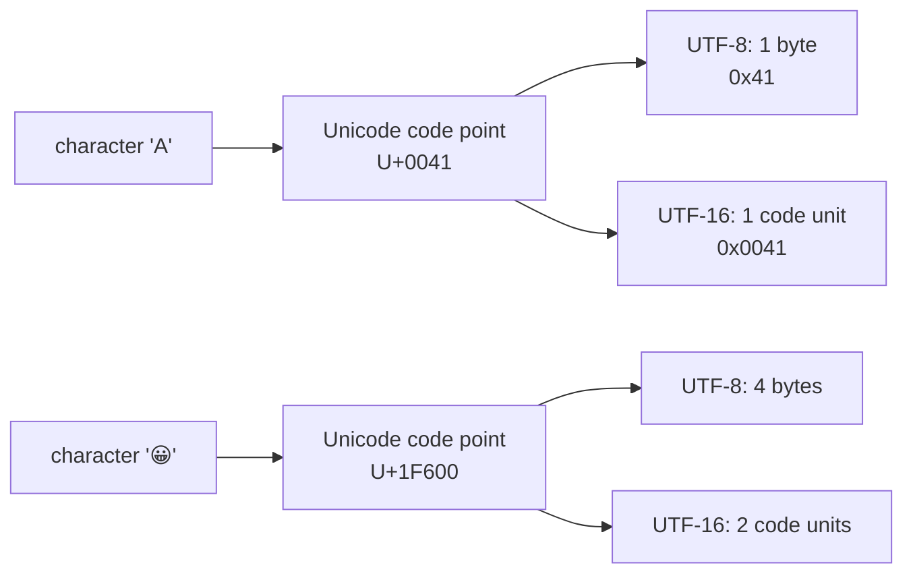

## Before you start

Builds on `number-theory` and `bit-manipulation` — strings are, underneath, just numbers stored as bits; this topic explains the rules for turning those numbers back into readable characters.

## In one sentence

**String manipulation** is reading, changing, and analyzing text data — the sequences of characters that make up names, messages, file contents, and nearly everything a user types.

## Why it matters

Almost every application deals with text: validating an email, searching for a word, formatting a name, parsing a log file. Strings look simple, but they hide real complexity around how characters are stored and compared, and interviewers use string problems constantly because they reveal whether you think carefully about edge cases rather than just the happy path.

## The intuition

Imagine a giant lookup table that assigns every character in every human writing system — plus emoji — its own unique number. That's essentially what **Unicode** is. But a number by itself isn't a file on disk; you need a rule for how to write that number down as actual bytes. That rule is called an **encoding**, and it's the difference between *what a character is* (its number) and *how it's stored* (its bytes).



The same character always has one Unicode code point, but how many bytes or code units that point takes up depends entirely on which encoding is writing it down — which is exactly why `'😀'.length` surprises people.

## How it actually works

Computers store text as numbers, using an encoding to map those numbers to characters. **ASCII** was an early encoding covering just 128 characters — English letters, digits, and basic punctuation — using one byte per character. It had no way to represent accented letters, emoji, or the scripts used by most of the world's languages.

**Unicode** replaced this limitation by assigning a unique number, called a **code point**, to essentially every character in every writing system, plus symbols and emoji. **UTF-8** is the most common way to actually store those Unicode code points as bytes on disk or over a network — it uses just 1 byte for basic English characters, keeping it fully compatible with old ASCII text, but up to 4 bytes for characters like emoji. This is why a string containing emoji can take up noticeably more storage than its visible character count would suggest.

This matters directly in JavaScript, where strings are sequences of **UTF-16** code units rather than UTF-8 bytes. Some characters — including many emoji — are represented by *two* code units, not one. This means `'😀'.length` returns `2`, not `1`, which surprises almost everyone the first time they hit it. A naive loop that walks a string one `.length` unit at a time can literally split an emoji in half, producing two broken, unprintable characters instead of one whole one.

Common string operations you'll reach for constantly include searching (`.includes()`, `.indexOf()`), splitting and joining (`.split()`, `.join()`), and normalization (`.toLowerCase()`, `.trim()`) — these form the toolkit behind almost every text-processing task you'll write.

## Worked example

```js
const email = '  User@Example.com  ';

// Normalize before comparing: trim whitespace, lowercase for case-insensitive match
const normalized = email.trim().toLowerCase();
console.log(normalized); // 'user@example.com'

// Reversing a string, character by character
function reverse(str) {
  return str.split('').reverse().join('');
}
console.log(reverse('hello')); // 'olleh'

// Careful: emoji can be 2 UTF-16 code units, so naive length/reverse can break them
console.log('😀'.length);     // 2, not 1
console.log(reverse('a😀b'));  // broken — the emoji gets split apart
```

Normalizing a string before comparing it — trimming whitespace, matching case — is one of the most common real-world string tasks, and it's why `email.trim().toLowerCase() === otherEmail.trim().toLowerCase()` is safer than a plain `===`. The emoji example shows the trap directly: `reverse('a😀b')` doesn't cleanly produce `'b😀a'`, because `.split('')` splits by UTF-16 code unit, cutting the two-unit emoji in half before reversing.

## A second example — when it gets harder

The fix for the broken emoji reversal shows why *how* you split a string matters, not just that you split it:

```js
function reverseSafely(str) {
  return Array.from(str).reverse().join(''); // splits by Unicode code point, not code unit
}

console.log(reverseSafely('a😀b')); // 'b😀a' — emoji stays intact
console.log(Array.from('😀').length); // 1 — Array.from understands the pairing
console.log('😀'.length);             // 2 — .length still counts raw code units
```

`Array.from(str)` (and the spread operator `[...str]`) iterate a string by full Unicode code point, correctly treating a two-unit emoji as a single character, while `.length` and `.split('')` operate on raw 16-bit code units and don't know the two units belong together. The lesson: `.length` answers "how many UTF-16 code units," which is a different question from "how many characters a human would see" — and for any text that might contain emoji or certain rare scripts, those two answers can disagree.

## Quick reference

| Method | What it does | Example |
|---|---|---|
| `.includes()` | Checks if a substring exists | `'hello'.includes('ell')` → true |
| `.split(sep)` | Breaks a string into an array | `'a,b,c'.split(',')` → `['a','b','c']` |
| `.trim()` | Removes leading/trailing whitespace | `'  hi  '.trim()` → `'hi'` |
| `.toLowerCase()` | Converts to lowercase | `'ABC'.toLowerCase()` → `'abc'` |
| `.padStart(n, ch)` | Pads to length `n` from the left | `'5'.padStart(2,'0')` → `'05'` |
| `Array.from(str)` | Splits by Unicode code point, not code unit | Safe for strings with emoji |

## Common mistakes

- Comparing strings without normalizing case or whitespace first, causing `'Test' === 'test '` to fail when the intent was to treat them as the same value.
- Assuming `.length` equals the number of visible characters — it's actually the number of UTF-16 code units, which differs for emoji and some other characters outside the basic range.
- Using `.split('')` to iterate a string that might contain emoji or other multi-code-unit characters — use `Array.from(str)` or the spread operator instead to avoid splitting a character in half.

## What interviewers ask

- **How would you check if two strings are anagrams of each other?** — Sort the characters of both strings and compare the results, or count character frequencies in both and compare the counts; the second approach is O(n) versus O(n log n) for sorting, worth mentioning as a follow-up optimization.
- **Why might `'😀'.length` not equal 1 in JavaScript?** — JavaScript strings are UTF-16 encoded, and some characters, including many emoji, require two 16-bit code units to represent, so `.length` counts code units, not visible characters.
- **How would you reverse a string efficiently, and what could go wrong?** — Convert it to an array of characters, reverse the array, then join it back — but `.split('')` can break apart multi-code-unit characters like emoji, so `Array.from(str)` is the safer way to split for text that might contain them.

## Practice

1. Write a function that checks if two strings are anagrams using a character frequency count instead of sorting, and explain why it's faster.
2. Write a function that safely reverses a string containing emoji, without splitting any character in half.
3. Write a function that counts how many "visible characters" (not UTF-16 code units) are in a string, and test it against a string containing at least one emoji.

## Where to go next

That completes Chapter 1. From here, move to Chapter 2's data structures topics — arrays and strings are where the bit-level and encoding details from this topic meet the algorithmic techniques (two pointers, sliding windows) that build on everything covered so far.
