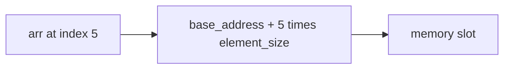

## Before you start

Nothing formal required — this is usually the first data structure anyone learns. If you know what a variable is, you're ready.

## In one sentence

An **array** is a row of same-sized boxes sitting next to each other in memory so the computer can jump straight to any box by number, and a **string** is just an array of characters with a couple of extra rules.

## Why it matters

Almost every interview question touches an array or a string, because they are the simplest way to hold a group of related values in order. Without arrays you'd need a separate named variable for every item, which falls apart the moment you have more than a handful of values. Every other data structure in this phase — lists, stacks, hash tables — is either built on top of an array or exists to fix one of its weaknesses, so the trade-offs you learn here reappear, in disguise, in every topic that follows.

## The intuition

Picture a street of identical, numbered mailboxes in a straight line. If you know a house is at number 5, you walk straight there — you don't check every mailbox before it. That's an array: because every "box" is the same size and they sit back-to-back, the computer computes the exact address of index 5 with simple arithmetic instead of searching.

Now picture wanting to insert a new house between numbers 3 and 4. Every house from 4 onward has to shift down the street to make room. That single image — instant lookup by number, expensive insertion in the middle — is the whole trade-off of arrays.

## How it actually works

Because array elements are contiguous in memory, reading `arr[5]` costs the same whether the array has 10 elements or 10 million — the engine just computes `base_address + 5 * element_size`. This is what "O(1) access" means in practice.



JavaScript arrays are **dynamic arrays**: under the hood, when the fixed-size block fills up, the engine allocates a bigger block elsewhere and copies everything over. You never see this happen, but it explains why adding to the end (`push`) is usually fast, while adding to the front (`unshift`) is slow — every existing item has to shift over by one to make room.

Strings behave like read-only arrays of characters. In JavaScript, strings are **immutable**: `str[0] = 'X'` silently does nothing. Any "change" — `toUpperCase()`, `slice()`, concatenation — actually builds a brand new string, leaving the original untouched. That is why repeatedly gluing strings together in a loop with `+=` is wasteful; a **string builder** pattern (collecting pieces in an array, then joining once) avoids creating a new string on every step.

This immutability is a deliberate design choice, not an accident. Because a string can never change after it's created, it's always safe to share the same string across multiple parts of a program without worrying that one piece of code will silently mutate it out from under another — a guarantee arrays don't give you, since two variables can point at the same mutable array and step on each other's changes.

## Worked example

```js
// Dynamic array growth and a string-builder pattern
const nums = [1, 2, 3];
nums.push(4);              // fast: adds to the end, amortized O(1)
nums.unshift(0);           // slow: shifts every element right, O(n)
console.log(nums);         // [0, 1, 2, 3, 4]

// Building a string efficiently
const parts = [];
for (let i = 0; i < 5; i++) {
  parts.push(`item-${i}`);
}
const joined = parts.join(', '); // one allocation instead of five
console.log(joined); // "item-0, item-1, item-2, item-3, item-4"
```

The loop collects pieces in an array first, then joins once at the end, instead of rebuilding a new string on every iteration — five small allocations plus one join, rather than five progressively larger string copies.

## A second example — when it gets harder

Naive string concatenation looks harmless for a handful of pieces, but the cost is quadratic, not linear. Watch what happens with `+=` instead:

```js
let result = '';
for (let i = 0; i < 5; i++) {
  result += `item-${i}, `; // each += copies the ENTIRE string so far
}
```

On iteration 1 the engine copies ~7 characters. On iteration 5 it copies ~35 characters, because the whole accumulated string is recreated every time. For 5 items this is invisible; for 50,000 items, this turns a job that should take milliseconds into one that takes minutes, because total work grows like 1+2+3+...+n, which is O(n²). The array-then-join version stays O(n) because each piece is only ever copied once, at the final join.

## Quick reference

| Operation | Array | String |
|---|---|---|
| Access by index | O(1) | O(1) |
| Search (unsorted) | O(n) | O(n) |
| Insert/delete at end | O(1) amortized | O(n) — new string |
| Insert/delete at start/middle | O(n) | O(n) |
| Mutable? | Yes | No (immutable) |

## Common mistakes

- Assuming `array.push()` and `array.unshift()` cost the same — they don't; `unshift` re-indexes every element.
- Mutating a string directly (`str[0] = 'a'`) and being surprised nothing changes — always reassign the result of a string method instead.
- Using `+=` to build a large string inside a loop instead of collecting pieces in an array and calling `.join()` once.
- Forgetting that `slice()`, `map()`, and `filter()` all return new arrays or strings — the original is never touched.

## What interviewers ask

- **Why is array access O(1) but linked list access is not?** — Arrays store elements contiguously, so the address of any index is computed with simple arithmetic. Linked lists store nodes scattered in memory, so you must walk from the head to reach a given position.
- **Why is string concatenation in a loop slow?** — Because strings are immutable, each `+=` creates an entirely new string and copies the old contents in, turning an n-step loop into roughly O(n²) work. Using an array plus `join()` avoids the repeated copying.
- **Reverse a string in place — can you?** — Not truly in place in JavaScript since strings are immutable; you convert to an array, reverse the array, and join it back, which is O(n) time and O(n) extra space.
- **What's the difference between a static array and a dynamic array?** — A static array has a fixed size set at creation; a dynamic array (like JS arrays or Python lists) resizes itself automatically by allocating a larger block and copying elements when it runs out of room.

## Practice

1. Write a function that returns `true` if a string is a palindrome, ignoring case and spaces.
2. Given an array of integers, find the two numbers that add up to a target value, without using a nested loop.
3. Given a large array of log lines, build a single formatted report string efficiently — measure the difference between `+=` and array-join for 100,000 lines.

## Where to go next

`linked-lists` — once you've felt the pain of shifting every element to insert in the middle of an array, the linked list's answer (just re-point two pointers) will make immediate sense.
