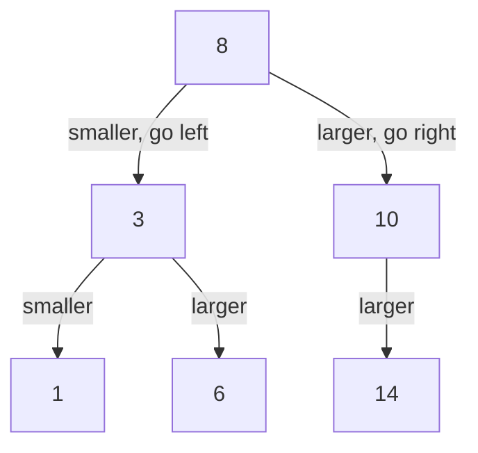
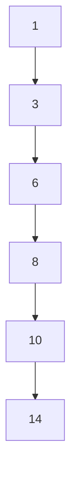

## Before you start

You need `trees` first — a binary search tree is a plain binary tree with exactly one extra rule added on top.

## In one sentence

A **binary search tree (BST)** is a binary tree where, for every node, everything in its left subtree is smaller and everything in its right subtree is larger, which lets you search it the way you'd search a sorted list — by repeatedly halving the space you're looking in.

## Why it matters

A sorted array gives you O(log n) search with binary search, but inserting into the middle costs O(n) because everything has to shift. A BST gives you that same O(log n) search *and* O(log n) insertion and deletion, because fixing the structure only means re-pointing a couple of references, not shifting a block of memory. That combination — fast search, fast insert, fast delete, all at once — is exactly what a plain sorted array can't offer, and it's why BSTs sit underneath ordered maps and sets in many languages.

## The intuition

Think of the game "guess the number, higher or lower." At the root, you compare your target to the current node: if it's smaller, you know it can only be in the left subtree, so you discard the entire right half without looking at it; if it's bigger, you discard the entire left half. Every comparison eliminates roughly half of what remains — the same idea as binary search on a sorted array, but on a structure that also supports cheap insertion.



## How it actually works

**Searching** for a value starts at the root and compares: equal means found, smaller means recurse left, bigger means recurse right, and hitting a `null` means the value isn't in the tree. **Inserting** a value follows the exact same path as a search, then attaches a new node where the search fell off the tree (at the `null` it reached). Both are O(height) — and if the tree is balanced, height is O(log n).

**Deletion** is the tricky one, with three cases: deleting a leaf just removes it; deleting a node with one child replaces it with that child; deleting a node with two children requires finding its **in-order successor** (the smallest value in its right subtree — keep going left until you can't anymore), copying that value into the node being deleted, and then deleting the successor from its original spot (which, being the smallest in that subtree, has at most one child, so it recurses into an easier case).

**Inorder traversal** — left, node, right, from `trees` — visits a BST's values in sorted order for free, precisely because of the left-smaller/right-larger rule.

## Worked example

```js
class BSTNode {
  constructor(value) {
    this.value = value;
    this.left = null;
    this.right = null;
  }
}

function insert(node, value) {
  if (!node) return new BSTNode(value);
  if (value < node.value) node.left = insert(node.left, value);
  else if (value > node.value) node.right = insert(node.right, value);
  return node;
}

function search(node, value) {
  if (!node) return false;
  if (value === node.value) return true;
  return value < node.value ? search(node.left, value) : search(node.right, value);
}

let root = null;
for (const v of [8, 3, 10, 1, 6, 14]) {
  root = insert(root, v);
}
console.log(search(root, 6));  // true
console.log(search(root, 7));  // false
```

Inserting `[8, 3, 10, 1, 6, 14]` in this order builds a roughly balanced tree because the values arrive in a mixed order. Searching for `6` compares against 8 (go left), then 3 (go right), then finds 6 — three comparisons instead of scanning all six values.

## A second example — when it gets harder

The example above works because insertion order happened to be well-mixed. Insert the same six values in **sorted order** instead — `[1, 3, 6, 8, 10, 14]` — and every new value is larger than everything already in the tree, so it always becomes the rightmost node's right child:



This is a valid BST — every node still satisfies left-smaller/right-larger — but it's degenerated into a linked list. Search for `14` now costs six comparisons instead of three, and in general this pattern makes every operation O(n) instead of O(log n), exactly the linked-list-in-disguise trap from `trees`. This is precisely why **self-balancing trees** exist: an **AVL tree** or a **red-black tree** performs extra rotation steps during insertion and deletion specifically to keep height at O(log n) regardless of the order values arrive in, guaranteeing the performance a plain BST only offers by luck.

## Quick reference

| Operation | Balanced BST | Degenerate BST (worst case) | Sorted array |
|---|---|---|---|
| Search | O(log n) | O(n) | O(log n) |
| Insert | O(log n) | O(n) | O(n) — shifting required |
| Delete | O(log n) | O(n) | O(n) — shifting required |
| In-order traversal (sorted output) | O(n) | O(n) | O(n) — already sorted |

## Common mistakes

- Assuming any binary tree that "looks sorted" is a valid BST — the rule must hold for *every* node against its *entire* left and right subtree, not just its immediate children.
- Inserting sorted or nearly-sorted data into a plain BST and being surprised performance degrades to O(n) — this is the classic degenerate-tree trap.
- Getting the two-children deletion case wrong by not fully removing the in-order successor from its original position after copying its value up.
- Confusing a BST with a **binary heap** — a heap only guarantees parent-child ordering, not left/right ordering, so it cannot be searched the way a BST can (see `heaps`).

## What interviewers ask

- **How do you delete a node with two children from a BST?** — Find its in-order successor (smallest value in the right subtree, or equivalently the in-order predecessor, the largest in the left subtree), copy that value into the node, then delete the successor from its original position, which is guaranteed to have at most one child.
- **How would you check if a binary tree is a valid BST?** — Don't just compare each node to its immediate children; recursively pass down a valid `(min, max)` range for each node and check the node's value falls within it, tightening the range as you descend. Comparing only to direct children misses violations further up the tree.
- **Why can a BST degrade to O(n) operations, and how do you prevent it?** — Inserting already-sorted (or adversarially ordered) data produces a tree where every node has only one child, effectively a linked list. Self-balancing variants like AVL or red-black trees perform rotations during insert/delete to guarantee O(log n) height regardless of input order.
- **How do you find the k-th smallest element in a BST?** — Perform an inorder traversal (which visits nodes in sorted order) and stop at the k-th value visited, giving O(h + k) time; augmenting nodes with a subtree-size count can get this down to O(h) per query.

## Practice

1. Implement `insert`, `search`, and `delete` for a BST, handling all three deletion cases.
2. Write a function that validates whether a given binary tree is a correct BST.
3. Find the lowest common ancestor of two nodes in a BST, using the ordering property to avoid a full traversal.

## Where to go next

`heaps` — another tree with an ordering rule, but a looser one (parent vs. children only, not left vs. right), which trades away searchability for an O(1) peek at the minimum or maximum element.
