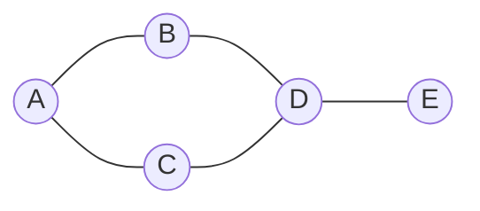

## Before you start

You need `trees` and `queues` — a tree is actually a special, restricted kind of graph, and breadth-first search on a graph reuses the exact queue-based pattern from level-order tree traversal.

## In one sentence

A **graph** is a set of **nodes** (also called vertices) connected by **edges**, with no restriction on how many connections a node can have or whether those connections point in one direction or both — it's the most general way to represent "things and the relationships between them."

## Why it matters

A tree can only model strict hierarchies — one parent per node, no cycles. Real relationships are rarely that tidy: friends on a social network, cities linked by roads, web pages linked to other web pages, tasks that depend on other tasks. Any time "this connects to that, which might connect back to this" describes your data, you need a graph, not a tree — and a huge share of hard interview problems (shortest path, dependency resolution, network connectivity) are graph problems in disguise.

## The intuition

Think of a graph as a subway map. Stations are nodes; the tracks between them are edges. Some lines run in both directions (an **undirected** graph — friendship on Facebook, where if you're my friend, I'm yours too); some are one-way, like a "follows" relationship on Twitter, where you can follow someone who doesn't follow you back (a **directed** graph). Unlike a tree, a subway map can have loops — you can ride in a circle and end up back where you started, which is a **cycle**, something a tree can never contain.

## How it actually works

A graph is represented one of two common ways. An **adjacency list** stores, for each node, a list of the nodes it connects to — efficient in space when edges are sparse (most real-world graphs), and the default choice unless you have a reason to pick otherwise. An **adjacency matrix** stores an n×n grid where cell `[i][j]` marks whether an edge exists between node i and node j — O(1) to check if a specific edge exists, but O(n²) space even if the graph has very few edges.

Traversal has the same two families as trees, generalized:

- **Breadth-first search (BFS)** uses a queue to explore all neighbors at the current distance before moving further out — the standard way to find the shortest path in an unweighted graph, because the first time you reach a node is guaranteed to be via the shortest route.
- **Depth-first search (DFS)** uses recursion or an explicit stack to go as deep as possible down one path before backtracking — natural for exploring all possibilities, detecting cycles, or checking connectivity.

Because graphs can have cycles, both traversals must track a **visited set** — without it, a traversal can loop forever revisiting the same nodes, which is never a concern in a tree.



## Worked example

```js
// Adjacency list representation + breadth-first search
const graph = {
  A: ['B', 'C'],
  B: ['A', 'D'],
  C: ['A', 'D'],
  D: ['B', 'C', 'E'],
  E: ['D'],
};

function bfs(start) {
  const visited = new Set([start]);
  const queue = [start];
  const order = [];

  while (queue.length) {
    const node = queue.shift();
    order.push(node);
    for (const neighbor of graph[node]) {
      if (!visited.has(neighbor)) {
        visited.add(neighbor);      // mark visited the moment it's queued
        queue.push(neighbor);
      }
    }
  }
  return order;
}

console.log(bfs('A')); // [ 'A', 'B', 'C', 'D', 'E' ]
```

`A` is visited first, then both its neighbors `B` and `C` (distance 1), then `D` (distance 2, reached from either B or C — visited prevents processing it twice), then `E` (distance 3). The `visited` set is what stops this from looping forever on the B–D–C–A cycle in the graph.

## A second example — when it gets harder

Drop the `visited` set from the example above and this graph — which contains a cycle (A–B–D–C–A) — sends the traversal into an infinite loop, endlessly re-queueing nodes it has already processed. This is the single most common bug when moving from tree traversal to graph traversal: trees can't have cycles, so beginners carry over tree-traversal code that never tracked visited nodes, and it silently hangs the first time it meets a real graph.

The second common surprise is **disconnected components**. If you run BFS starting from `A` but the graph secretly also contains an island `{F, G}` with no edges to `A`'s component, your traversal will report only `[A, B, C, D, E]` and never see `F` or `G` — not because of a bug, but because they're genuinely unreachable from that starting point. Detecting this requires explicitly looping over *every* node and starting a fresh traversal from any node not yet visited, which is exactly how you'd count the number of separate "islands" in a grid-based graph problem.

## Quick reference

| Representation | Space | Check if edge (u,v) exists | Iterate all neighbors of u |
|---|---|---|---|
| Adjacency list | O(V + E) | O(degree of u) | O(degree of u) |
| Adjacency matrix | O(V²) | O(1) | O(V) |

| Traversal | Data structure used | Finds shortest path (unweighted)? |
|---|---|---|
| BFS | Queue | Yes |
| DFS | Stack (or recursion) | No — finds *a* path, not necessarily shortest |

## Common mistakes

- Forgetting the visited set, causing infinite loops the moment the graph has a cycle — this never bites you in tree problems, which is exactly why it's easy to forget.
- Using DFS when you actually need the shortest path — DFS finds *some* path, but only BFS guarantees the shortest one in an unweighted graph.
- Assuming the graph is fully connected — always account for the possibility that some nodes are unreachable from your starting point.
- Mixing up directed and undirected edges — in an undirected graph, an edge `A–B` must appear in both `A`'s and `B`'s adjacency lists, or your traversal will silently miss connections.

## What interviewers ask

- **When would you use BFS versus DFS?** — BFS when you need the shortest path in an unweighted graph or need to explore level by level; DFS when you need to explore every possibility, detect cycles, or don't care about path length — for example, checking whether a path exists at all.
- **How do you detect a cycle in a graph?** — For an undirected graph, DFS while tracking each node's parent; finding a visited neighbor that isn't the parent means a cycle. For a directed graph, track nodes currently "in progress" on the current DFS path; revisiting one of those means a cycle — this is the basis of detecting circular dependencies.
- **What's the difference between an adjacency list and an adjacency matrix, and when would you pick one over the other?** — A list is space-efficient for sparse graphs (most real graphs) and fast to iterate a node's neighbors; a matrix gives O(1) edge lookups and is simpler for dense graphs, at the cost of O(V²) space regardless of how many edges actually exist.
- **How would you find the shortest path in a weighted graph?** — BFS no longer works because it assumes all edges cost the same. Dijkstra's algorithm, using a priority queue (a heap) to always expand the currently-closest unvisited node, solves this for non-negative weights.

## Practice

1. Given an adjacency list, implement both BFS and DFS, and return the order nodes are visited.
2. Count the number of connected components in an undirected graph (the "number of islands" pattern).
3. Given a list of course prerequisites, determine whether it's possible to finish all courses (detect a cycle in a directed graph — topological sort).

## Where to go next

`tries` — a different specialization of "a tree with structure": instead of a general web of connections, a trie is a tree shaped specifically around shared prefixes of strings.
