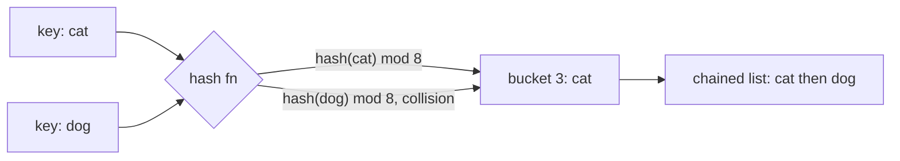

## Before you start

You should be comfortable with `arrays-and-strings` — a hash table is, underneath, an array with a clever trick for turning a key into an index.

## In one sentence

A **hash table** stores key-value pairs so that looking up a value by its key takes roughly constant time, no matter how many items are stored, by using a **hash function** to convert the key into an array index.

## Why it matters

Without a hash table, "does this exist?" or "what's the value for this key?" means scanning every item — O(n). Hash tables turn that into O(1) on average, which is why they're everywhere: caches, database indexes, counting word frequency, deduplicating a list, and the object literals (`{}`) you already use every day in JavaScript.

## The intuition

A hash table is a coat check counter. You hand over your coat (the value) and get a numbered ticket (computed from your key). To get your coat back, you don't describe it to the attendant and wait while they search the whole rack — you hand over the ticket number, and they walk straight to that spot. The hash function is what turns your key into that ticket number.

## How it actually works

A **hash function** takes a key (a string, a number, anything) and produces a number — the **hash code**. That number is reduced (usually with modulo) to fit inside the table's current size, giving an array index. The value is stored at that index. Looking up a key repeats the same computation to jump straight to the right slot, avoiding any search.

The catch: two different keys can hash to the same index. This is a **collision**, and it's not a bug — with a good hash function and enough keys, it's mathematically inevitable (the "birthday paradox" shows collisions happen sooner than intuition suggests). The two standard fixes are **chaining** (each array slot holds a small list of all key-value pairs that landed there) and **open addressing** (on a collision, probe forward to the next free slot instead).



The **load factor** (number of stored items ÷ table size) controls how often collisions happen. As it climbs past roughly 0.7, chains get longer and lookups degrade toward O(n). This is why hash tables **resize**: once the load factor crosses a threshold, the table allocates a bigger backing array and rehashes every existing key into it — an expensive O(n) event that happens rarely enough to keep the *average* cost of each insert at O(1).

## Worked example

```js
// Using JavaScript's built-in Map (a hash table) to count word frequency
function wordFrequency(text) {
  const counts = new Map();
  for (const word of text.toLowerCase().split(/\s+/)) {
    counts.set(word, (counts.get(word) || 0) + 1); // O(1) average per word
  }
  return counts;
}

const result = wordFrequency('the cat sat on the mat the cat ran');
console.log(result.get('the')); // 3
console.log(result.get('cat')); // 2
console.log([...result.entries()]);
// [ ['the', 3], ['cat', 2], ['sat', 1], ['on', 1], ['mat', 1], ['ran', 1] ]
```

Each `.get()` and `.set()` computes a hash of the word and jumps straight to its slot — the loop is O(n) total for n words, not O(n²), because each lookup doesn't depend on how many words came before it.

## A second example — when it gets harder

The naive mental model is "hashing means O(1), always." That breaks down in two ways worth knowing:

**A bad hash function creates a hash table that's secretly a linked list.** Imagine a hash function that only looks at a string's length. Every key with the same length collides into the same slot:

```js
// A deliberately bad hash function
function badHash(key, tableSize) {
  return key.length % tableSize; // ignores everything except length!
}
```

`"cat"`, `"dog"`, and `"ant"` all hash to the same slot. With chaining, that slot's list grows to hold every 3-letter key you insert, and looking any of them up degrades to O(n) — you've built an array that pretends to be a hash table but behaves like a single linked list.

**Object keys and reference equality.** `Map` and `Object` in JavaScript hash primitive keys by value, but if you use a plain object as a key without care, two different object instances with identical contents are treated as different keys, because their hash is based on identity, not content — a common source of "why didn't my lookup find this?" bugs.

## Quick reference

| Operation | Average case | Worst case (many collisions) |
|---|---|---|
| Insert | O(1) | O(n) |
| Lookup by key | O(1) | O(n) |
| Delete | O(1) | O(n) |
| Resize (rehash all keys) | O(n), amortized across inserts | O(n) |

| Collision strategy | How it works | Trade-off |
|---|---|---|
| Chaining | Each slot holds a list of colliding pairs | Simple, but a slot can grow unbounded |
| Open addressing | On collision, probe the next free slot | No extra lists, but clustering can hurt performance |

## Common mistakes

- Assuming hash table operations are *always* O(1) — they're average-case O(1); a poor hash function or adversarial input can force O(n).
- Using a plain object (`{}`) instead of `Map` for arbitrary keys — object keys are coerced to strings, so numeric and object keys don't behave the way you'd expect; `Map` handles any key type correctly.
- Iterating a hash table expecting a guaranteed order — in JavaScript, `Map` preserves insertion order, but many hash table implementations in other languages do not.
- Forgetting that mutating an object after using it as a `Map` key doesn't change its identity — the key still refers to the same object, but relying on its *contents* for lookups (rather than its reference) won't work as expected.

## What interviewers ask

- **How does a hash table achieve O(1) average lookup?** — A hash function converts the key into an array index in constant time, so lookup becomes direct array access rather than a search. The "average" qualifier matters because collisions can degrade this, which is why a well-distributed hash function and a managed load factor are essential.
- **What is a collision, and how do you handle one?** — A collision is when two different keys hash to the same slot. Chaining stores a small list at that slot; open addressing finds the next available slot by probing. Both are standard, and interviewers usually want you to at least name chaining.
- **How would you detect duplicates in an array in better than O(n²)?** — Walk the array once, inserting each element into a hash set; if an element is already in the set, it's a duplicate. This is O(n) time and O(n) space, versus the O(n²) naive nested-loop comparison.
- **Why does a hash table need to resize, and why is that not a performance problem in practice?** — As more items are inserted, the load factor rises and collisions become more frequent, degrading lookups toward O(n). Resizing (allocating a bigger table and rehashing everything) happens rarely relative to the number of inserts, so its O(n) cost is amortized down to O(1) per insert on average.

## Practice

1. Implement a hash set from scratch using an array and chaining, supporting `add`, `has`, and `remove`.
2. Given two arrays, find their intersection in O(n + m) time using a hash set.
3. Group a list of strings into anagram groups (e.g. `"eat"`, `"tea"`, `"ate"` together) using a hash map keyed by sorted characters.

## Where to go next

`trees` — hash tables give you fast lookup but no useful ordering; trees are the structure that gets you both ordering and efficient search, at the cost of giving up hash tables' O(1) average lookup for O(log n).
