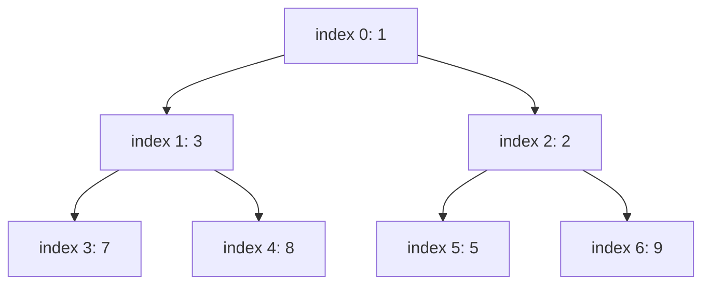

## Before you start

You need `trees` (a heap is a binary tree) and `arrays-and-strings` (a heap is almost always stored in a plain array, not with node pointers).

## In one sentence

A **heap** is a binary tree where every parent is smaller than its children (a **min-heap**) or larger than its children (a **max-heap**), which makes finding the smallest — or largest — element instant, without keeping everything else fully sorted.

## Why it matters

Sometimes you don't need the whole collection sorted — you just repeatedly need "give me the current minimum" or "give me the current highest priority," even as new items keep arriving. Sorting the whole thing every time an item is added would be wasteful. A heap gives you the extreme value in O(1) and lets you remove it and get the *new* extreme value in O(log n), which is exactly the access pattern behind task schedulers, Dijkstra's shortest-path algorithm, and "top K" problems.

## The intuition

Think of a heap like a tournament bracket, but upside down: the strongest player is always at the top (the root), and every match winner is guaranteed to be stronger than whoever they beat below them — but there's no guarantee about how the two semifinalists on opposite sides of the bracket compare to each other. That's the whole trick of a heap: strict order going up toward the root, no ordering promise sideways.

## How it actually works

A heap only enforces the **heap property**: every parent is ≤ its children (min-heap) or ≥ its children (max-heap). It says nothing about left versus right, which is exactly what distinguishes it from a BST — a heap is easy to keep balanced, but you cannot search it for an arbitrary value the way you can a BST.

Because a heap is always a **complete binary tree** (every level full except possibly the last, which fills left to right), it can be stored in a plain array with no pointers at all: for a node at index `i`, its children live at `2i + 1` and `2i + 2`, and its parent at `Math.floor((i - 1) / 2)`.

Two operations keep the heap property intact after a change:

- **Sift up** (used after inserting at the end of the array): repeatedly swap the new element with its parent while it's smaller than the parent (min-heap), until the property holds.
- **Sift down** (used after removing the root, which is replaced by the last element): repeatedly swap the element with its smaller child until the property holds.



The array `[1, 3, 2, 7, 8, 5, 9]` and the tree above are the same min-heap — index `i`'s children always live at `2i + 1` and `2i + 2`, so no pointers are needed at all.

A **priority queue** is the abstract idea ("always give me the highest-priority item next"); a heap is the concrete, efficient way to implement one.

## Worked example

```js
class MinHeap {
  constructor() { this.data = []; }

  push(value) {
    this.data.push(value);
    let i = this.data.length - 1;
    while (i > 0) {
      const parent = Math.floor((i - 1) / 2);
      if (this.data[parent] <= this.data[i]) break;
      [this.data[parent], this.data[i]] = [this.data[i], this.data[parent]]; // sift up
      i = parent;
    }
  }

  pop() {
    const top = this.data[0];
    const last = this.data.pop();
    if (this.data.length) {
      this.data[0] = last;
      let i = 0;
      while (true) {
        const left = 2 * i + 1, right = 2 * i + 2;
        let smallest = i;
        if (left < this.data.length && this.data[left] < this.data[smallest]) smallest = left;
        if (right < this.data.length && this.data[right] < this.data[smallest]) smallest = right;
        if (smallest === i) break;
        [this.data[i], this.data[smallest]] = [this.data[smallest], this.data[i]]; // sift down
        i = smallest;
      }
    }
    return top;
  }
}

const heap = new MinHeap();
[5, 2, 8, 1, 9].forEach(v => heap.push(v));
console.log(heap.pop()); // 1 — the current minimum
console.log(heap.pop()); // 2 — the new minimum, in O(log n)
```

Each `push` appends to the end of the array then sifts up in O(log n); each `pop` returns the root, moves the last element to the top, and sifts it down in O(log n) — the array never needs to be fully re-sorted.

## A second example — when it gets harder

The naive assumption is "the heap array is basically sorted, so I could just read off the top few elements directly." That's true only for the very first element. Look at a valid min-heap laid out as an array:

```
Array:        [1, 3, 2, 7, 8, 5, 9]
As a tree:          1
                   / \
                  3   2
                 / \ / \
                7  8 5  9
```

`data[0]` is guaranteed to be the minimum, `1`. But `data[1]` and `data[2]` are `3` and `2` — not necessarily the second- and third-smallest overall. In fact the second smallest here is `2`, sitting at index 2, while index 1 holds `3`. If you need the true "top K smallest" values, you cannot just read the first K array slots — you must pop K times (each pop is O(log n), so K pops cost O(K log n)), because popping is the only operation that guarantees the next-smallest bubbles correctly to the root.

## Quick reference

| Operation | Time complexity |
|---|---|
| Peek min/max (root) | O(1) |
| Insert (push) | O(log n) |
| Remove min/max (pop) | O(log n) |
| Build a heap from n unsorted elements | O(n) — not O(n log n) |
| Search for an arbitrary value | O(n) — no ordering to exploit |

## Common mistakes

- Assuming the heap array is fully sorted — only the root is guaranteed to be the extreme value; siblings have no defined order relative to each other.
- Trying to search a heap for an arbitrary value as if it were a BST — a heap gives you no shortcut for that; it only optimizes access to the single extreme value.
- Forgetting to sift down after replacing the root with the last element during a pop, leaving the heap property violated.
- Confusing a min-heap with a max-heap when picking a library implementation — many languages' built-in priority queues default to one or the other, and getting it backward silently returns results in the wrong order.

## What interviewers ask

- **How would you find the k largest elements in an array?** — Maintain a min-heap of size k: push each element, and whenever the heap exceeds size k, pop the minimum. What remains is the k largest, and this runs in O(n log k), better than sorting the whole array when k is small.
- **Why is building a heap from n elements O(n) and not O(n log n)?** — Because most nodes in a complete binary tree are near the bottom, where sift-down has very little distance to travel; the total work sums to O(n) rather than n calls to an O(log n) operation, a result that's easy to misjudge without doing the math.
- **How is a heap different from a binary search tree?** — A heap only guarantees parent-child ordering (weaker), while a BST guarantees a full left-smaller/right-larger ordering (stronger). That extra structure is what lets a BST support search in O(log n), which a heap cannot do.
- **How would you implement a priority queue for a task scheduler?** — Use a min-heap keyed by priority (or deadline); `pop()` always returns the most urgent task in O(log n), and new tasks can be inserted at any time in O(log n) without disturbing already-scheduled ones.

## Practice

1. Implement a min-heap from scratch with `push` and `pop`, and use it to sort an array (heapsort).
2. Given a stream of numbers, maintain the median efficiently using two heaps (a max-heap for the lower half, a min-heap for the upper half).
3. Merge k sorted linked lists into one sorted list using a min-heap to always pick the next smallest head.

## Where to go next

`graphs` — heaps show up again immediately once you study weighted shortest-path algorithms like Dijkstra's, which use a priority queue to always expand the closest unvisited node next.
