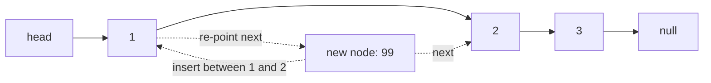

## Before you start

You should already be comfortable with `arrays-and-strings` — a linked list solves the exact problem that makes array insertion slow.

## In one sentence

A **linked list** is a chain of items where each item (a **node**) holds its value plus a pointer to the next node, instead of all items sitting side by side like an array.

## Why it matters

Arrays are fast to read but expensive to grow or shrink in the middle, because every later element must shift. Linked lists solve exactly that problem: inserting or removing a node only means re-pointing a couple of links, which is why they show up under the hood of queues, undo history, and "play next" features in music apps. Whenever you see "insert/remove frequently, rarely need to jump to a specific position," that's a strong hint a linked list — or a structure built on one — beats a plain array.

## The intuition

Think of a linked list like a treasure hunt: each clue tells you where to find the next clue, but you can't jump straight to clue 5 — you have to follow the chain from the start. That's the trade-off versus an array: no random access, but cheap insertion and deletion once you're standing at the right spot.

## How it actually works

A **singly linked list** node points only forward, to the next node. A **doubly linked list** node points both forward and backward, which makes it easy to walk in either direction and to delete a node in O(1) once you already have a reference to it, since you don't need to re-find its predecessor. A **circular linked list** is either variant with the last node pointing back to the first instead of to `null`, useful for things like round-robin scheduling.



Every list keeps a `head` pointer (the start), and often a `tail` pointer (the end) so appending doesn't require walking the whole list. The last node's `next` is `null`, which is how you know you've reached the end.

Inserting a node in the middle of a list is where the whole trade-off with arrays becomes concrete: you don't move any existing data at all. You create the new node, point its `next` at whatever the previous node used to point at, and then point the previous node's `next` at the new node. Two pointer writes, regardless of whether the list has 10 nodes or 10 million — compare that to an array insert at the same logical position, which shifts every element after it.

## Worked example

```js
class Node {
  constructor(value) {
    this.value = value;
    this.next = null;
  }
}

class LinkedList {
  constructor() {
    this.head = null;
    this.tail = null;
  }

  push(value) {
    const node = new Node(value);
    if (!this.head) {
      this.head = node;
      this.tail = node;
    } else {
      this.tail.next = node;
      this.tail = node;
    }
  }

  toArray() {
    const out = [];
    let current = this.head;
    while (current) {
      out.push(current.value);
      current = current.next;
    }
    return out;
  }
}

const list = new LinkedList();
list.push(1);
list.push(2);
list.push(3);
console.log(list.toArray()); // [1, 2, 3]
```

`push` never walks the list — it just re-points `tail.next` and moves `tail` — which is why appending is O(1) as long as you keep a tail pointer.

## A second example — when it gets harder

The naive mental model is "a list is just a slower array," but the real trap is **cycles**. If a bug (or a deliberate circular list) makes some node's `next` point back to an earlier node instead of eventually reaching `null`, a plain `while (current) { current = current.next }` loop never terminates:

```js
// node C accidentally points back to node A — infinite loop if you just walk it
a.next = b;
b.next = c;
c.next = a; // bug, or an intentional circular list
```

The fix that every interviewer expects is **Floyd's cycle detection** (the "tortoise and hare"): run two pointers, one stepping once per iteration and one stepping twice. If there's a cycle, the fast pointer eventually laps the slow one and they meet; if there's no cycle, the fast pointer reaches `null` first. This runs in O(n) time and O(1) space, versus a hash-set approach that also works but costs O(n) space.

## Quick reference

| Operation | Singly linked | Doubly linked | Array (for comparison) |
|---|---|---|---|
| Access by index | O(n) | O(n) | O(1) |
| Insert/delete at head | O(1) | O(1) | O(n) |
| Insert/delete at tail (with tail pointer) | O(1) | O(1) | O(1) amortized |
| Delete a given node (reference in hand) | O(n) — must find predecessor | O(1) | O(n) |
| Search by value | O(n) | O(n) | O(n) |

## Common mistakes

- Losing the reference to the rest of the list by overwriting `next` before saving it — always save `const next = current.next` before rewiring.
- Forgetting to update `tail` after removing the last node, leaving it pointing at a detached node.
- Off-by-one errors when the list is empty or has exactly one node — always test these edge cases separately.
- Trying to binary search a linked list — you can't jump to the middle without walking there first, so binary search's O(log n) advantage disappears.

## What interviewers ask

- **How do you reverse a singly linked list?** — Walk the list once, and at each node flip its `next` pointer to point backward instead of forward, tracking `previous`, `current`, and `next` as you go. It's O(n) time and O(1) space, and interviewers want to see you handle the pointer reassignment without losing the rest of the chain.
- **How do you detect a cycle in a linked list?** — Floyd's tortoise-and-hare: a slow pointer moves one step and a fast pointer moves two steps per iteration; if they ever point to the same node, there's a cycle. This is the expected O(1)-space answer, versus a hash set which is O(n) space but easier to explain.
- **When would you choose a linked list over an array?** — When you're doing frequent insertions or deletions at the front or in the middle and don't need random access by index — for example, implementing a queue or an LRU cache's eviction list.
- **How do you find the middle of a linked list in one pass?** — Use slow and fast pointers again: when the fast pointer (moving two steps) reaches the end, the slow pointer (moving one step) is at the middle.

## Practice

1. Reverse a singly linked list, iteratively and then recursively.
2. Detect whether a linked list has a cycle, and if it does, find the node where the cycle begins.
3. Merge two sorted linked lists into one sorted list without allocating a new list — reuse the existing nodes.

## Where to go next

`stacks` — a stack can be built directly on top of a singly linked list (push/pop at the head are both O(1)), which is a natural next step now that you understand node pointers.
