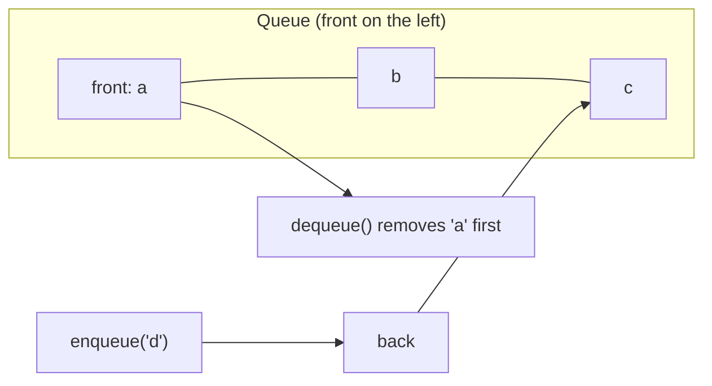

## Before you start

Read `stacks` first — a queue is easiest to understand as "the other order," and the contrast is where it clicks.

## In one sentence

A **queue** is a collection where you add items at one end and remove them from the other, so the first thing you put in is the first thing that comes out — **FIFO**, first-in-first-out.

## Why it matters

Anything that needs to be processed in the order it arrived needs a queue: print jobs, customer support tickets, requests hitting a server, or tasks waiting for a worker. Fairness is the point — a stack would let the newest request jump the line and starve everything already waiting, which is exactly the wrong behavior for a job queue or a support ticket system. It's also the engine behind **breadth-first search**, which you'll meet again in `trees` and `graphs` — without a queue, you cannot correctly explore "everything one step away, then everything two steps away," because that guarantee depends entirely on processing discoveries in the order they were made.

## The intuition

A queue is a line at a coffee shop. New customers join at the back. The barista serves whoever has been waiting longest, at the front. Nobody gets served out of order just because they're standing closer to the counter.



## How it actually works

A queue supports **enqueue** (add to the back) and **dequeue** (remove from the front). Both should be O(1) — and that's where a naive array implementation trips people up. `array.push()` is O(1) because it touches the end, but `array.shift()` (removing the front) is O(n) because every remaining element has to shift down one index to fill the gap.

The fix is either a **doubly linked list** (O(1) at both ends, since you keep head and tail pointers) or a **circular buffer** (a fixed-size array with `front` and `back` indices that wrap around, avoiding any shifting). A **deque** (double-ended queue) generalizes this further, allowing O(1) insertion and removal at *both* ends — useful when you need queue and stack behavior in the same structure.

A circular buffer is worth understanding on its own, because it's the version you'll actually find inside high-performance systems. Instead of growing and shrinking, it allocates a fixed block of memory once and tracks two indices, `front` and `back`. When `back` reaches the end of the block, it wraps around to index 0 as long as there's free space behind `front` — hence "circular." This avoids both the shifting cost of `array.shift()` and the per-node memory overhead of a linked list, at the price of needing to know (or cap) the maximum size in advance.

## Worked example

```js
// A queue built on a doubly linked list — enqueue and dequeue are both O(1)
class Node {
  constructor(value) {
    this.value = value;
    this.next = null;
  }
}

class Queue {
  constructor() {
    this.head = null; // front — dequeue from here
    this.tail = null; // back — enqueue to here
    this.size = 0;
  }

  enqueue(value) {
    const node = new Node(value);
    if (!this.tail) {
      this.head = this.tail = node;
    } else {
      this.tail.next = node;
      this.tail = node;
    }
    this.size++;
  }

  dequeue() {
    if (!this.head) return undefined;
    const value = this.head.value;
    this.head = this.head.next;
    if (!this.head) this.tail = null;
    this.size--;
    return value;
  }
}

const q = new Queue();
q.enqueue('a');
q.enqueue('b');
q.enqueue('c');
console.log(q.dequeue()); // "a" — the first one in
console.log(q.dequeue()); // "b"
```

Enqueue always attaches at `tail` and dequeue always removes from `head` — neither operation ever walks the list, so both stay O(1) regardless of queue size.

## A second example — when it gets harder

The naive "array as a queue" looks fine until you measure it at scale. Using `array.shift()` for dequeue seems correct — and it is, functionally — but it silently turns an O(n) operation into the hot path of your loop:

```js
const queue = [];
for (let i = 0; i < 100000; i++) queue.push(i);
while (queue.length) {
  const item = queue.shift(); // O(n) every single call
}
```

Each `shift()` re-indexes every remaining element, so draining 100,000 items costs roughly 100,000 + 99,999 + ... ≈ 5 billion element moves — an O(n²) drain that can take seconds instead of milliseconds. This is the same trap as `unshift()` from `arrays-and-strings`, and it's why production queue implementations (message brokers, task queues, BFS traversal) always use a linked list or circular buffer instead of a plain array with `shift()`.

## Quick reference

| Operation | Array (`push`/`shift`) | Linked-list-backed queue | Circular buffer |
|---|---|---|---|
| Enqueue (add to back) | O(1) amortized | O(1) | O(1) |
| Dequeue (remove from front) | O(n) | O(1) | O(1) |
| Peek front | O(1) | O(1) | O(1) |
| Extra memory per item | None | One pointer | None (fixed-size array) |

## Common mistakes

- Using `array.shift()` for dequeue in a hot loop, not realizing it's O(n) — use a linked list or circular buffer instead for large or frequent queues.
- Confusing queue order with stack order — a queue serves the oldest item first, a stack serves the newest.
- Forgetting to reset `tail` to `null` when dequeuing the last remaining item in a linked-list queue, leaving a dangling reference.
- Assuming a "priority queue" is the same as a regular queue — it isn't; it dequeues by priority, not by arrival order (see `heaps`).

## What interviewers ask

- **Why is `array.shift()` a bad choice for a queue's dequeue operation?** — Because removing the first element of an array forces every remaining element to shift down one index, making it O(n) instead of the O(1) you'd want. A linked list or circular buffer avoids this by never needing to move existing elements.
- **How do you implement a queue using two stacks?** — Push new items onto an "in" stack; when you need to dequeue and the "out" stack is empty, pop everything from "in" into "out" (reversing the order), then pop from "out". Amortized, each element is moved at most twice, giving O(1) amortized dequeue.
- **How does a queue enable breadth-first search?** — BFS needs to explore nodes in the order they were discovered — visit all neighbors of the start node before any of their neighbors. A queue enforces exactly that discovery order; using a stack instead would turn it into depth-first search.
- **What's a deque and when would you use one?** — A double-ended queue supports O(1) insertion and removal at both ends, useful for sliding-window problems (like tracking a maximum over a moving window) where you need to add and remove from both sides efficiently.

## Practice

1. Implement a queue using two stacks, and reason about its amortized time complexity.
2. Use a queue to implement level-order (breadth-first) traversal of a binary tree, printing one level per line.
3. Implement a fixed-size circular buffer that supports `enqueue` and `dequeue` in O(1) without ever shifting elements.

## Where to go next

`hash-tables` — a different kind of building block: instead of ordering items by arrival, a hash table organizes them for near-instant lookup by key, which is the next major idea in this chapter.
