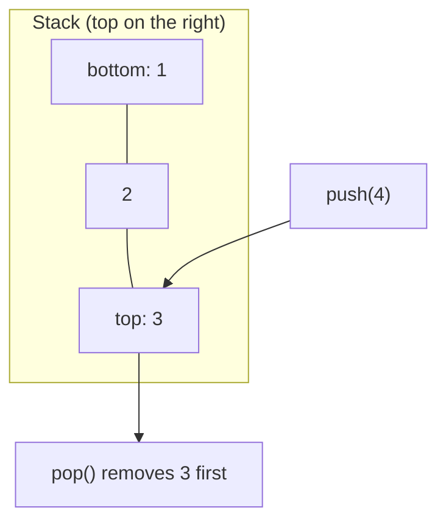

## Before you start

Helpful but not required: `arrays-and-strings` (a stack is often built on an array) or `linked-lists` (a stack can be built on a list's head).

## In one sentence

A **stack** is a collection where you can only add or remove from one end, so the last thing you put in is the first thing that comes out — **LIFO**, last-in-first-out.

## Why it matters

Some problems only make sense in reverse order of how you encountered them: undoing your last action, backtracking out of a maze, or unwinding function calls when a program crashes. A stack is the natural fit whenever "the most recent thing" is what you need next, and it quietly powers your browser's back button, the call stack every function call uses, and undo/redo in every editor you've used. Any time you see the phrase "undo the last operation" or "backtrack to where I came from," that's a strong signal the right tool is a stack, not a queue or a plain array.

## The intuition

A stack is a pile of plates. You can only take a plate off the top, and you can only add a new plate to the top — reaching into the middle of the pile isn't allowed. The plate you put down most recently is always the first one you'll pick back up.



## How it actually works

A stack supports exactly two core operations: **push** (add to the top) and **pop** (remove from the top), plus usually a **peek** (look at the top without removing it). Both push and pop only ever touch the top element, which is exactly why they're O(1) — no shifting, no searching.

You rarely need to build a stack from scratch: a plain array already gives you a stack if you only ever call `push()` and `pop()` on it (both operate on the end of the array, which is cheap). If you need guaranteed O(1) even for enormous stacks, a linked list where you push and pop at the head works identically, avoiding any resizing concerns.

Notice the discipline a stack imposes is really just a restriction: it's an array (or a list) with two of its operations locked away. You cannot read the third element from the top, you cannot insert in the middle, and you cannot iterate front-to-back the way you would a normal array — you can only ever see and touch the top. That restriction is the entire value of the abstraction: it makes the LIFO guarantee impossible to violate by accident, which is exactly what you want when correctness depends on strict ordering, like matching brackets or unwinding a call stack.

## Worked example

```js
// A stack built on an array, used to check balanced parentheses
function isBalanced(input) {
  const stack = [];
  const pairs = { ')': '(', ']': '[', '}': '{' };

  for (const char of input) {
    if (char === '(' || char === '[' || char === '{') {
      stack.push(char);           // opening bracket: push it
    } else if (char in pairs) {
      if (stack.pop() !== pairs[char]) return false; // closing bracket: must match the top
    }
  }
  return stack.length === 0; // everything must have been closed
}

console.log(isBalanced('{[()]}')); // true
console.log(isBalanced('{[(])}')); // false — order is wrong
```

Each opening bracket is pushed; each closing bracket pops the most recent opening bracket and checks it matches. Output confirms `{[()]}` closes everything in the right order, while `{[(])}` closes `(` before `[`, which the stack catches immediately.

## A second example — when it gets harder

The naive understanding of a stack stops at "matching brackets." The harder case is when you need to know the top of the stack *and* something aggregated about everything below it — like the minimum value in the whole stack, in O(1), even after pops.

You can't just scan the stack each time (that's O(n) per query). The trick is a **second stack** that tracks the running minimum alongside the main one:

```js
class MinStack {
  constructor() {
    this.stack = [];
    this.minStack = []; // minStack[i] = min of stack[0..i]
  }
  push(value) {
    this.stack.push(value);
    const currentMin = this.minStack.length
      ? Math.min(value, this.minStack[this.minStack.length - 1])
      : value;
    this.minStack.push(currentMin);
  }
  pop() {
    this.minStack.pop();
    return this.stack.pop();
  }
  getMin() {
    return this.minStack[this.minStack.length - 1];
  }
}
```

Every push also pushes the minimum-so-far onto a parallel stack, so popping one pops both and `getMin()` stays O(1) no matter how deep the stack is. This "track extra state alongside the stack" pattern shows up constantly once problems go beyond simple matching.

## Quick reference

| Operation | Array-backed stack | Linked-list-backed stack |
|---|---|---|
| Push | O(1) amortized | O(1) |
| Pop | O(1) | O(1) |
| Peek (top) | O(1) | O(1) |
| Search for a value | O(n) | O(n) |
| Access by index (not the top) | Not supported by the ADT | Not supported by the ADT |

## Common mistakes

- Popping without checking if the stack is empty first, causing `undefined` to slip through your logic silently.
- Reaching into the middle of the "stack" (e.g. `stack[2]`) — if your code needs that, you don't actually need a stack, you need an array.
- Forgetting that recursion uses a stack implicitly: deep, unbounded recursion will overflow the **call stack**, the same way pushing forever overflows any stack.
- Using a stack when you actually need FIFO order — that's a queue, not a stack; mixing them up silently reverses your output order.

## What interviewers ask

- **How would you check for balanced parentheses in a string?** — Push every opening bracket onto a stack; on each closing bracket, pop and verify it matches the expected opener. The string is balanced only if the stack is empty at the end. This tests whether you reach for LIFO order instead of counting brackets, which fails on nesting order.
- **How do you implement a queue using two stacks?** — Push all elements into stack A for enqueue; for dequeue, if stack B is empty, pop everything from A into B (which reverses the order), then pop from B. This is the classic way to interviewers to test whether you understand how LIFO can simulate FIFO.
- **How is the call stack related to recursion?** — Every function call pushes a new frame (its local variables and return address) onto the call stack, and returning pops it off. Recursion that doesn't hit a base case keeps pushing frames until it overflows — a "stack overflow" is literally this stack running out of space.
- **Design a stack that returns its minimum element in O(1).** — Keep a second stack that stores the running minimum alongside every push, so both push and `getMin()` stay O(1) without rescanning the stack.

## Practice

1. Implement `isBalanced` for parentheses, brackets, and braces mixed together in one string.
2. Evaluate a postfix (Reverse Polish Notation) expression like `"3 4 + 2 *"` using a stack.
3. Implement a `MinStack` that supports push, pop, top, and retrieving the minimum, all in O(1).

## Where to go next

`queues` — a queue looks almost identical to a stack in its interface (add, remove, peek) but flips the order to FIFO, which is the clearest way to see why the "which end you use" decision matters so much.
