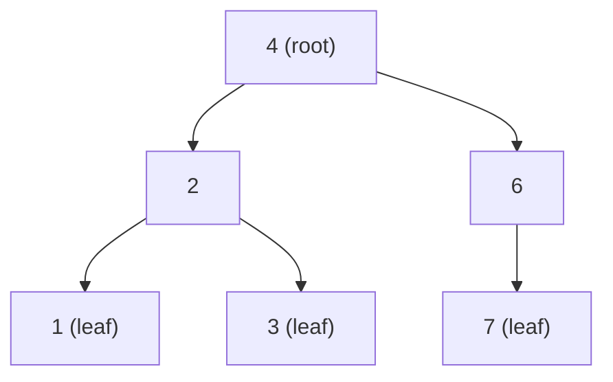

## Before you start

You need `linked-lists` (a tree node is a lot like a list node, just with more than one "next"). Comfort with basic recursion helps, but this topic will teach you enough to get by.

## In one sentence

A **tree** is a set of connected nodes where each node has exactly one parent (except the topmost **root**, which has none), and data branches out instead of sitting in a single line.

## Why it matters

Lots of real data is naturally hierarchical, not linear: a file system's folders, an HTML page's DOM, a company's org chart, the decisions in a chess engine. A tree is the structure that represents "this contains these, which each contain these" — a linked list simply has no way to express branching, and an array has no way to express hierarchy at all.

## The intuition

A tree is a family tree, drawn the way you'd expect: one ancestor at the top, children branching below, and their children branching further. You can only get from one person to another by tracing a path up and back down through their common ancestor — there's no shortcut sideways.

## How it actually works

Each **node** holds a value and references to its **children**. A node with no children is a **leaf**. The **depth** of a node is how many steps it is from the root; the tree's **height** is the depth of its deepest leaf. A **binary tree** restricts every node to at most two children, conventionally called `left` and `right` — the simplest and most common shape, and the one nearly every interview question means when it says "tree."



You explore a tree by **traversal**, and there are two families:

- **Depth-first traversals** go as deep as possible down one branch before backtracking, implemented naturally with recursion (or an explicit stack). The three orders — **preorder** (visit node, then left, then right), **inorder** (left, node, right), and **postorder** (left, right, node) — differ only in *when* you process the current node relative to its children.
- **Breadth-first traversal** (also called **level-order**) visits all nodes at depth 1, then all at depth 2, and so on, using a queue instead of recursion — the same queue you met in `queues`.

## Worked example

```js
class TreeNode {
  constructor(value, left = null, right = null) {
    this.value = value;
    this.left = left;
    this.right = right;
  }
}

//        4
//       / \
//      2   6
//     / \   \
//    1   3   7
const root = new TreeNode(4,
  new TreeNode(2, new TreeNode(1), new TreeNode(3)),
  new TreeNode(6, null, new TreeNode(7))
);

function inorder(node, out = []) {
  if (!node) return out;
  inorder(node.left, out);
  out.push(node.value);
  inorder(node.right, out);
  return out;
}

console.log(inorder(root)); // [1, 2, 3, 4, 6, 7]
```

The recursion visits the left subtree fully, records the current node, then visits the right subtree — for this particular tree, inorder happens to print the values in sorted order, which is not a coincidence (see `binary-search-trees`).

## A second example — when it gets harder

The naive picture of a tree is small and balanced, like the one above. The case that breaks that intuition is a tree built from already-sorted input, inserted one node at a time with each new value going to the right child:

```js
// Inserting 1, 2, 3, 4, 5 in order, always going right, produces:
// 1
//  \
//   2
//    \
//     3
//      \
//       4
//        \
//         5
```

This is technically still a valid binary tree, but it's really a linked list wearing a tree's clothing. Any operation that relies on tree height being small — like search — degrades from the O(log n) you'd expect from a "balanced" tree to O(n), because you have to walk every node to reach the bottom. This is precisely the motivation for self-balancing trees, and it's the first thing to check when a tree-based solution is mysteriously slow: is the tree actually balanced, or did the input order turn it into a chain?

## Quick reference

| Traversal | Order | Typical use |
|---|---|---|
| Preorder (node, left, right) | Root first | Copying/serializing a tree |
| Inorder (left, node, right) | Sorted order (for a BST) | Reading values in order |
| Postorder (left, right, node) | Root last | Deleting a tree, evaluating expressions |
| Level-order (breadth-first) | Top row to bottom row | Shortest-path-style problems, printing by level |

| Property | Meaning |
|---|---|
| Height | Number of edges from root to the deepest leaf |
| Balanced | Height is O(log n) relative to node count |
| Degenerate | Every node has at most one child — behaves like a linked list |

## Common mistakes

- Forgetting the base case in a recursive traversal (`if (!node) return`), causing a crash on `null` children.
- Confusing preorder, inorder, and postorder — the fastest way to remember them is by *when* the current node is processed relative to "left, right."
- Assuming a tree is balanced without checking — an adversarial or sorted input can produce a degenerate, list-like tree with O(n) operations.
- Using recursion on a very deep tree without considering stack depth — an unbalanced tree with 100,000 nodes can overflow the call stack; an explicit stack-based traversal avoids that.

## What interviewers ask

- **What's the difference between preorder, inorder, and postorder traversal?** — They differ in when the current node is visited relative to its children: before both (preorder), between them (inorder), or after both (postorder). Interviewers often follow up by asking which one to use to, say, clone a tree (preorder) or safely delete one bottom-up (postorder).
- **How do you traverse a tree level by level?** — Use a queue: start with the root in the queue, and repeatedly dequeue a node, process it, and enqueue its children. This is breadth-first search applied to a tree, and it's the same pattern used for shortest-path problems on graphs.
- **What is the height of a tree, and how do you compute it?** — The height is the longest path from the root to a leaf. Recursively, a node's height is `1 + max(height(left), height(right))`, with a null node having height -1 or 0 depending on convention — always clarify which convention you're using.
- **Can you traverse a tree without recursion?** — Yes — maintain an explicit stack (for depth-first) or queue (for breadth-first) and push/pop nodes manually, mimicking what the call stack does automatically in the recursive version. This matters for very deep trees where recursion risks a stack overflow.

## Practice

1. Implement preorder, inorder, and postorder traversal both recursively and iteratively (using an explicit stack).
2. Given a binary tree, compute its maximum depth.
3. Given a binary tree, print its values level by level (breadth-first), one line per level.

## Where to go next

`binary-search-trees` — trees become dramatically more useful once you add one ordering rule: everything to the left of a node is smaller, everything to the right is larger.
