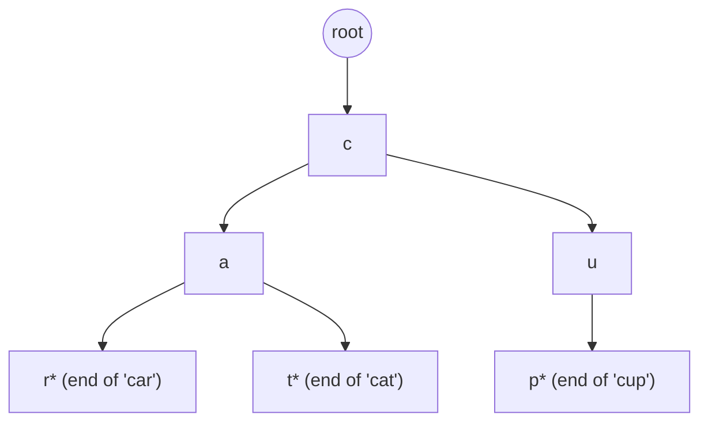

## Before you start

You need `trees` — a trie is a tree where the structure itself, not a comparison rule like in `binary-search-trees`, is built around shared string prefixes.

## In one sentence

A **trie** (pronounced "try", short for re**trie**val) is a tree where each path from the root spells out a string one character at a time, and words sharing the same prefix literally share the same path through the tree.

## Why it matters

A hash table can tell you instantly whether an exact word exists, but it's useless for "what words start with `pre`?" — you'd have to check every stored word. A trie makes prefix questions cheap: autocomplete, spell-checkers, and IP routing tables all need exactly this "what matches so far?" query, and a trie answers it in time proportional to the length of the prefix, not the number of words stored.

## The intuition

Think of a trie as the branching structure of a phone directory sorted letter by letter. Every name starting with "CA" — Carl, Carla, Cassidy — shares the same first two branches, `C` then `A`, and only splits where the names actually differ. Walking down the shared branches for "CA" instantly gives you every name that starts that way, without touching any name that doesn't share that prefix.

## How it actually works

Each **node** represents one character position and holds a map from the next character to a child node, plus a flag marking whether a complete word ends at that node (important — `"car"` might be a word while `"ca"`, one step up, is only a prefix of something else, not a word on its own).



`"car"`, `"cat"`, and `"cup"` all start at the shared root; `car` and `cat` additionally share the `c → a` path and only diverge at the third letter. The `*` marks a node where a real word ends, distinguishing "a complete word" from "just a prefix on the way to one."

**Inserting** a word walks from the root, creating any missing child nodes for each character, and marks the final node as end-of-word. **Searching** for a word walks the same path and returns true only if every character exists *and* the final node is marked end-of-word (otherwise you've only found a prefix, not a stored word). **Prefix search** (used for autocomplete) is identical to search but skips the end-of-word check — reaching the end of the prefix successfully is enough.

## Worked example

```js
class TrieNode {
  constructor() {
    this.children = new Map();
    this.isEndOfWord = false;
  }
}

class Trie {
  constructor() { this.root = new TrieNode(); }

  insert(word) {
    let node = this.root;
    for (const char of word) {
      if (!node.children.has(char)) node.children.set(char, new TrieNode());
      node = node.children.get(char); // walk down, creating nodes as needed
    }
    node.isEndOfWord = true;
  }

  startsWith(prefix) {
    let node = this.root;
    for (const char of prefix) {
      if (!node.children.has(char)) return false;
      node = node.children.get(char);
    }
    return true; // reached the end of the prefix — that's enough
  }
}

const trie = new Trie();
['car', 'cat', 'cup'].forEach(w => trie.insert(w));
console.log(trie.startsWith('ca'));  // true — "car" and "cat" both match
console.log(trie.startsWith('cu'));  // true — "cup" matches
console.log(trie.startsWith('do')); // false — no word starts this way
```

Inserting three words builds the shared-prefix shape from the diagram above; `startsWith('ca')` walks only two steps from the root and immediately confirms a match exists, without ever comparing against the full stored words.

## A second example — when it gets harder

The naive trie implementation conflates "this path exists" with "this is a stored word," which breaks the moment prefixes overlap fully. Insert only `"car"` and `"carpet"`:

```js
const trie2 = new Trie();
trie2.insert('car');
trie2.insert('carpet');
console.log(trie2.startsWith('car')); // true — correct, but is "car" itself a word?
```

`startsWith('car')` correctly returns true, but that alone can't tell you whether `"car"` was ever inserted as a complete word, or whether you're only standing at a *prefix* of `"carpet"`. This is exactly why every node needs its own `isEndOfWord` flag rather than relying on "is this a leaf" — in this trie, the node for `"car"` is not a leaf (it still has a child for `p`), yet it must correctly report itself as a complete word. Forgetting this flag is the most common trie bug: code that treats "has children" and "is a real word" as the same thing.

## Quick reference

| Operation | Time complexity | Notes |
|---|---|---|
| Insert a word of length L | O(L) | Independent of how many words are already stored |
| Search for an exact word of length L | O(L) | Must also check the end-of-word flag |
| Check if any word starts with a prefix of length L | O(L) | The core advantage over a hash table |
| Space | O(total characters across all words), with shared prefixes reducing this | Can be much less than storing every word separately |

## Common mistakes

- Treating "reached the last character" as "found a word" — you must also check the `isEndOfWord` flag, or a search for `"car"` will report true just because `"carpet"` exists.
- Using a fixed-size array of 26 children per node when the input isn't guaranteed to be lowercase English letters — a `Map` is safer and still fast for mixed-case or Unicode input.
- Forgetting that deleting a word from a trie may need to remove now-unused nodes — simply unsetting `isEndOfWord` is correct only if you don't also need to reclaim memory for a now-dead branch.
- Reaching for a trie when a hash set would do — if you never need prefix queries, a trie's extra structure is pure overhead compared to a hash table's O(1) exact lookup.

## What interviewers ask

- **How would you implement autocomplete?** — Walk the trie down to the node representing the typed prefix, in O(L) for prefix length L, then run a depth-first search from that node collecting every complete word beneath it. This is the textbook trie use case interviewers are checking you recognize.
- **How do you distinguish a prefix from a complete word in a trie?** — Every node needs its own boolean flag marking whether a word ends there, because a word can be a strict prefix of a longer stored word (like `"car"` inside `"carpet"`), and "no children" is not a reliable substitute for that flag.
- **What's the space trade-off of a trie versus a hash set?** — A trie can save space when many words share prefixes, since the shared path is stored once, but it can cost more than a hash set when words are mostly distinct, because of the per-character node overhead. It's a trade you make for the prefix-query capability, not for raw space efficiency in general.
- **How would you implement a trie's delete operation?** — Recurse down to the target word's end node, unset its end-of-word flag, then unwind back up the recursion removing any node that has no children and isn't itself the end of another word — otherwise you'd corrupt other stored words that share the prefix.

## Practice

1. Implement `insert`, `search`, and `startsWith` for a trie from scratch.
2. Implement an autocomplete function that returns all stored words matching a given prefix.
3. Given a trie, implement `delete(word)` that removes a word without breaking any other word that shares part of its path.

## Where to go next

You've now covered every core data structure in this phase. From here, move to **Phase 3: Algorithms**, where these structures become the building blocks for searching, sorting, and traversal techniques you'll apply on top of them.
