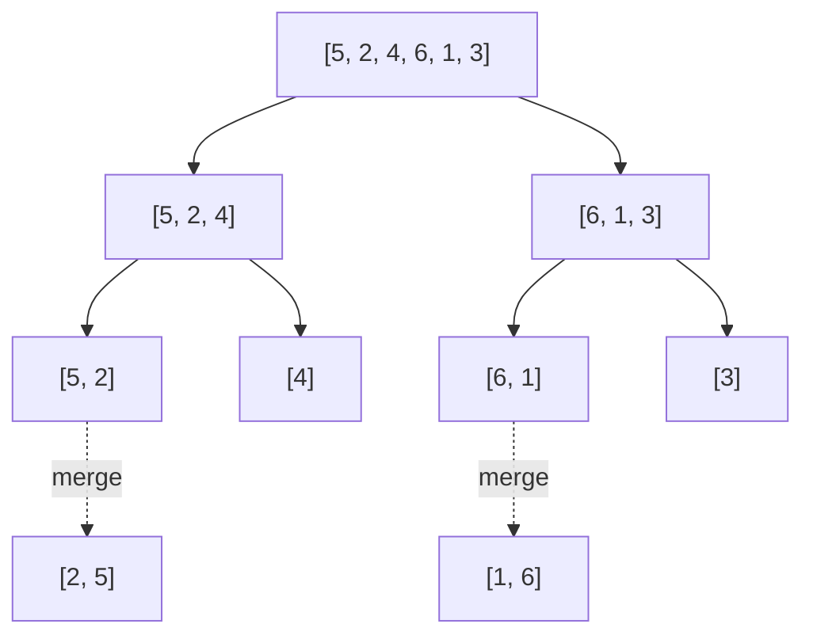

## Before you start

You need `sorting` for the baseline (why O(n²) isn't good enough) and a basic comfort with recursion — a function that calls itself on a smaller version of the problem.

## In one sentence

**Merge Sort** and **Quick Sort** are faster sorting algorithms that get an array in order in O(n log n) time by splitting the problem into smaller pieces and conquering each piece, instead of comparing every neighboring pair.

## Why it matters

Bubble, Selection, and Insertion Sort all take roughly n² steps in the worst case — fine for a list of 10, unusable for a list of 10 million. Merge Sort and Quick Sort are what real languages and databases actually use (JavaScript's `Array.prototype.sort` is a hybrid of both), because n log n is dramatically smaller than n² once the input gets large: for a million items, n² is a trillion steps, while n log n is about 20 million. This is also the topic where "divide and conquer" — breaking a problem into smaller versions of itself — first clicks, and that idea reappears in `divide-and-conquer`, `tree-algorithms`, and beyond.

## The intuition

Imagine you have two friends helping you sort a huge stack of exam papers by score. **Merge Sort** says: hand half the stack to each friend, tell them to sort their half however they like (they can recruit their own helpers, splitting again and again down to single papers), then you take the two sorted piles they hand back and merge them into one pile by repeatedly taking whichever pile's top paper has the lower score. **Quick Sort** works differently: you pick one paper as a benchmark, quickly sort everyone else into "lower than this" and "higher than this" piles, put the benchmark paper between them, and then recursively do the same trick on each pile.

Both rely on the same core move — recursively break the array down, then combine or arrange the pieces — but Merge Sort does its work while combining, and Quick Sort does its work while dividing.

## How it actually works

**Merge Sort** has two clearly separate phases. First, **divide**: split the array in half, then split each half in half, recursively, until every piece has zero or one element (already "sorted" by definition). Second, **conquer**: merge pairs of sorted pieces back together by repeatedly comparing their front elements and taking the smaller one, walking up until the whole array is one sorted list. The merge step is O(n) work per level, and there are O(log n) levels of splitting, giving O(n log n) total.

**Quick Sort** does its work up front. Pick a **pivot** element (here, the last element of the array). Walk through the rest, placing everything smaller than the pivot to its left and everything larger to its right — this is called **partitioning**. The pivot is now in its final sorted position. Recursively apply the same process to the left and right partitions. On average this also gives O(n log n), because a well-chosen pivot splits the array roughly in half each time — but if the pivot is consistently the smallest or largest element (e.g., an already-sorted array with a naive pivot choice), the split is 1-vs-(n−1) every time, degrading to O(n²).



## Worked example

```js
function mergeSort(arr) {
  if (arr.length <= 1) return arr; // a single element is already "sorted"

  const mid = Math.floor(arr.length / 2);
  const left = mergeSort(arr.slice(0, mid));   // recursively sort the left half
  const right = mergeSort(arr.slice(mid));     // recursively sort the right half
  return merge(left, right);
}

function merge(left, right) {
  const result = [];
  let i = 0, j = 0;
  while (i < left.length && j < right.length) {
    if (left[i] <= right[j]) result.push(left[i++]);
    else result.push(right[j++]);
  }
  return result.concat(left.slice(i), right.slice(j)); // append whatever's left over
}

console.log(mergeSort([5, 2, 4, 6, 1, 3]));
// [1, 2, 3, 4, 5, 6]
```

Trace the split on `[5, 2, 4, 6, 1, 3]`: it splits into `[5, 2, 4]` and `[6, 1, 3]`, each of those splits again down to single elements, then merging climbs back up — `[2, 5]` merges with `[4]` to give `[2, 4, 5]`, `[1, 6]` merges with `[3]` to give `[1, 3, 6]`, and finally `[2, 4, 5]` merges with `[1, 3, 6]` to produce `[1, 2, 3, 4, 5, 6]`.

## A second example — when it gets harder

Quick Sort's naive pivot choice is where the naive understanding breaks:

```js
function quickSort(arr) {
  if (arr.length <= 1) return arr;
  const pivot = arr[arr.length - 1]; // always picks the LAST element as pivot
  const left = [], right = [];
  for (let i = 0; i < arr.length - 1; i++) {
    if (arr[i] < pivot) left.push(arr[i]);
    else right.push(arr[i]);
  }
  return [...quickSort(left), pivot, ...quickSort(right)];
}

console.log(quickSort([5, 2, 4, 6, 1, 3])); // [1, 2, 3, 4, 5, 6] — balanced input
console.log(quickSort([5, 4, 3, 2, 1]));    // [1, 2, 3, 4, 5]    — already reverse-sorted
```

Both calls return correctly sorted arrays, but they do very different amounts of work. On `[5, 2, 4, 6, 1, 3]`, the pivot `3` splits the rest into `[2, 1]` and `[5, 4, 6]` — two roughly equal halves, giving the expected O(n log n) behavior. On the reverse-sorted `[5, 4, 3, 2, 1]`, the pivot is always the smallest remaining element, so every partition is "everything" versus "nothing" — the recursion is n levels deep instead of log n, degrading to O(n²), the exact same worst case as Bubble Sort. This is why production Quick Sort implementations pick a pivot randomly or use "median of three" instead of always taking the last element.

## Quick reference

| Algorithm | Best case | Average case | Worst case | Space | Stable? |
|---|---|---|---|---|---|
| Merge Sort | O(n log n) | O(n log n) | O(n log n) | O(n) | Yes |
| Quick Sort | O(n log n) | O(n log n) | O(n²) | O(log n) | No |

## Common mistakes

- Thinking Quick Sort is always O(n log n) — its worst case is O(n²), and a naive fixed pivot hits that worst case on already-sorted or reverse-sorted input.
- Forgetting Merge Sort's O(n) extra space cost — it needs auxiliary arrays for merging, unlike Quick Sort's in-place partitioning.
- Confusing "divide" and "conquer" between the two: Merge Sort's real work happens in the merge (combine) step; Quick Sort's real work happens in the partition (divide) step.

## What interviewers ask

- **Why is Quick Sort usually preferred over Merge Sort despite the same average complexity?** — Quick Sort sorts in place with O(log n) space from recursion, while Merge Sort needs O(n) extra space for merging; Quick Sort also tends to have better cache locality in practice.
- **How do you avoid Quick Sort's O(n²) worst case?** — Choose the pivot randomly, or use median-of-three, so an adversarial or already-sorted input can't reliably force an unbalanced split.
- **Is Merge Sort stable? Is Quick Sort?** — Merge Sort is stable because the merge step takes from the left array on ties; standard in-place Quick Sort is not stable, since partitioning can reorder equal elements.

## Practice

1. Trace Merge Sort by hand on `[8, 3, 7, 4, 2]`, drawing the split tree and then the merges back up.
2. Rewrite the `quickSort` above to pick a random index as the pivot instead of always the last element, and explain why this defends against the worst case.
3. Given a linked list (not an array), which of Merge Sort or Quick Sort adapts more naturally, and why? (Hint: think about what each algorithm needs random access for.)

## Where to go next

`divide-and-conquer` generalizes the "split, solve, combine" pattern you just used beyond sorting — the same shape shows up in binary search, computing powers, and finding the closest pair of points.
