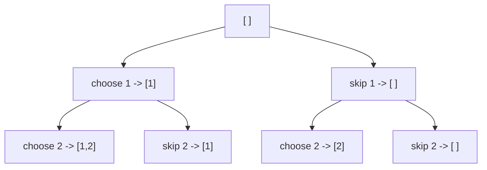

## Before you start

You need comfortable recursion and it helps to have seen `greedy-algorithms` first — backtracking is what you reach for exactly when greedy's "never look back" rule doesn't hold.

## In one sentence

**Backtracking** explores every possible choice at each step, but the moment a choice leads somewhere invalid, it undoes ("backtracks") that choice and tries the next one — instead of committing forever like greedy, or recomputing everything from scratch like naive recursion.

## Why it matters

Many real problems are "try every combination, but stop early whenever you hit a dead end": placing chess pieces so none attack each other, filling in a Sudoku grid, finding every way to split a set into groups. Brute-force would generate every possibility and check each one at the end; backtracking checks validity *as it builds*, so it can abandon a bad path after just a few choices instead of after building the whole thing. This is the other topic (with DP) beginners bounce off hardest — the code looks like plain recursion, but the "undo the choice" step is easy to forget and easy to misplace.

## The intuition

Imagine you're filling in a maze by hand with a pencil, one step at a time. At each junction, you pick a direction and keep going. If you eventually hit a wall with no way forward, you don't start the whole maze over — you erase your last few pencil marks back to the previous junction and try a different direction from there. That eraser step is backtracking: undo the most recent choice, then try the next option in its place.

## How it actually works

The pattern is always the same three moves, applied recursively: **choose** an option, **explore** what happens if you commit to it (recurse), then **un-choose** it (undo) before trying the next option. The un-choose step is what makes it backtracking rather than plain recursion — without it, choices from one branch would leak into the next branch you try.

Take the smallest possible example: generating every subset of `[1, 2, 3]`. At each element, you have two choices — include it or don't — and backtracking explores both:



Every path from the root to any node is a valid subset-in-progress. There's no "invalid" state to prune here — every combination is legal — but the tree shape is exactly what backtracking always builds: a decision at every level, branching into every option.

## Worked example

```js
function subsets(nums) {
  const result = [];
  function backtrack(start, current) {
    result.push([...current]); // every partial state is a valid subset — record it
    for (let i = start; i < nums.length; i++) {
      current.push(nums[i]);       // choose
      backtrack(i + 1, current);   // explore
      current.pop();               // un-choose (backtrack)
    }
  }
  backtrack(0, []);
  return result;
}

console.log(subsets([1, 2, 3]));
// [[],[1],[1,2],[1,2,3],[1,3],[2],[2,3],[3]]
```

Trace the first few steps: `backtrack(0, [])` immediately records `[]`. It then pushes `1` (`current = [1]`), records `[1]`, recurses to push `2` (`current = [1,2]`), records `[1,2]`, recurses to push `3` (`current = [1,2,3]`), records `[1,2,3]`. Now the inner loop is exhausted, so it pops `3` back off (`current = [1,2]`), returns up a level, pops `2` off (`current = [1]`), and the loop moves to `i=2`, pushing `3` this time (`current = [1,3]`). That `current.pop()` after every recursive call is the entire backtracking mechanism — without it, `current` would keep growing and every subset after the first would be wrong.

## A second example — when it gets harder

Subsets never rejects a choice — every branch is valid. The **N-Queens problem** (place N chess queens on an N×N board so none attack each other) is where backtracking's real power shows up: pruning invalid branches *before* fully exploring them.

```js
function solveNQueens(n) {
  const results = [];
  const cols = new Set(), diag1 = new Set(), diag2 = new Set();
  const board = [];

  function backtrack(row) {
    if (row === n) {
      results.push([...board]); // placed a queen in every row without conflicts
      return;
    }
    for (let col = 0; col < n; col++) {
      if (cols.has(col) || diag1.has(row - col) || diag2.has(row + col)) {
        continue; // PRUNE: this square is attacked, skip without recursing further
      }
      cols.add(col); diag1.add(row - col); diag2.add(row + col);
      board.push(col);

      backtrack(row + 1); // explore placing a queen in the next row

      cols.delete(col); diag1.delete(row - col); diag2.delete(row + col);
      board.pop(); // undo this placement before trying the next column
    }
  }
  backtrack(0);
  return results;
}

const solutions = solveNQueens(4);
console.log(solutions.length); // 2
console.log(solutions);        // [ [1, 3, 0, 2], [2, 0, 3, 1] ]
```

Each number in a solution is the column where that row's queen goes — `[1, 3, 0, 2]` means row 0's queen is in column 1, row 1's queen is in column 3, and so on. The `continue` is the prune: the moment a column is already attacked (same column, or same diagonal), backtracking skips it *without ever recursing into it* — it never wastes time exploring a branch it already knows is doomed. This is the difference from brute force: brute force would place all 4 queens and check for conflicts only at the end; backtracking checks after every single placement, so a bad choice in row 0 gets abandoned before rows 1 through 3 are ever considered.

## Quick reference

| Concept | What it means | Where it appears in the code |
|---|---|---|
| Choose | Commit to one option | `current.push(...)`, adding to `cols`/`diag1`/`diag2` |
| Explore | Recurse assuming that choice | The recursive `backtrack(...)` call |
| Un-choose | Undo the choice before the next option | `current.pop()`, `.delete(...)` calls |
| Prune | Skip a branch known to be invalid, without recursing | The `continue` in `solveNQueens` |

## Common mistakes

- Forgetting the "un-choose" step, which leaves state from one branch bleeding into the next — the single most common backtracking bug.
- Pruning too late — checking validity only after fully building a solution wastes all the time backtracking exists to save; check as early as possible instead.
- Confusing backtracking with plain brute force — brute force generates every full combination and checks at the end; backtracking abandons partial combinations the moment they become invalid.

## What interviewers ask

- **What's the difference between backtracking and brute force?** — Both explore all possibilities in principle, but backtracking prunes invalid branches as early as possible during construction, while brute force builds every full combination before checking validity.
- **Why is the "un-choose" step necessary?** — Because the same mutable data structure (an array, a set) is reused across every recursive branch; without undoing a choice, later branches would incorrectly see state left over from an earlier one.
- **What's the time complexity of N-Queens?** — Worst case is O(n!) since each row has fewer valid column choices than the last, but pruning makes the *actual* runtime far better in practice by cutting off doomed branches early.

## Practice

1. Modify the `subsets` function to only generate subsets of a target sum, pruning any branch whose running total already exceeds the target.
2. Write a backtracking solution to generate all permutations of `[1, 2, 3]` — the key difference from subsets is that order matters and every element must be used exactly once.
3. Sketch (on paper) the pruning that would occur solving 4-Queens: place a queen in row 0, column 0, then explain which columns in row 1 get pruned immediately and why.

## Where to go next

`divide-and-conquer` returns to a recursive pattern without the "undo" step — comparing the two side by side makes clear that not every recursive technique needs backtracking's choose/explore/un-choose cycle.
