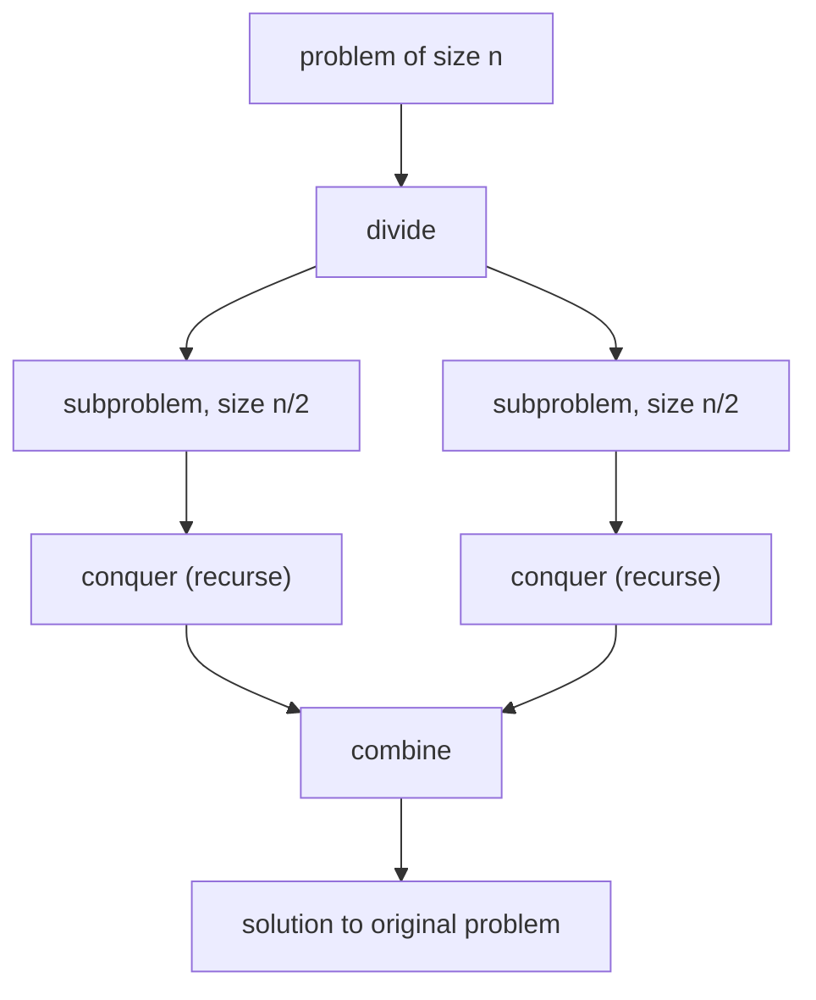

## Before you start

You've already used this pattern if you've done `advanced-sorting` or `searching` — divide and conquer is the general name for the "split, solve, combine" shape both of those rely on.

## In one sentence

**Divide and conquer** solves a problem by splitting it into smaller versions of the same problem, solving each one recursively, and then combining their results into the answer for the original problem.

## Why it matters

You've already met this pattern twice without naming it: Binary Search divides the search space in half each step, and Merge Sort divides the array in half, sorts each half, then combines. Naming the pattern explicitly matters because it transfers — once you can spot "this problem can be split into smaller identical problems," you can reach for the same three-step template (divide, conquer, combine) on problems you've never seen before, like finding the closest pair of points or computing a large power efficiently.

## The intuition

Think about counting all the pages in a giant stack of documents you can't count one at a time. Instead, you split the stack in half, hand each half to a friend, and ask each of them to do the same — split their half again and hand off — until someone is holding a stack small enough to count directly. Then everyone reports their count back up the chain, and each person just adds the two numbers they received. Nobody ever counted the whole stack directly; the answer emerged entirely from combining small, easy counts.

## How it actually works

Every divide and conquer algorithm has the same three parts:

1. **Divide** — split the problem into smaller subproblems of the same type.
2. **Conquer** — solve each subproblem recursively (the base case is small enough to solve directly).
3. **Combine** — merge the subproblem results into the answer for the original problem.



The reason this is usually fast: each level of splitting does a bounded amount of "divide" and "combine" work, and there are only `log n` levels before you hit the base case — so the total work is often the per-level cost times `log n`, which is why so many divide-and-conquer algorithms land on O(n log n).

The **Master Theorem** is a shortcut for working out the overall complexity without tracing every level by hand. It applies to recurrences of the shape "a subproblems, each of size n/b, plus f(n) combine work," and it compares how fast the combine work grows against how fast the subproblem count grows. If the combine step is cheap relative to the branching (like Binary Search's O(1) combine with only one subproblem), the recursion's own depth dominates, giving O(log n). If the combine step is comparable to the total input size at each level (like Merge Sort's O(n) merge with two subproblems), that per-level cost dominates instead, giving O(n log n). You don't need to memorize the formal cases to use the intuition: identify how many subproblems you recurse into, how large the combine step is, and multiply the combine cost by the number of levels.

## Worked example

A classic small example that isn't sorting: computing `base^exp` (exponentiation). The naive way multiplies `base` by itself `exp` times — O(exp). Divide and conquer does much better by noticing `base^exp = (base^(exp/2))²`, halving the exponent at each step instead of just subtracting one:

```js
function powerNaive(base, exp) {
  let result = 1;
  for (let i = 0; i < exp; i++) result *= base; // exp multiplications, one at a time
  return result;
}

function powerFast(base, exp) {
  if (exp === 0) return 1;                          // base case
  const half = powerFast(base, Math.floor(exp / 2)); // divide: solve for half the exponent
  if (exp % 2 === 0) return half * half;             // combine: square it
  return half * half * base;                         // combine: square it, fix odd exponent
}

console.log(powerNaive(2, 10)); // 1024
console.log(powerFast(2, 10));  // 1024
console.log(powerFast(2, 11));  // 2048
```

Trace `powerFast(2, 10)`: it needs `powerFast(2, 5)`, which needs `powerFast(2, 2)`, which needs `powerFast(2, 1)`, which needs `powerFast(2, 0) = 1`. Climbing back up: `powerFast(2,1) = 1*1*2 = 2`, `powerFast(2,2) = 2*2 = 4`, `powerFast(2,5) = 4*4*2 = 32`, `powerFast(2,10) = 32*32 = 1024`. Only 4 recursive calls were needed instead of 10 multiplications — and the gap widens fast as the exponent grows.

## A second example — when it gets harder

The real payoff of halving the exponent (instead of just subtracting one) shows up on a much larger exponent, where the naive approach is `exp` steps but the fast version is only `log₂(exp)` steps:

```js
let calls = 0;
function powerFastCounted(base, exp) {
  calls++;
  if (exp === 0) return 1;
  const half = powerFastCounted(base, Math.floor(exp / 2));
  if (exp % 2 === 0) return half * half;
  return half * half * base;
}

calls = 0;
powerFastCounted(2, 1024);
console.log(calls); // 12
```

Naive `powerNaive(2, 1024)` would loop 1024 times. The divide-and-conquer version needs only 12 recursive calls, because each call halves the exponent — `1024 → 512 → 256 → ... → 1 → 0` is 11 halvings, matching `log₂(1024) = 10` plus the base case. This is the pattern to recognize: whenever a naive approach reduces the problem size by *subtracting a constant* each step (O(n)) but a smarter version can reduce it by *dividing* each step (O(log n)), divide and conquer is almost always the mechanism making that possible.

## Quick reference

| Algorithm | Divide | Combine | Complexity |
|---|---|---|---|
| Binary Search | Split search range in half | Nothing to combine — discard the wrong half | O(log n) |
| Merge Sort | Split array in half | Merge two sorted halves | O(n log n) |
| Fast exponentiation | Halve the exponent | Multiply the result by itself (and `base` if odd) | O(log n) |
| Closest pair of points | Split points by x-coordinate | Check points near the dividing line | O(n log n) |

## Common mistakes

- Forgetting the base case, causing infinite recursion — every divide-and-conquer function needs a "small enough to solve directly" stopping point.
- Assuming any recursive split automatically gives O(log n) or O(n log n) — the complexity depends on both how balanced the split is and how expensive the combine step is; an expensive combine step (like O(n²)) can dominate the total runtime.
- Confusing divide and conquer with dynamic programming — divide and conquer's subproblems are typically independent (no overlap), while DP specifically exists to handle subproblems that *do* overlap.

## Practice

1. Trace `powerFast(3, 13)` by hand, writing out each recursive call and its return value.
2. Implement a divide-and-conquer function that finds the maximum value in an array by splitting it in half, finding the max of each half, and combining by taking the larger of the two — then compare its complexity to a simple linear scan.
3. Look up the "closest pair of points" problem and explain in your own words why the "combine" step only needs to check points within a narrow strip near the dividing line, not every point in both halves.

## Where to go next

`two-pointers-sliding-window` is a different shape of optimization — instead of splitting the problem into smaller instances, it processes one input with two moving positions in a single pass, which is often even cheaper when it applies.
