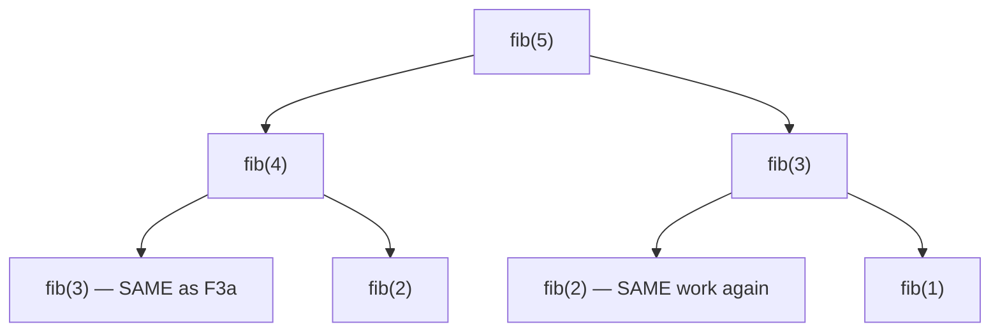

## Before you start

You need solid recursion — a function calling itself on a smaller input — and `big-o-notation` to appreciate why the fix here matters so much.

## In one sentence

**Dynamic programming (DP)** is a technique for solving problems that can be broken into smaller overlapping subproblems, by solving each distinct subproblem only once and reusing the answer instead of recomputing it.

## Why it matters

Some recursive problems look innocent but explode in runtime because the same smaller calculation gets redone thousands or millions of times. DP is the fix: it turns algorithms that would take longer than the age of the universe on modest inputs into ones that finish instantly, just by remembering work you've already done. It's also one of the two hardest topics for beginners in this entire course (alongside Backtracking), precisely because the fix is invisible in the code's structure — two functions that look almost identical can differ by a billion times in speed.

## The intuition

Imagine you're asked "what's the 10th Fibonacci number?" (each number is the sum of the two before it: 0, 1, 1, 2, 3, 5, 8...). If you answer it by recursively asking "what's the 9th?" and "what's the 8th?", and each of those asks two more questions, you'll notice something wasteful: "what's the 7th Fibonacci number?" gets asked *multiple times*, by different branches of the same calculation, and each time you answer it from scratch. Dynamic programming is simply: **write the answer on a sticky note the first time you work it out, and check your sticky notes before recalculating anything.**

## How it actually works

Take the naive recursive Fibonacci function — no sticky notes yet:

```js
function fibNaive(n) {
  if (n <= 1) return n;
  return fibNaive(n - 1) + fibNaive(n - 2);
}
```

Here's what happens when it computes `fib(5)`:



`fib(3)` gets computed twice, `fib(2)` gets computed multiple times, and this duplication compounds at every level — the number of calls roughly doubles per level of depth, giving O(2ⁿ) total calls. There are only `n` genuinely distinct subproblems (`fib(0)` through `fib(n)`), but the naive version solves the same ones over and over.

DP fixes this in one of two equivalent ways. **Memoization** (top-down) keeps the recursion but adds a cache: before computing `fib(k)`, check if it's already in the cache; if so, return the cached value instead of recursing. **Tabulation** (bottom-up) flips the direction entirely — instead of recursing from `n` down to the base case, it starts at the base case and iteratively builds up to `n`, storing each answer in an array as it goes. Both store exactly the same `n` answers; they differ only in whether you compute them "on demand" via recursion or "in order" via a loop.

## Worked example

```js
function fibMemo(n, memo = {}) {
  if (n in memo) return memo[n];       // sticky note already exists — reuse it
  if (n <= 1) return n;
  memo[n] = fibMemo(n - 1, memo) + fibMemo(n - 2, memo); // write the sticky note
  return memo[n];
}

console.log(fibMemo(10)); // 55
console.log(fibMemo(50)); // 12586269025 — naive fib(50) would take years to finish
```

`fibMemo(10)` still starts by asking for `fib(9)` and `fib(8)`, but the moment `fib(7)` is computed once and stored in `memo`, every later branch that would have recomputed `fib(7)` just reads it back out in O(1). This collapses the call count from exponential (O(2ⁿ)) down to O(n) — for `fib(10)`, that's the difference between roughly 177 recursive calls (naive) and just 10 unique calculations, and for `fib(50)` it's the difference between an answer that returns instantly versus one that would never finish on a naive implementation.

## A second example — when it gets harder

Tabulation solves the exact same problem bottom-up, and seeing both side by side is where the "top-down vs bottom-up" distinction really clicks:

```js
function fibTab(n) {
  if (n <= 1) return n;
  const dp = [0, 1]; // dp[i] will hold the i-th Fibonacci number
  for (let i = 2; i <= n; i++) {
    dp[i] = dp[i - 1] + dp[i - 2]; // build each answer from the two just before it
  }
  return dp[n];
}

console.log(fibTab(10)); // 55 — same answer, no recursion at all
```

There's no recursion, no call stack, and no risk of a stack overflow on large `n` — `fibTab` just fills an array left to right, each cell depending only on the two cells before it. This version also makes an optimization visible that memoization hides: since `dp[i]` only ever needs `dp[i-1]` and `dp[i-2]`, you don't need the whole array — two variables are enough, dropping space from O(n) to O(1). That kind of space optimization is much harder to spot in the recursive memoized version, which is a good reason to reach for tabulation once you're comfortable with the idea.

## Quick reference

| Approach | Direction | Uses recursion? | Space (Fibonacci) | Risk |
|---|---|---|---|---|
| Naive recursion | Top-down | Yes | O(n) call stack | O(2ⁿ) time — unusable past small `n` |
| Memoization | Top-down | Yes | O(n) cache + O(n) call stack | Stack overflow on very large `n` |
| Tabulation | Bottom-up | No | O(n), or O(1) with rolling variables | None of the above |

## Common mistakes

- Reaching for DP before confirming the problem actually has **overlapping subproblems** — if every subproblem is genuinely distinct (like in plain Merge Sort), memoizing adds overhead for nothing.
- Forgetting the base case in a memoized function, causing infinite recursion instead of a clean stop.
- Assuming memoization and tabulation always have the same space complexity — tabulation frequently allows a rolling-variable optimization that top-down memoization does not.

## What interviewers ask

- **What makes a problem a good fit for dynamic programming?** — It needs both *overlapping subproblems* (the same smaller calculation is needed multiple times) and *optimal substructure* (the best overall answer can be built from the best answers to subproblems).
- **Memoization or tabulation — which do you reach for first?** — Memoization is usually easier to write correctly first, since it mirrors the natural recursive definition; tabulation is preferred once the recurrence is well understood, since it avoids recursion overhead and often enables space optimization.
- **Walk me through why naive Fibonacci is O(2ⁿ) but memoized Fibonacci is O(n).** — Draw the call tree: naive recursion redoes identical subproblems at every branch, roughly doubling calls per depth level; memoization guarantees each of the `n` distinct subproblems is computed exactly once, with every repeat becoming an O(1) lookup.

## Practice

1. Write a memoized function for computing `n choose k` (binomial coefficient) using the recurrence `C(n,k) = C(n-1,k-1) + C(n-1,k)`, and count how many unique subproblems it actually solves for `n=10`.
2. Convert your memoized solution from exercise 1 into a bottom-up tabulated version using a 2D array.
3. The classic "coin change" problem — given coins `[1, 3, 4]`, find the minimum number of coins to make 6 — has overlapping subproblems. Identify what the subproblem is (hint: "minimum coins to make amount X") before writing any code.

## Where to go next

`greedy-algorithms` looks deceptively similar — both build a solution incrementally — but greedy never reconsiders a choice once made, while DP explores all the ways subproblems combine. Seeing where greedy fails (and DP is needed instead) is the sharpest way to understand both.
