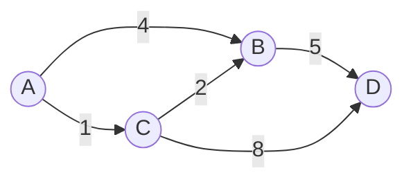

## Before you start

You need `tree-algorithms` — Dijkstra's algorithm is BFS's cousin, adapted for graphs where edges have different **weights** (costs) instead of all being equal.

## In one sentence

**Dijkstra's algorithm** finds the shortest path from a starting node to every other node in a graph where edges have weights, by always expanding outward from whichever known node is currently cheapest to reach.

## Why it matters

Plain BFS finds the shortest path only when every edge costs the same — but real-world graphs rarely work that way. A road network has distances; a flight network has prices; a network router has latencies. GPS navigation, network routing protocols, and "cheapest flight" search all reduce to this exact problem: find the lowest-cost path through a graph with weighted edges. Dijkstra's is the algorithm interviewers expect you to reach for the moment "shortest path" and "weights" appear in the same sentence.

## The intuition

Imagine you're figuring out the cheapest way to travel from your city to every other city, where flights between cities have different prices. You wouldn't randomly explore — you'd always look at the cheapest total cost you've found *so far* to any not-yet-finalized city, lock that cost in as final (since nothing could reach it cheaper later), and then check if flying through that city opens up cheaper prices to its neighbors. Repeat until every city has a finalized cheapest price. That greedy "always expand the currently-cheapest option" habit is the entire algorithm.

## How it actually works

Start by setting the distance to the source node as `0` and every other node as infinity (unknown). Maintain a set of "visited" (finalized) nodes, initially empty.

Repeat until every node is visited: among all unvisited nodes, pick the one with the smallest known distance — call it `current`. Mark `current` as visited (its distance is now final and will never improve, because every other path to it would have to go through an already-more-expensive node). Then **relax** each of `current`'s edges: for every neighbor, check if going through `current` gives a cheaper total distance than what's currently recorded, and if so, update it.

The reason picking the smallest unvisited distance guarantees correctness is that all edge weights are non-negative — there's no way a longer, unexplored path could later become cheaper than the smallest distance already found. This is also exactly why Dijkstra's **breaks** on graphs with negative edge weights: a "shortcut" through a negative edge could undercut a distance you already declared final.



Starting from `A`, the direct edge to `D` doesn't exist, but the path `A → C → B → D` costs `1 + 2 + 5 = 8`, cheaper than any other route — exactly the answer the worked example below computes.

## Worked example

```js
function dijkstra(graph, start) {
  const distances = {};
  const visited = new Set();
  for (const node in graph) distances[node] = Infinity;
  distances[start] = 0;

  while (visited.size < Object.keys(graph).length) {
    // Find the unvisited node with the smallest known distance
    let current = null;
    let currentDist = Infinity;
    for (const node in distances) {
      if (!visited.has(node) && distances[node] < currentDist) {
        current = node;
        currentDist = distances[node];
      }
    }
    if (current === null) break;
    visited.add(current);

    // Relax every edge out of `current`
    for (const [neighbor, weight] of Object.entries(graph[current])) {
      const newDist = distances[current] + weight;
      if (newDist < distances[neighbor]) distances[neighbor] = newDist;
    }
  }
  return distances;
}

const graph = {
  A: { B: 4, C: 1 },
  B: { A: 4, C: 2, D: 5 },
  C: { A: 1, B: 2, D: 8 },
  D: { B: 5, C: 8 },
};

console.log(dijkstra(graph, "A"));
// { A: 0, B: 3, C: 1, D: 8 }
```

Trace it: distance to `A` starts at 0, everything else is infinity. First pick `A` (smallest, 0), relax its edges: `B` becomes 4, `C` becomes 1. Next pick `C` (smallest unvisited, 1), relax its edges: going `A→C→B` costs `1+2=3`, cheaper than the current 4, so `B` updates to 3; going `A→C→D` costs `1+8=9`, so `D` becomes 9. Next pick `B` (smallest unvisited, 3), relax: going `A→C→B→D` costs `3+5=8`, cheaper than 9, so `D` updates to 8. Finally pick `D` (8) — nothing left to relax. Final distances: `{A:0, B:3, C:1, D:8}` — notice the shortest path to `D` isn't the direct-looking route, it's the one that hops through both `C` and `B`.

## A second example — when it gets harder

The naive picture — "just relax edges as you find them" — breaks down on graphs with a negative edge weight, and it's also worth seeing why **A\*** improves on Dijkstra's for a single-target search:

```js
// Negative weight breaks Dijkstra's core assumption: once a node is
// "visited" (finalized), the algorithm treats its distance as permanent.
const trickyGraph = {
  A: { B: 10, C: 2 },
  B: { C: -9 }, // negative edge!
  C: {},
};
console.log(dijkstra(trickyGraph, "A"));
// { A: 0, B: 10, C: 1 }
```

Watch the visit order, not just the final numbers: Dijkstra's finalizes `A` (0) first, then picks `C` next because 2 is the smallest remaining distance — `C` is now marked visited and, by the algorithm's own rule, considered *done*. Only after that does it visit `B` (10) and relax the edge `B→C`, discovering the true shortest path `A→B→C = 10 + (-9) = 1`. This particular implementation happens to still overwrite the number in the `distances` object after the fact, but the algorithm had already committed to `C` being finalized at step two — in a version that stops updating a node once visited (the standard, faster form using a priority queue), the answer would be permanently stuck at the wrong value, `2`, never discovering `1`. Either way, the guarantee Dijkstra's relies on — "the smallest known distance can never improve later" — is false the moment a negative edge exists. Graphs with negative edges need a different algorithm (Bellman-Ford).

**A\*** solves a narrower problem — shortest path to *one specific target*, not to every node — faster than Dijkstra's by adding a **heuristic**: an estimate of remaining distance to the target (like straight-line distance on a map), which lets it prioritize exploring nodes that seem to be heading toward the goal instead of expanding equally in every direction.

## Quick reference

| Algorithm | Handles negative weights? | Finds shortest path to | Time complexity |
|---|---|---|---|
| BFS | N/A (unweighted only) | All nodes | O(V + E) |
| Dijkstra's | No | All nodes from source | O((V + E) log V) with a priority queue |
| A\* | No | One target node | Same worst case as Dijkstra's, faster in practice with a good heuristic |
| Bellman-Ford | Yes | All nodes from source | O(V × E) |

## Common mistakes

- Running Dijkstra's on a graph with negative edges and getting silently wrong answers instead of an error — the algorithm has no way to detect this itself.
- Implementing the "find smallest unvisited distance" step with a linear scan (as in the example above) instead of a priority queue — it still works, just slower: O(V²) instead of O((V+E) log V).
- Confusing Dijkstra's (single-source, all destinations) with A\* (single-source, single destination) — using A\* when you actually need distances to every node wastes its heuristic advantage.

## What interviewers ask

- **Why doesn't Dijkstra's work with negative weights?** — It permanently finalizes a node's distance the moment it's visited, assuming no unexplored path could ever be cheaper; a negative edge can violate that assumption after the fact.
- **What's the time complexity of Dijkstra's, and how do you improve it?** — A naive linear scan for the minimum gives O(V²); using a min-heap priority queue to fetch the minimum brings it down to O((V + E) log V).
- **How does A\* improve on Dijkstra's?** — By adding a heuristic estimate of distance-to-goal, A\* prioritizes exploring nodes likely to lead toward the target, avoiding Dijkstra's uniform expansion in every direction.

## Practice

1. Trace Dijkstra's by hand on a 5-node graph you draw yourself, verifying your code's output matches your hand trace.
2. Modify the `dijkstra` function above to also return the actual shortest *path* (not just the distance) by tracking each node's predecessor.
3. Given a graph representing a road network, explain in plain English why A\* with straight-line distance as its heuristic is guaranteed to still find the true shortest path (not just a fast one).

## Where to go next

`dynamic-programming` is next: several graph shortest-path variants (like the ones with a bounded number of stops) are actually solved with DP rather than Dijkstra's, and seeing both approaches side by side sharpens your sense of when each applies.
