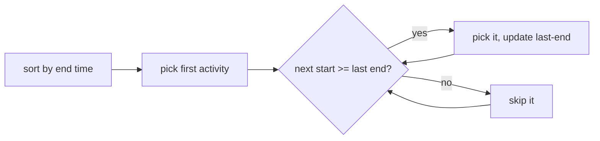

## Before you start

Nothing beyond basic sorting and arrays. `dynamic-programming` is useful context afterward, since the two techniques are easiest to tell apart once you've seen both.

## In one sentence

A **greedy algorithm** builds a solution step by step, always picking whatever option looks best *right now*, and never reconsidering that choice later.

## Why it matters

Greedy algorithms are usually the simplest and fastest solution to a problem when they work — no recursion tree, no cache, just one pass making locally obvious choices. Scheduling meeting rooms, giving correct change, and compressing files (Huffman coding) all have clean greedy solutions. But greedy doesn't *always* work, and knowing when it fails — and reaching for dynamic programming instead — is one of the most common judgment calls in an interview.

## The intuition

Imagine you're picking which meetings to attend today so you attend as many as possible, and two meetings overlapping means you can only pick one. A greedy approach says: always pick whichever remaining meeting *ends soonest* — that frees you up earliest for whatever comes next. You never go back and swap out a meeting you already picked; you just keep moving forward, always taking the locally best option available at each step.

## How it actually works

The **activity selection problem** is the cleanest example: given a set of activities each with a start and end time, pick the maximum number that don't overlap. The greedy strategy: sort all activities by their **end time**, then walk through them in order, greedily picking any activity whose start time is at or after the end time of the last one you picked.



Why does picking the earliest-ending activity always work here? Because among all activities that could be picked first, the one ending soonest leaves the most room for everything after it — it can never be a worse choice than picking one that ends later. This "no choice needs to be revisited" property is called the **greedy-choice property**, and it's what distinguishes problems greedy can solve from problems that actually need DP.

## Worked example

```js
function activitySelection(activities) {
  const sorted = [...activities].sort((a, b) => a.end - b.end); // sort by end time
  const selected = [sorted[0]];
  let lastEnd = sorted[0].end;

  for (let i = 1; i < sorted.length; i++) {
    if (sorted[i].start >= lastEnd) {   // no overlap with the last pick
      selected.push(sorted[i]);
      lastEnd = sorted[i].end;
    }
  }
  return selected;
}

const activities = [
  { name: "A", start: 1, end: 3 },
  { name: "B", start: 2, end: 5 },
  { name: "C", start: 4, end: 6 },
  { name: "D", start: 6, end: 8 },
  { name: "E", start: 5, end: 7 },
];

console.log(activitySelection(activities).map(a => a.name));
// [ 'A', 'C', 'D' ]
```

Sorted by end time: `A(1-3), B(2-5), C(4-6), E(5-7), D(6-8)`. Pick `A` first (ends at 3). `B` starts at 2, before 3, so skip it. `C` starts at 4, at or after 3, so pick it (ends at 6). `E` starts at 5, before 6, so skip it. `D` starts at 6, at or after 6, so pick it. Final answer: `A, C, D` — three non-overlapping activities, the maximum possible for this input.

## A second example — when it gets harder

Greedy feels like it should generalize to any "pick the best option now" problem, but it doesn't. The classic counterexample is **coin change with a non-standard coin system**:

```js
function greedyCoinChange(coins, amount) {
  const sorted = [...coins].sort((a, b) => b - a); // try biggest coins first
  const result = [];
  let remaining = amount;
  for (const coin of sorted) {
    while (remaining >= coin) {
      result.push(coin);
      remaining -= coin;
    }
  }
  return result;
}

console.log(greedyCoinChange([1, 3, 4], 6));
// [ 4, 1, 1 ]  -- 3 coins total
```

Greedy always grabs the biggest coin that still fits, so for amount 6 with coins `[1, 3, 4]` it takes a `4`, then can only make the remaining `2` with two `1`s — three coins total. But the actual optimal answer is two `3`-coins (`3 + 3 = 6`), using only two coins. Greedy's "biggest coin first" heuristic isn't always the right *local* choice, because taking the `4` closes off the better path through two `3`s — and greedy never looks back to reconsider. This exact problem is why coin change is one of the standard examples used to introduce dynamic programming: it needs to consider *all* combinations, not just the locally obvious one, to guarantee the true optimum.

## Quick reference

| Problem | Greedy works? | Why |
|---|---|---|
| Activity selection | Yes | Greedy-choice property holds: earliest-ending choice never blocks a better solution |
| Huffman coding | Yes | Always merging the two least-frequent nodes provably minimizes total encoding length |
| Coin change (arbitrary coin values) | No (in general) | A locally optimal coin can block the globally optimal combination |
| Coin change (US coin values: 1, 5, 10, 25) | Yes | This specific coin system happens to have the greedy-choice property |

## Common mistakes

- Assuming greedy works for "coin change" in general — it only works for specific coin systems (like standard currency denominations), not arbitrary ones.
- Skipping the proof step — greedy "looks" right on the first example you try, but without confirming the greedy-choice property holds for *all* inputs, you can ship a subtly wrong solution.
- Confusing greedy with DP when a problem asks for an *optimal* value — if you can't argue why the locally best choice is always safe, default to checking whether DP is needed instead.

## What interviewers ask

- **What is the greedy-choice property, and why does it matter?** — It's the guarantee that making the locally optimal choice at each step never prevents reaching a globally optimal solution; without this property, a greedy algorithm can produce a wrong (suboptimal) answer.
- **Give an example where greedy fails but looks like it should work.** — Coin change with denominations like `[1, 3, 4]` for a target of `6`: greedy picks `4, 1, 1` (3 coins) instead of the optimal `3, 3` (2 coins), because taking the biggest coin first isn't always safe.
- **How do you decide between greedy and DP for a new problem?** — Try to prove or disprove the greedy-choice property with a small counterexample first; if you can't find one quickly but also can't prove it holds, DP is the safer default since it explores all combinations.

## Practice

1. Implement Huffman coding's core step: repeatedly take the two lowest-frequency nodes from a list and merge them into a new node whose frequency is their sum, until one node remains.
2. Find a set of coin denominations (other than `[1, 3, 4]`) where greedy fails, and compute the amount where it first breaks.
3. The "fractional knapsack" problem (you can take fractions of items) has a correct greedy solution, while "0/1 knapsack" (whole items only) does not. Explain in one sentence why removing the ability to take fractions breaks the greedy-choice property.

## Where to go next

`backtracking` is the next core technique — where greedy commits to one choice per step, backtracking tries a choice, and explicitly undoes it if it turns out to be wrong, which is exactly what problems without the greedy-choice property need.
