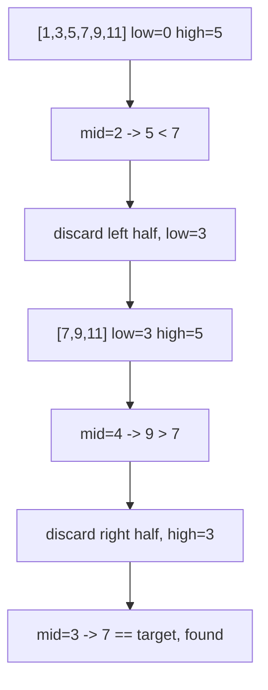

## Before you start

Nothing beyond arrays and `big-o-notation` — this is one of the simplest ideas in the course, and it's where "sorted data unlocks faster algorithms" first becomes concrete.

## In one sentence

**Searching** means finding whether a target value exists in a collection (and often where), and the two core techniques are **Linear Search** — check every item one by one — and **Binary Search** — repeatedly cut a *sorted* list in half.

## Why it matters

Almost every program looks something up: a user by ID, a word in a dictionary, a price in a sorted list of products. Picking the right search strategy is the difference between an app that feels instant and one that visibly crawls as the data grows. Binary search is also the cleanest, smallest example of a "divide and conquer" algorithm, and it's the mental model interviewers expect before they ask you anything harder.

## The intuition

Think about finding a name in a phone book. Linear Search is checking every single page from the front, one at a time, until you find the name — reliable, but slow for a thick book. Binary Search is what people actually do: open to the middle, see whether your name comes before or after that page, and throw away the half you know your name isn't in. Repeat on the remaining half, and each step eliminates half of what's left, so even a book with a million names takes only about 20 comparisons.



## How it actually works

**Linear Search** walks the array from the start, comparing each element to the target, and stops the moment it finds a match (or reaches the end without one). It makes no assumptions about the data — it works on an unsorted array just as well as a sorted one — but in the worst case it has to check every single element.

**Binary Search** requires the array to already be **sorted**. It tracks a `low` and `high` boundary covering the region that might still contain the target. Each step computes the `mid` index between them and compares `arr[mid]` to the target: if they're equal, you're done; if the target is smaller, the entire right half (including `mid`) can be discarded, so `high` moves to `mid - 1`; if the target is larger, the left half is discarded and `low` moves to `mid + 1`. The search region halves every step, which is exactly what makes it O(log n) instead of O(n).

The trade-off is upfront cost: if the data isn't already sorted, you'd need to sort it first (O(n log n)), which only pays off if you're going to search the same data many times.

## Worked example

```js
function binarySearch(arr, target) {
  let low = 0;
  let high = arr.length - 1;

  while (low <= high) {
    const mid = Math.floor((low + high) / 2);
    if (arr[mid] === target) return mid;
    if (arr[mid] < target) low = mid + 1;   // target is in the right half
    else high = mid - 1;                    // target is in the left half
  }
  return -1; // never found
}

console.log(binarySearch([1, 3, 5, 7, 9, 11], 7));
// 3
```

Trace it: `low = 0, high = 5`, so `mid = 2` → `arr[2] = 5`, which is less than `7`, so `low` becomes `3`. Now `low = 3, high = 5`, so `mid = 4` → `arr[4] = 9`, which is greater than `7`, so `high` becomes `3`. Now `low = 3, high = 3`, so `mid = 3` → `arr[3] = 7`, a match — return `3`. Three comparisons found the target in a 6-element array; a 6-million-element array would still only take about 23.

## A second example — when it gets harder

The naive understanding breaks on a target that **isn't in the array at all**, and on the classic off-by-one bug: using `mid` instead of `mid ± 1` as the new boundary.

```js
console.log(binarySearch([1, 3, 5, 7, 9, 11], 4));
// -1

// A buggy version that never converges:
function buggyBinarySearch(arr, target) {
  let low = 0, high = arr.length - 1;
  let steps = 0;
  while (low <= high && steps < 5) { // capped so this demo doesn't hang forever
    const mid = Math.floor((low + high) / 2);
    if (arr[mid] === target) return mid;
    if (arr[mid] < target) low = mid;   // BUG: should be mid + 1
    else high = mid;                     // BUG: should be mid - 1
    steps++;
  }
  return `gave up after ${steps} steps, low=${low} high=${high}`;
}

console.log(buggyBinarySearch([1, 3, 5, 7, 9, 11], 4));
// "gave up after 5 steps, low=2 high=3"
```

Searching for `4` (absent from the array) correctly returns `-1` in the correct version, because `low` eventually exceeds `high` and the loop exits. But the buggy version — which forgets to move the boundary past `mid` — gets stuck oscillating between the same two indices forever, since `mid` itself is never excluded from the next range. This is the single most common binary search bug: the boundary update must strictly exclude `mid` once you know it's not the answer, or the loop never shrinks.

## Quick reference

| Technique | Requires sorted data? | Time (worst case) | Space |
|---|---|---|---|
| Linear Search | No | O(n) | O(1) |
| Binary Search | Yes | O(log n) | O(1) iterative, O(log n) recursive |

## Common mistakes

- Running binary search on unsorted data — it will silently return wrong results instead of erroring, because the halving logic assumes order that isn't there.
- Off-by-one errors in the boundary update (`mid` instead of `mid + 1` / `mid - 1`), which can cause an infinite loop or skip the target entirely.
- Overflowing `(low + high) / 2` in languages with fixed-size integers — not a JavaScript problem, but a classic interview gotcha worth knowing about.

## What interviewers ask

- **Why is Binary Search O(log n)?** — Each comparison discards half of the remaining search space, so the number of comparisons needed is the number of times you can halve `n` before reaching 1, which is `log₂ n`.
- **When would you choose Linear Search over Binary Search?** — When the data isn't sorted and won't be searched repeatedly, since sorting first costs more than a single linear pass would.
- **Can you find the first or last occurrence of a duplicate value with Binary Search?** — Yes, with a modified version that keeps searching one direction even after finding a match, instead of returning immediately — this variant shows up constantly in interview problems.

## Practice

1. Implement Linear Search and Binary Search on the same array, then compare the number of comparisons each makes for a target near the end of the array.
2. Write a binary search variant that returns the index where a target *would* be inserted to keep the array sorted, even if the target isn't present.
3. Given a sorted array that's been rotated (e.g., `[4, 5, 6, 1, 2, 3]`), adapt binary search to still find a target in O(log n) time.

## Where to go next

`two-pointers-sliding-window` builds on the same "narrow the search space" instinct, applying it to problems where you scan an array with two moving positions instead of jumping to a midpoint.
