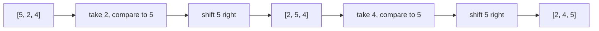

## Before you start

You should be comfortable with arrays and `for` loops, and it helps to already know `big-o-notation` — this topic is where that vocabulary gets its first real workout.

## In one sentence

**Sorting** means rearranging a list of items into order — smallest to largest, or A to Z — and the three classic beginner algorithms (Bubble, Selection, Insertion) all do it by repeatedly comparing pairs of elements and moving them toward their correct spot.

## Why it matters

A sorted list unlocks fast lookups — binary search only works on sorted data — and makes duplicates, ranges, and rankings trivial to compute. Every database index, every "sort by price" button, and every leaderboard relies on sorting somewhere under the hood. More importantly for an interview: these three algorithms are the first place you learn to reason precisely about nested loops and worst-case behavior, a skill every later topic in this course depends on.

## The intuition

Picture sorting a hand of playing cards. **Selection Sort** is like scanning the whole messy pile to find the single smallest card, pulling it out, and placing it first — then repeating on what's left. **Bubble Sort** instead walks along the cards comparing neighbors, swapping any pair that's out of order, so the largest card gradually "bubbles" to the end with each pass. **Insertion Sort** is how most people actually sort cards by hand: you hold a small sorted hand and, for each new card, slide it into the correct position among the cards you're already holding.

All three are built from the same two moves — compare and swap — just applied in a different order.

## How it actually works

**Selection Sort** repeats one idea `n` times: find the minimum value in the unsorted remainder of the array, then swap it into the next position. After pass `i`, the first `i` elements are correctly placed forever.

**Bubble Sort** repeats a full left-to-right sweep: compare each adjacent pair and swap if they're out of order. One full sweep guarantees the largest remaining value ends up at the far right, so each pass shrinks the "unsorted" region by one from the end.

**Insertion Sort** grows a sorted region from the left. For each new element, it shifts every larger element in the sorted region one step to the right, opening a gap, then drops the new element into that gap. Unlike the other two, it can stop early — if an element is already bigger than everything before it, no shifting happens at all.

All three do roughly `n²` comparisons in the worst case, because for each of `n` elements you may need to look at the rest again. The real difference is *how much work depends on the input's existing order*: Selection Sort always does the same amount of scanning regardless of how sorted the array already is; Bubble Sort and Insertion Sort can both finish early on nearly-sorted input, but Insertion Sort does it more efficiently in practice.



## Worked example

```js
function insertionSort(arr) {
  for (let i = 1; i < arr.length; i++) {
    const current = arr[i];
    let j = i - 1;
    // Shift every larger element one step right to make room for `current`
    while (j >= 0 && arr[j] > current) {
      arr[j + 1] = arr[j];
      j--;
    }
    arr[j + 1] = current;
  }
  return arr;
}

console.log(insertionSort([5, 2, 4, 6, 1, 3]));
// [1, 2, 3, 4, 5, 6]
```

Trace it on `[5, 2, 4]`: start with `[5]` as the "sorted" region. Take `2` — it's smaller than `5`, so `5` shifts right and `2` lands at index 0, giving `[2, 5]`. Take `4` — it's smaller than `5` but bigger than `2`, so only `5` shifts right, giving `[2, 4, 5]`. Each element only travels as far left as it needs to.

## A second example — when it gets harder

The naive picture breaks down once you ask "what if the array is already sorted, or sorted backwards?" Compare Bubble Sort's behavior on both:

```js
function bubbleSort(arr) {
  let swaps;
  for (let i = 0; i < arr.length - 1; i++) {
    swaps = 0;
    for (let j = 0; j < arr.length - 1 - i; j++) {
      if (arr[j] > arr[j + 1]) {
        [arr[j], arr[j + 1]] = [arr[j + 1], arr[j]];
        swaps++;
      }
    }
    if (swaps === 0) break; // nothing moved this pass — already sorted, stop early
  }
  return arr;
}

console.log(bubbleSort([1, 2, 3, 4]));   // [1, 2, 3, 4] — exits after 1 pass, 0 swaps
console.log(bubbleSort([4, 3, 2, 1]));   // [1, 2, 3, 4] — needs every pass, worst case
```

On an already-sorted array, the inner loop makes zero swaps, the `break` fires, and the whole sort finishes in one O(n) pass. On a reverse-sorted array, every single comparison is also a swap, and it needs all `n` passes — the true O(n²) worst case. Without the early-exit check, Bubble Sort would grind through all `n` passes even on data that's already sorted, which is the single most common beginner mistake with this algorithm.

## Quick reference

| Algorithm | Best case | Worst case | Space | Stable? |
|---|---|---|---|---|
| Bubble Sort | O(n) | O(n²) | O(1) | Yes |
| Selection Sort | O(n²) | O(n²) | O(1) | No |
| Insertion Sort | O(n) | O(n²) | O(1) | Yes |

**Stable** means equal elements keep their original relative order — important when you sort by one field after already sorting by another.

## Common mistakes

- Confusing comparisons with swaps — Bubble Sort compares O(n²) times but Selection Sort swaps at most `n` times total; know which cost an interviewer is asking about.
- Forgetting Bubble Sort's early-exit optimization, which is the only thing that gives it its O(n) best case.
- Assuming Selection Sort adapts to nearly-sorted input the way Insertion Sort does — it doesn't; it always scans the full remaining range no matter what.

## What interviewers ask

- **Why are these three O(n²)?** — Each nests one loop inside another over roughly `n` elements, so the total comparisons scale with `n × n`. Walking through the nested loop out loud is exactly what the interviewer wants to see.
- **What does "stable" mean, and why would you care?** — A stable sort preserves the relative order of equal elements, which matters when sorting rows of data by a secondary key after already sorting by a primary one.
- **When would you actually use one of these in production?** — Insertion Sort is genuinely useful for small arrays or nearly-sorted data; many production sort implementations (like Timsort) fall back to it below a size threshold.

## Practice

1. Trace Selection Sort by hand on `[29, 10, 14, 37]`, writing out the array after each pass.
2. Modify Insertion Sort to count and return the total number of shifts it performs — this number tells you how "unsorted" the input was.
3. Given an array that is sorted except for one element that's out of place, argue which of the three algorithms finishes fastest, and why.

## Where to go next

`advanced-sorting` picks up exactly where this leaves off: Merge Sort and Quick Sort solve the same problem in O(n log n) by giving up the "compare every neighbor" approach entirely.
