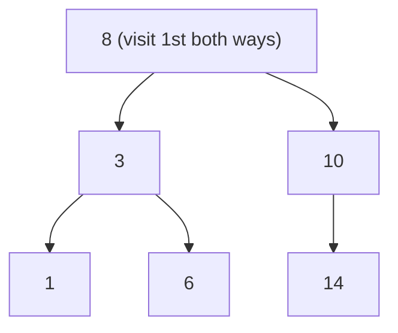

## Before you start

You need `trees` — specifically knowing what a node, root, and child are — and basic recursion. `searching` is useful context but not required.

## In one sentence

**Tree traversal** means visiting every node in a tree exactly once, and the two fundamental strategies are **BFS** (Breadth-First Search — visit level by level, like ripples spreading out) and **DFS** (Depth-First Search — plunge down one branch as far as possible before backtracking).

## Why it matters

Every operation on a tree — finding a value, printing it, computing its height, serializing it to JSON — starts with a traversal. The two strategies aren't interchangeable: BFS finds the shortest path in an unweighted tree or graph, while DFS is what naturally falls out of recursion and is what you need for problems like "does a path exist" or "list every route from root to leaf." Interviewers use tree problems constantly because they force you to choose the right traversal for the question being asked.

## The intuition

Picture a family tree, and you want to find a specific ancestor. BFS is like calling everyone one generation at a time — you finish checking every child before moving down to any grandchild, spreading outward evenly. DFS is like picking one branch of the family and following it all the way down to its last descendant before backtracking to try the next branch — going deep before going wide.



BFS visits `8, 3, 10, 1, 6, 14` — level by level, left to right. DFS preorder visits `8, 3, 1, 6, 10, 14` — all the way down the left branch before ever reaching `10`.

## How it actually works

**BFS** visits nodes level by level. It uses a **queue** (first-in-first-out): start by putting the root in the queue, then repeatedly remove the front node, record it, and add its children to the back of the queue. Because the queue processes nodes in the order they were discovered, every node at depth 1 is visited before any node at depth 2.

**DFS** visits nodes by going as deep as possible before backtracking. It's naturally expressed with recursion (using the **call stack**) or explicitly with a **stack** (last-in-first-out): visit a node, then recurse into one child completely — all the way to its leaves — before returning to try the next child. DFS comes in three common orders depending on *when* you record the current node relative to its children: **preorder** (node, then left, then right), **inorder** (left, then node, then right), and **postorder** (left, then right, then node).

The key structural difference is the data structure driving the traversal: a queue naturally spreads outward (BFS), while a stack — or the recursive call stack, which behaves like one — naturally goes deep first (DFS).

## Worked example

```js
class Node {
  constructor(val) { this.val = val; this.left = null; this.right = null; }
}
function insert(root, val) {
  if (!root) return new Node(val);
  if (val < root.val) root.left = insert(root.left, val);
  else root.right = insert(root.right, val);
  return root;
}

let root = null;
for (const v of [8, 3, 10, 1, 6, 14]) root = insert(root, v);
//        8
//      /   \
//     3     10
//    / \      \
//   1   6      14

function bfs(root) {
  const result = [];
  const queue = [root];
  while (queue.length) {
    const node = queue.shift();       // remove from the FRONT
    result.push(node.val);
    if (node.left) queue.push(node.left);   // add children to the BACK
    if (node.right) queue.push(node.right);
  }
  return result;
}

function dfsPreorder(root, result = []) {
  if (!root) return result;
  result.push(root.val);              // visit node first
  dfsPreorder(root.left, result);     // then everything on the left
  dfsPreorder(root.right, result);    // then everything on the right
  return result;
}

console.log(bfs(root));         // [8, 3, 10, 1, 6, 14]
console.log(dfsPreorder(root)); // [8, 3, 1, 6, 10, 14]
```

Both visit the same six nodes, but in a different order. BFS visits `8` (level 0), then `3, 10` (level 1), then `1, 6, 14` (level 2) — strictly level by level. DFS preorder visits `8`, then dives all the way down the left branch to `3` and `1` before ever looking at `10`.

## A second example — when it gets harder

DFS is usually written recursively, but recursion has a hidden cost: it uses the call stack, and a very deep or unbalanced tree can overflow it. Here's DFS rewritten with an explicit stack instead:

```js
function dfsPreorderIterative(root) {
  const result = [];
  const stack = [root];
  while (stack.length) {
    const node = stack.pop();                    // remove from the TOP
    result.push(node.val);
    if (node.right) stack.push(node.right);       // push right FIRST
    if (node.left) stack.push(node.left);         // so left is popped first
  }
  return result;
}

console.log(dfsPreorderIterative(root)); // [8, 3, 1, 6, 10, 14] — same order as recursive
```

The output matches the recursive version exactly, but notice the order children are pushed: right before left. Because a stack is last-in-first-out, pushing right first means left comes off the top next, preserving the same "visit left before right" order the recursive version gives for free through call-stack ordering. This is the detail that trips people up the first time they convert recursion to an explicit stack — get the push order backwards and you silently traverse right-to-left instead.

## Quick reference

| Traversal | Data structure | Visits | Good for |
|---|---|---|---|
| BFS | Queue | Level by level | Shortest path (unweighted), "closest" node problems |
| DFS (preorder) | Stack / recursion | Node → left → right | Copying or serializing a tree |
| DFS (inorder) | Stack / recursion | Left → node → right | Reading a binary search tree in sorted order |
| DFS (postorder) | Stack / recursion | Left → right → node | Deleting a tree, computing subtree values bottom-up |

Both BFS and DFS visit every node exactly once, so both are O(n) time and O(n) space in the worst case (a queue/stack holding a full level, or a call stack holding a full root-to-leaf path).

## Common mistakes

- Using DFS when the problem asks for the *shortest* path or *closest* node in an unweighted structure — BFS guarantees shortest first; DFS does not.
- Forgetting the push order when converting DFS from recursive to iterative — push right before left so left pops first, matching recursive order.
- Assuming inorder traversal gives sorted output for any tree — it only does that for a **binary search tree**, where left children are always smaller and right children always larger.

## Practice

1. Given the tree built above, write out the inorder and postorder DFS sequences by hand, then verify with code.
2. Write a BFS that returns the tree's values grouped by level (an array of arrays), not just a flat list.
3. Write a function that computes a tree's height using DFS, and explain why BFS would be a more awkward fit for this problem.

## Where to go next

`graph-algorithms` takes BFS and DFS beyond trees into general graphs, where cycles mean you need to track visited nodes explicitly — the traversal ideas here are the foundation for everything that follows.
