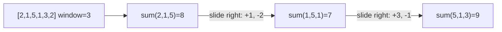

## Before you start

You need `searching` — the two-pointer idea is a close cousin of binary search's "narrow the range" instinct, just applied by scanning instead of jumping to a midpoint.

## In one sentence

**Two pointers** and **sliding window** are techniques for scanning an array or string using two positions instead of one, avoiding the need to recheck the same elements repeatedly the way a naive nested loop would.

## Why it matters

A huge class of array and string problems — "find a pair that sums to X," "find the longest substring without repeats," "find the maximum sum of any 3 consecutive elements" — have an obvious O(n²) brute-force solution: check every pair, or recompute every window from scratch. Two pointers and sliding window turn many of these into O(n), by reusing work from the previous step instead of starting over. This is one of the highest-leverage patterns for coding interviews specifically because so many "medium" problems reduce to one of these two templates.

## The intuition

Imagine you're looking through a photo album for the pair of consecutive pages whose combined page numbers add up to a target, and the pages are already in order. Instead of comparing every page to every other page, you put one finger on the first page and another on the last page. If the sum is too big, you move the *right* finger inward (smaller page number lowers the sum); if it's too small, you move the *left* finger inward. Each move throws away possibilities you now know can't work, so you never re-examine a pair you've already ruled out.

## How it actually works

**Two pointers** typically start at opposite ends of a sorted array and move toward each other, using the current sum (or comparison) to decide which pointer to move. Because the array is sorted, moving the left pointer right only increases the sum, and moving the right pointer left only decreases it — that monotonic behavior is what guarantees you never need to backtrack.

**Sliding window** keeps a window defined by two pointers (`start` and `end`) that both usually move forward across an array, tracking some running value (a sum, a count, a set of seen characters) for whatever is currently inside the window. Instead of recomputing that value from scratch for every new window position, you update it incrementally: add what just entered the window, remove what just left it.



Both techniques share the same underlying reason for their speed: each element is only ever added to and removed from consideration once, giving O(n) total work instead of the O(n²) you'd get from recomputing everything at every position.

## Worked example

Take the brute-force version first: find the maximum sum of any 3 consecutive elements in `[2, 1, 5, 1, 3, 2]`.

```js
function maxSumNaive(arr, k) {
  let best = -Infinity;
  for (let i = 0; i <= arr.length - k; i++) {
    let sum = 0;
    for (let j = i; j < i + k; j++) sum += arr[j]; // recompute the whole window every time
    best = Math.max(best, sum);
  }
  return best;
}

console.log(maxSumNaive([2, 1, 5, 1, 3, 2], 3)); // 9
```

This works, but for every one of the `n - k` window positions, it re-adds all `k` elements from scratch — O(n × k) total, which is O(n²) when `k` is close to `n`. Every window shares most of its elements with the previous one, and none of that overlap is reused.

## A second example — when it gets harder

The sliding window fix reuses the previous window's sum instead of recomputing it:

```js
function maxSumWindow(arr, k) {
  let windowSum = 0;
  for (let i = 0; i < k; i++) windowSum += arr[i]; // build the first window once

  let best = windowSum;
  for (let i = k; i < arr.length; i++) {
    windowSum += arr[i] - arr[i - k]; // add the incoming element, drop the outgoing one
    best = Math.max(best, windowSum);
  }
  return best;
}

console.log(maxSumWindow([2, 1, 5, 1, 3, 2], 3)); // 9
```

Instead of re-summing 3 elements at every position, each step does exactly one addition and one subtraction — the window "slides" by adjusting the total incrementally. Both versions return `9` (the window `[5, 1, 3]`), but `maxSumWindow` does O(n) total work regardless of `k`, while `maxSumNaive`'s cost grows with `k` as well as `n`.

The two-pointer variant applies the same reused-work idea to a different shape of problem — finding a pair, not a window:

```js
function twoSumSorted(arr, target) {
  let left = 0, right = arr.length - 1;
  while (left < right) {
    const sum = arr[left] + arr[right];
    if (sum === target) return [left, right];
    if (sum < target) left++;   // sum too small — need a bigger left value
    else right--;               // sum too big — need a smaller right value
  }
  return null;
}

console.log(twoSumSorted([2, 7, 11, 15], 9));  // [0, 1] -- 2 + 7 = 9
console.log(twoSumSorted([1, 3, 4, 6, 9], 10)); // [0, 4] -- 1 + 9 = 10
```

On `[1, 3, 4, 6, 9]` looking for `10`: start at `left=0 (1), right=4 (9)`, sum is `10` — found immediately. A brute-force pair check would need to try every pair until reaching this one; here, because the array is sorted, the pointers converge on the answer by ruling out impossible combinations each step instead of trying them all.

## Quick reference

| Pattern | Typical use | Complexity | Requires sorted input? |
|---|---|---|---|
| Two pointers (opposite ends) | Pair-sum problems | O(n) | Usually yes |
| Sliding window (fixed size) | Max/min sum of exactly k elements | O(n) | No |
| Sliding window (variable size) | Longest/shortest substring meeting a condition | O(n) | No |
| Brute force (nested loop) | Same problems, before optimizing | O(n²) | No |

## Common mistakes

- Using two pointers on unsorted data expecting the same monotonic guarantee — the "move left up / move right down" logic only works because the array is sorted.
- Recomputing the window sum from scratch on each slide instead of incrementally adding/removing — this silently turns an O(n) sliding window back into O(n × k).
- Forgetting to shrink a variable-size window when its condition is violated (e.g., a substring with too many repeated characters) — a sliding window that only ever grows isn't tracking a valid window anymore.

## What interviewers ask

- **Why does the two-pointer technique require sorted input?** — Because moving a pointer needs to reliably increase or decrease the running sum in one direction; without sorted order, you can't know which pointer to move to fix an over- or under-shoot.
- **What's the difference between a fixed and variable sliding window?** — A fixed window always covers exactly `k` elements and slides one step at a time; a variable window grows and shrinks its boundaries based on whether a condition currently holds.
- **How would you find the longest substring without repeating characters?** — A variable sliding window: expand the right edge, and whenever a repeat is found, shrink the left edge past the previous occurrence — tracking seen characters with a hash set as you go.

## Practice

1. Convert `maxSumNaive` into a sliding window solution for a window size you choose, and verify both give the same answer on a test array.
2. Using two pointers, write a function that checks whether a string is a palindrome, comparing characters from both ends moving inward.
3. Write a variable-size sliding window that finds the length of the longest substring in a string with no repeated characters (e.g., `"abcabcbb"` → `3`, for `"abc"`).

## Where to go next

You've now covered the full toolkit of Phase 3. `hash-tables` (in `02-data-structures`) pairs especially well with sliding window problems — many variable-window solutions use a hash map to track what's currently "inside" the window in O(1).
