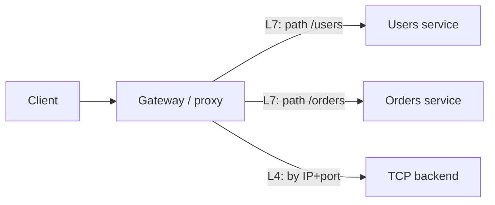

## Before you start

`tcp-ip-udp` matters here, because the single biggest distinction in this topic — L4 versus L7 — is exactly the difference between handling TCP and handling HTTP. `dns-load-balancing` is a useful companion.

## In one sentence

A **reverse proxy** is a server that sits in front of your backends and forwards requests on their behalf; a **load balancer** is a reverse proxy whose main job is spreading traffic across many backends; and an **API gateway** is a reverse proxy that also handles API concerns like authentication, rate limiting, and request shaping.

## Why it matters

Interviewers ask this precisely because candidates blur the three together. They overlap heavily in practice — one NGINX process can be all three at once — so the real signal is whether you can say *what job each one is doing*, not which product is installed.

There's a practical stake too. Putting authentication in a load balancer that cannot read HTTP is impossible, and pushing per-request business logic into a component built for raw throughput is how you build something slow and fragile.

## The intuition

Picture a large office building.

A **reverse proxy** is the receptionist. Visitors talk only to reception; they never learn which floor anyone sits on. Reception can also handle things centrally that would otherwise be repeated everywhere — checking ID, taking coats, logging arrivals.

A **load balancer** is a receptionist managing a bank of identical service counters, sending each visitor to whichever is free. The job is distribution and keeping a queue away from a busy counter.

An **API gateway** is a receptionist for a building of many *different* departments. It reads what you're asking for, checks your appointment, notes you've already made ten requests today, routes you to the right department, and formats the answer consistently. It understands the request's meaning, not just its destination.

Note what's shared: all three are the single front door, and all three hide the internal layout. The difference is how much they *understand* about what's passing through.

## How it actually works



The decisive question is **which layer it reads**.

An **L4** (transport layer) balancer sees TCP: source and destination IP addresses and ports. It never inspects the payload. It picks a backend, then shovels bytes in both directions. Because it doesn't parse anything, it's extremely fast, works for any protocol — databases, message brokers, raw TCP — and can pass encrypted traffic straight through without decrypting it. What it cannot do is route on a URL path, read a header, or retry a failed request intelligently, because it has no idea what a request even is.

An **L7** (application layer) proxy parses HTTP. That unlocks everything people actually want: routing `/orders` to one service and `/users` to another, sticky sessions from a cookie, retrying an idempotent request on a different backend, compressing responses, and **TLS termination** — decrypting at the edge so backends handle plain HTTP. The cost is CPU and latency, since it must decrypt and parse every request.

An **API gateway** is L7 by definition, plus API-specific duties: verifying tokens, enforcing per-client rate limits, API versioning, and sometimes aggregating several backend calls into one response. Its purpose is to hold cross-cutting concerns you'd otherwise reimplement in every microservice.

**Balancing algorithms** matter less than people think, but appear in interviews. Round robin rotates evenly. Least connections favours the backend with the fewest in-flight requests, which handles uneven request durations far better. Consistent hashing maps a key to a backend so the same user or cache key lands on the same machine, and — crucially — adding or removing a backend reshuffles only a small fraction of keys.

Every one of these performs **health checks**, removing failing backends from rotation. This is often the most valuable thing the layer does.

## Worked example

```js
const http = require('node:http');

const backends = ['http://127.0.0.1:4001', 'http://127.0.0.1:4002'];
let next = 0;

http.createServer((req, res) => {
  // L7: we can read the path, so route on meaning
  if (req.url.startsWith('/admin')) {
    res.writeHead(403).end('forbidden');       // a policy an L4 balancer cannot express
    return;
  }
  const target = backends[next++ % backends.length]; // round robin
  const proxied = http.request(target + req.url, { method: req.method }, (up) => {
    res.writeHead(up.statusCode, up.headers);
    up.pipe(res);
  });
  proxied.on('error', () => res.writeHead(502).end('bad gateway'));
  req.pipe(proxied);
}).listen(8080);
```

With two backends running, repeated requests alternate between them:

```
$ curl -s localhost:8080/hello; curl -s localhost:8080/hello
from backend 4001
from backend 4002
$ curl -s -o /dev/null -w '%{http_code}\n' localhost:8080/admin
403
```

The `/admin` rule is the point. Blocking by path requires parsing HTTP — an L4 balancer, seeing only TCP bytes, could never make that decision.

## A second example — when it gets harder

Now make the backends unequal, and the naive model breaks.

Round robin assumes requests cost roughly the same. Suppose 95% of requests are 5ms lookups and 5% are 2-second report generations. Round robin hands every server an equal *count*, so a server that happens to receive three reports in a row now has fast requests queued behind two seconds of work — while its neighbour sits idle. Latency at the tail collapses even though average load looks balanced. **Least connections** fixes this by tracking in-flight work rather than assuming uniformity.

Sticky sessions cause the second classic failure. Routing a user to the same backend by cookie lets that backend keep session state in memory — convenient until that server restarts and those users are logged out, or until load skews because heavy users are pinned to one machine. Sticky sessions are a workaround for state living in the wrong place; moving sessions to a shared store makes every backend interchangeable.

The third trap is health checks that only prove a process is listening. A TCP-level check passes while the app returns 500s for every request, because a socket accepting connections says nothing about whether the service works. Health checks should exercise a real endpoint.

## Quick reference

| | L4 load balancer | L7 proxy / gateway |
|---|---|---|
| Reads | IP + port | Full HTTP request |
| Route by path or header | No | Yes |
| TLS termination | No (passthrough) | Yes |
| Retry a failed request | No | Yes (if idempotent) |
| Rate limit per API key | No | Yes |
| Speed | Very fast, low CPU | Slower — parses and decrypts |
| Works with non-HTTP | Yes | No |

| Algorithm | Best when |
|---|---|
| Round robin | Requests cost about the same |
| Least connections | Request durations vary widely |
| Consistent hashing | Same key must reach the same backend |

## Common mistakes

- Treating the three terms as different products. They're overlapping roles, and one process often plays all three.
- Assuming a load balancer can route by URL path. Only an L7 one can; an L4 balancer cannot see a path at all.
- Using round robin when request costs vary wildly, then being surprised by tail latency.
- Relying on sticky sessions instead of externalising session state, which quietly makes every deploy log users out.
- Health checks that only confirm the port is open while the application is failing every request.
- Putting business logic in the gateway until it becomes a shared bottleneck that every team must coordinate to change.

## What interviewers ask

- **What's the difference between a reverse proxy, a load balancer, and an API gateway?** — All sit in front of backends; a load balancer emphasises distributing traffic, a reverse proxy emphasises being the single front door, and a gateway adds API concerns like auth and rate limiting on top of L7 routing.
- **L4 versus L7 — when would you pick each?** — L4 for raw speed, non-HTTP protocols, or passing TLS through untouched; L7 when you need path routing, header inspection, retries, or TLS termination.
- **Forward proxy versus reverse proxy?** — A forward proxy acts on behalf of clients leaving a network; a reverse proxy acts on behalf of servers receiving traffic, and the client usually doesn't know it exists.
- **Why might round robin be the wrong choice?** — It assumes uniform request cost, so a few slow requests can pile up behind one backend while others idle; least connections tracks actual in-flight work instead.
- **Where would you terminate TLS, and what's the trade-off?** — Terminating at the edge simplifies backends and enables L7 features, but traffic behind the edge is then unencrypted unless you re-encrypt internally.

## Practice

1. Run the proxy above with two backends that log their port. Add an artificial 2-second delay to one and watch round robin distribute badly. Then implement least connections and compare.
2. Write an L4 version using `node:net` that pipes raw sockets to a backend. Confirm you cannot implement the `/admin` rule and explain exactly why.
3. Design the gateway for an API with three services, per-key rate limits, and JWT auth. Decide what belongs in the gateway versus each service, and defend the split.

## Where to go next

Continue to `websockets-vs-polling` — persistent connections behave very differently through these layers, and it's where proxy timeouts and sticky routing suddenly matter.
