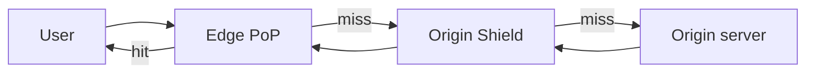

## Before you start

`http-https-websockets` for request/response headers, and `tls-and-certificates` — a CDN terminates TLS at the edge, which is a large part of why it feels fast.

## In one sentence

A **CDN** (Content Delivery Network) is a fleet of servers spread around the world that keep copies of your content close to users, so a request is answered by a machine a few milliseconds away instead of your single origin server an ocean away.

## Why it matters

Distance is not a tuning problem — it's physics. A round trip from Sydney to a server in Virginia costs roughly 200ms no matter how fast your code is. Ten such round trips to load a page is two seconds spent purely on the speed of light. No amount of query optimisation touches that.

A CDN also absorbs load. If a hundred thousand people request the same logo, your origin can serve it once and let edge servers handle the rest. That's the difference between a traffic spike being a non-event and being an outage.

## The intuition

Think of a popular book. The **origin** is the national library — one building, authoritative, far from most readers. A CDN is a network of local branch libraries. The first reader in a city requests the book, the branch fetches one copy from the national library and shelves it. Every subsequent local reader is served from that shelf, in minutes rather than days.

Two questions follow immediately, and they are the whole topic. **What counts as "the same book"?** — that's the cache key. **What happens when the book is revised?** — that's invalidation. Everything else is detail.

## How it actually works



A user's request lands at the nearest **PoP** (point of presence). The edge computes a **cache key** — normally the host plus path, sometimes plus selected query parameters or headers — and looks it up.

On a **hit**, it returns the stored response immediately and your origin never learns the request happened. On a **miss**, it fetches from upstream, stores the response according to the caching headers, then serves it.

Your origin controls caching through response headers. `Cache-Control: max-age=3600` means fresh for an hour. `s-maxage` targets shared caches like the CDN specifically, letting you cache at the edge for a long time while telling browsers to hold it briefly. `ETag` lets an edge revalidate cheaply: it asks "changed since this version?" and a `304 Not Modified` saves resending the body.

**Origin shielding** adds a designated mid-tier cache. Without it, a miss at 200 edge locations means 200 simultaneous fetches hitting your origin for one object. With a shield, those collapse into one origin fetch, and the shield fans the result back out.

**Invalidation** comes in two forms. Purging by URL is precise but tedious when one change affects many pages. Purging by **surrogate key** (or cache tag) is what production systems use: you tag responses, then purge everything carrying a tag in one call — publishing an author's correction invalidates every page tagged with that author.

The strongest technique avoids invalidation altogether. **Cache busting** puts a content hash in the filename, so `app.a3f9c1.js` is immutable and cacheable for a year; a new build produces a new filename, and the old one simply stops being referenced.

## Worked example

```js
const http = require('node:http');

// A tiny origin that sets the caching rules a CDN would obey
http.createServer((req, res) => {
  if (req.url.startsWith('/static/')) {
    // hashed filename => content can never change => cache aggressively
    res.setHeader('Cache-Control', 'public, max-age=31536000, immutable');
  } else if (req.url === '/articles/42') {
    // edge caches 10 min; browsers only 30s so purges take effect fast
    res.setHeader('Cache-Control', 'public, max-age=30, s-maxage=600');
    res.setHeader('Surrogate-Key', 'article-42 author-7'); // purge by tag later
  } else if (req.url === '/me') {
    res.setHeader('Cache-Control', 'private, no-store'); // per-user, never shared
  }
  res.end('ok');
}).listen(3000);
```

Check what the origin actually promises:

```
$ curl -sI localhost:3000/articles/42 | grep -i -E 'cache-control|surrogate'
Cache-Control: public, max-age=30, s-maxage=600
Surrogate-Key: article-42 author-7
```

The `/me` route is the important one. Marking a personalised response `private, no-store` is what stops a shared cache storing one user's data and serving it to the next.

## A second example — when it gets harder

The cache key is where real outages come from.

Suppose your article page varies by language, chosen from an `Accept-Language` header, but your cache key is only host plus path. The first request is German, the response is cached, and every user worldwide now gets German. Adding `Vary: Accept-Language` fixes correctness by splitting the key per language — but browsers send dozens of variations of that header, so you may fragment one cached object into hundreds, collapsing your hit rate. The production answer is to normalise: map the header to a small set (`en`, `de`, `fr`) at the edge and vary on that.

The mirror-image bug is a key that is too *wide*. Include the whole query string and `?utm_source=twitter` produces a distinct cache entry per campaign for identical content — every share is a miss.

The sharpest failure is caching an authenticated response. If a `Set-Cookie` session response is cached publicly, the edge hands one user's logged-in page to strangers. This is a real class of incident, not a hypothetical, and it's why "is this response the same for everyone?" must be answered before anything is cached.

A CDN also does not help where people assume it does: personalised responses, write requests, and rarely-requested content that expires before a second reader arrives.

## Quick reference

| Situation | Do this | Why |
|---|---|---|
| Hashed asset (`app.a3f9.js`) | `max-age=31536000, immutable` | Filename changes on edit; never needs purging |
| Article / listing page | `s-maxage` long, `max-age` short | Purges take effect quickly at the edge |
| Per-user page | `private, no-store` | Prevents cross-user leakage |
| Content varies by header | Normalise, then `Vary` | Correct without shredding hit rate |
| Many edges, one origin | Origin shield | Collapses a miss storm into one fetch |
| Frequent edits | Surrogate keys | Purge many URLs in one call |

## Tools & frameworks

| Tool | What it's for | Reach for it when |
|---|---|---|
| [Cloudflare Cache](https://developers.cloudflare.com/cache/) | CDN caching rules and purge | You want cache behaviour expressed as rules, not origin headers alone |
| [CloudFront](https://docs.aws.amazon.com/AmazonCloudFront/latest/DeveloperGuide/) | AWS-integrated CDN | Your origin is already S3 or an ALB and you want one IAM boundary |
| [Fastly](https://docs.fastly.com/) | CDN with instant purge and VCL | You need sub-second global purge of one specific object |
| [Varnish](https://www.varnish.org/docs/index.html) | Self-hosted caching reverse proxy | You must keep the cache inside your own perimeter for compliance |
| [Cloudflare Workers](https://developers.cloudflare.com/workers/) | Compute at the edge | The response varies per user, so a single static cache entry cannot work |

## Common mistakes

- Assuming a CDN speeds up everything. It does nothing for uncacheable, personalised, or write traffic.
- Leaving the full query string in the cache key, so tracking parameters turn every share into a cache miss.
- Caching a response containing `Set-Cookie` or user data in a shared cache — a data leak, not a performance bug.
- Using `Vary` on a raw, highly variable header and destroying the hit rate you were optimising for.
- Treating a purge as instant. Propagation across edges takes time, and a stale browser copy outlives the edge purge entirely — which is why `max-age` should be short when `s-maxage` is long.

## What interviewers ask

- **How does a CDN actually make a site faster?** — It shortens physical distance so round trips cost less, terminates TLS near the user, and serves repeat requests without involving the origin at all.
- **What is a cache key and how do you choose one?** — It's what the edge uses to decide two requests want the same object; too narrow serves the wrong variant, too wide destroys the hit rate, so normalise inputs to the smallest set that preserves correctness.
- **How do you invalidate cached content?** — Purge by URL for one-offs, surrogate keys to invalidate many pages at once, and prefer immutable hashed filenames so most assets never need invalidating.
- **When does a CDN not help?** — Personalised or authenticated responses, write traffic, and long-tail content requested too rarely to stay warm.
- **Why is an origin shield useful?** — It stops a single miss from fanning out into one origin request per edge location, protecting the origin during spikes and purges.

## Practice

1. Run the server above and request each route with `curl -I`. For each, decide whether a shared cache may store it, and justify it from the headers alone.
2. Take a page varying by currency and design its cache key. State how you normalise, and estimate the resulting number of variants.
3. You must correct a typo appearing on 50,000 pages within a minute. Compare purge-by-URL, purge-by-tag, and short TTLs on cost and propagation time.

## Where to go next

Continue to `api-gateways-and-proxies` — a CDN is one member of a family of intermediaries, and gateways, reverse proxies, and load balancers are routinely confused in interviews.
