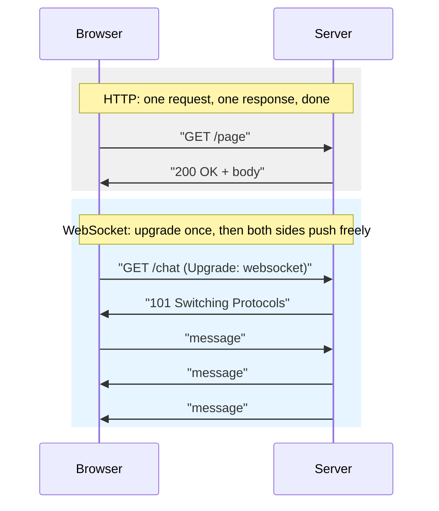

## Before you start

You should know `tcp-ip-udp` — HTTP is built directly on top of TCP, and understanding why TCP guarantees ordered delivery explains why HTTP can safely assume a request arrives intact.

## In one sentence

**HTTP** (HyperText Transfer Protocol) is the request-and-response language browsers and servers use to talk to each other; **HTTPS** is the same thing wrapped in encryption; **WebSockets** let both sides keep talking back and forth over one connection instead of asking-and-waiting every single time.

## Why it matters

Almost every web app you've used runs on HTTP requests: load a page, submit a form, fetch data from an API. Without HTTPS, anyone sharing your network — your Wi-Fi router, your ISP, someone on the same coffee shop hotspot — could read or silently tamper with that traffic, including passwords and payment details. And without WebSockets, live features like chat, stock tickers, or multiplayer games would need to constantly re-ask the server "anything new yet?" every second, wasting bandwidth, adding delay, and still missing updates between polls.

## The intuition

HTTP works like exchanging letters through the mail: your browser sends a **request** — pick a method (`GET` to fetch, `POST` to submit), specify an address (the URL), attach some notes (headers) — and the server sends back a **response**: a status code (`200` for "here you go," `404` for "couldn't find that") plus a body. Each letter is independent; the server doesn't remember you between exchanges unless you both agree to include something like a cookie, similar to signing each letter with a reference number so the recipient can connect it to previous ones.

A WebSocket is different: instead of exchanging separate letters, both sides open a phone line and just talk, live, for as long as the call lasts. No need to write a new letter and wait for a reply every time — either party speaks whenever they have something to say.

## How it actually works



An HTTP exchange has two halves. The **request** includes a method (`GET`, `POST`, `PUT`, `DELETE`, and others), a path, headers (`Content-Type`, `Authorization`, and so on), and sometimes a body (like JSON data for a `POST`). The **response** includes a status code, response headers, and a body. Status codes follow ranges with real meaning: `2xx` means success, `3xx` means redirect, `4xx` means the client made a mistake (like `404 Not Found`), and `5xx` means the server failed.

**HTTPS** doesn't change any of this — it's HTTP wrapped inside **TLS** (Transport Layer Security). Before any HTTP request is sent, the client and server perform a TLS handshake: they agree on encryption methods and the server proves its identity using a **certificate**, signed by a trusted authority. After that handshake, everything — the method, headers, body, response — travels encrypted, unreadable to anyone intercepting the connection.

**WebSockets** solve a different problem entirely. HTTP's ask-and-wait pattern is a poor fit for anything needing constant two-way updates. A WebSocket connection starts life as a *normal* HTTP request, carrying a special `Upgrade: websocket` header. If the server agrees, it responds with status `101 Switching Protocols`, and from that point on, the underlying TCP connection stops speaking HTTP and stays open indefinitely — either side can send a message at any moment, with no new handshake, no new request. This is exactly what chat apps, live dashboards, and multiplayer games need.

## Worked example

```js
const http = require('http');

const server = http.createServer((req, res) => {
  // req.method + req.url describe the request; res.writeHead + res.end send the response
  if (req.url === '/hello') {
    res.writeHead(200, { 'Content-Type': 'text/plain' });
    res.end('Hello, world'); // one request, one response, then the exchange is fully done
  } else {
    res.writeHead(404);
    res.end('Not found');
  }
});

server.listen(3000);
```

A request to `/hello` produces:

```
$ curl -i http://localhost:3000/hello
HTTP/1.1 200 OK
Content-Type: text/plain

Hello, world
```

Every single call to this server opens and closes independently — the server has no memory that you asked before, unlike a WebSocket which stays open across many exchanges.

## A second example — when it gets harder

Here's where the naive "just poll the server" approach breaks down. Imagine a live chat app that polls `GET /messages` every 2 seconds. On a good connection, users see a new message up to 2 seconds late — noticeable but tolerable. Now scale it to 10,000 concurrent users: that's 5,000 requests per second hitting your server, the overwhelming majority of which return "nothing new," each still paying the cost of a full HTTP request (headers, sometimes a new TCP connection, and for HTTPS a TLS handshake on top).

Replace polling with one WebSocket per user, and the server only sends data the instant a message actually arrives — zero wasted requests, and messages appear in milliseconds instead of up to 2 seconds late. The trade-off: your server now must hold 10,000 *open* connections simultaneously rather than handling brief, stateless bursts, which changes how you think about server capacity — it's no longer just "requests per second," it's "how many connections can stay open at once."

## Quick reference

| | HTTP | HTTPS | WebSocket |
|---|---|---|---|
| Encrypted | No | Yes (TLS) | Depends (`wss://` is encrypted, `ws://` is not) |
| Connection style | Request, response, done | Same as HTTP | Stays open, two-way |
| Good for | Pages, REST APIs | Anything with sensitive data | Chat, live feeds, games |
| Starts as | Plain request | TLS handshake first | Normal HTTP request that "upgrades" |
| Common status codes | 200, 301, 404, 500 | Same as HTTP | 101 (switching protocols) to start |

## Common mistakes

- Thinking WebSockets replace HTTP entirely — most real apps still use HTTP for page loads and regular API calls, adding a WebSocket only for the specific parts that genuinely need live, two-way updates.
- Assuming HTTPS makes an app fully secure — it only protects data *in transit*; the server can still have security bugs, and you still must validate input and manage authentication properly.
- Confusing a `404` (client asked for something that doesn't exist) with a `500` (the server itself broke) — interviewers use this to check you understand who is "at fault" in each status range.

## What interviewers ask

- **What's the difference between HTTP and HTTPS?** — HTTPS is HTTP wrapped in TLS encryption; the request/response model is identical, but HTTPS also verifies the server's identity via a certificate and prevents eavesdropping or tampering in transit.
- **Why use a WebSocket instead of polling the server every few seconds?** — Polling wastes requests asking "anything new?" even when the answer is no, adding both latency (data is only as fresh as your poll interval) and server load; a WebSocket lets the server push data the instant it's available, over one persistent connection.
- **How does a WebSocket connection start?** — It begins as a normal HTTP request carrying an `Upgrade: websocket` header; if the server agrees, it responds with a `101` status and the connection switches protocols, staying open afterward for two-way messages.
- **What do the different HTTP status code ranges mean?** — `2xx` is success, `3xx` means the client should look elsewhere (a redirect), `4xx` means the client's request was invalid in some way, and `5xx` means the server itself failed to handle a valid request.

## Practice

1. Extend the worked example server to handle a `POST /echo` route that reads the request body and returns it back with a `200` — this forces you to deal with the fact that Node's `http` module delivers the body as a stream of chunks, not a ready value.
2. Explain why a WebSocket handshake reuses the HTTP request format instead of inventing a completely new protocol from scratch.
3. Design (on paper) a live "seats remaining" counter for a ticket-booking page. Decide whether you'd use polling or a WebSocket, and justify the choice based on how often the count actually changes.

## Where to go next

Continue to `dns-load-balancing` to see what happens *before* any of these HTTP requests even reach a server — how a domain name resolves to an IP address, and how traffic gets spread across many servers once it arrives.
