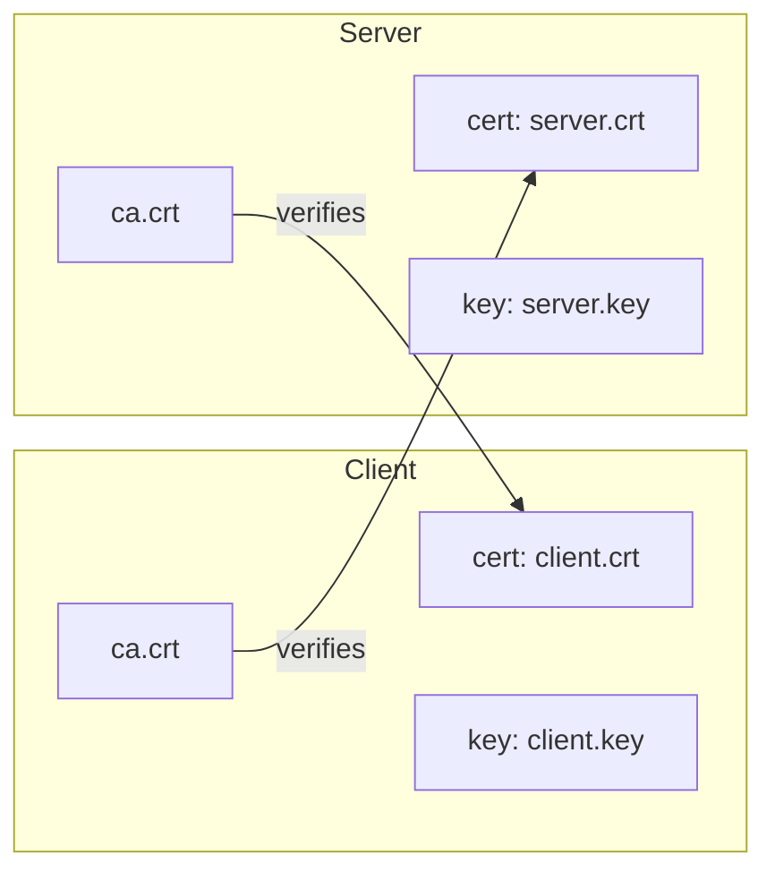
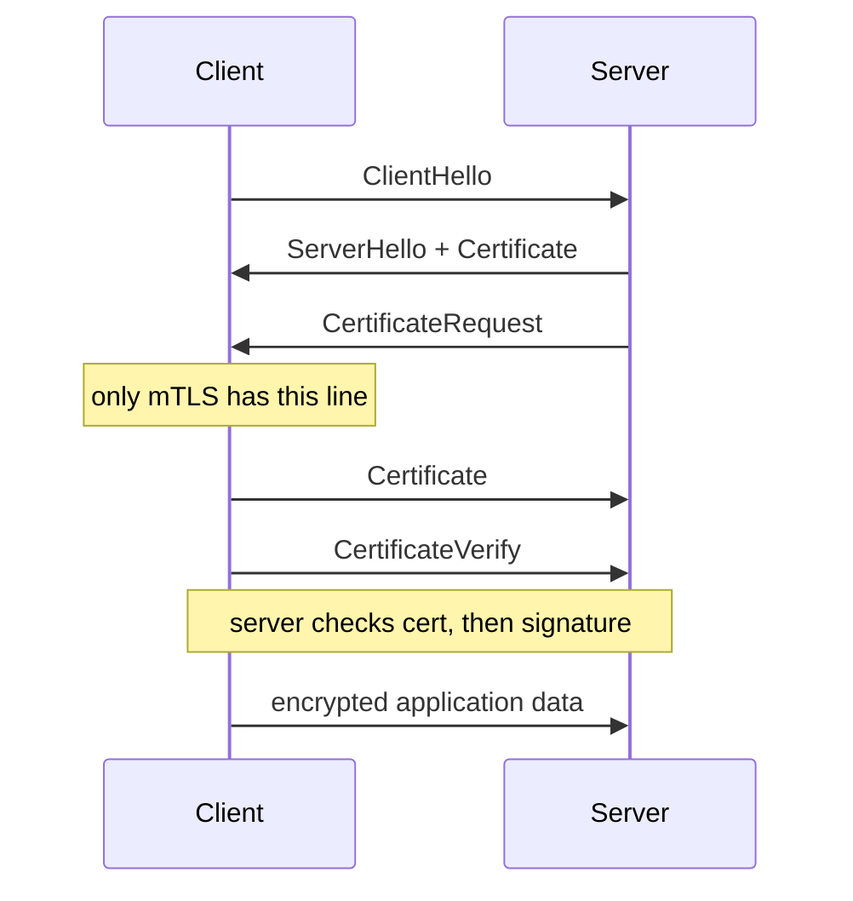

## Before you start

Read `tls-and-certificates` first. Everything here builds on the one-way handshake, certificate chains and what a CA is — this topic adds one thing to that picture and does not repeat it. `tcp-ip-udp` helps, since TLS still runs on top of a TCP connection.

## In one sentence

**Mutual TLS** (mTLS) is ordinary TLS with one addition: the server also asks the client for a certificate, so both ends prove who they are instead of only the server.

## Why it matters

In normal HTTPS the server has no idea who is calling it. Anyone on the internet can open a connection; the server learns a caller's identity only later, from something *inside* the request — a bearer token, an API key, a session cookie. That works, but it means a stolen string is a stolen identity. A token copied out of a log file, a config repo or an error report works from any machine on earth.

mTLS moves identity down to the connection itself. The caller must hold a private key that never leaves its process, and must prove possession of it during the handshake. Copying the client's certificate off the wire gets an attacker nothing, because the certificate is public — the proof requires the key. That is why mTLS is the default for service-to-service traffic inside a cluster, where you have thousands of internal calls and no human to log in.

The other payoff is that identity arrives *before* your application code runs. A request that reaches your handler has already been authenticated. You never wrote that check.

## The intuition

Go back to the embassy from `tls-and-certificates`. In ordinary HTTPS you check the official's passport, they hand you nothing to check about you, and you start talking. The building's security relies on a password you say once you are inside.

mTLS is the version where the guard also asks for *your* passport at the door. You both show ID issued by an authority the other side recognises, and neither of you says a word until both checks pass.

Here is the part that makes it click, and it is the single most useful idea in this topic. Each side holds exactly **three** things:

- `cert` — my ID. Public. I send it.
- `key` — my secret. Private. I never send it.
- `ca` — who I trust. Public. I check *the other side* with it.

Ordinary HTTPS: only the server has a `cert` and `key`. The client has only a `ca`.
Mutual TLS: the client has a `cert` and `key` too.

And the symmetry that trips people up in interviews: **both sides hold "a CA certificate", and in a simple setup it is literally the same file — used in opposite directions.** The client's copy verifies the server. The server's copy verifies the client. Same bytes, opposite job. If you can say that sentence out loud, you understand mTLS.



## How it actually works

The handshake is the one you already know, plus two extra messages in the middle and one extra request from the server.



**CertificateRequest** is the switch. The server sends it only if it was configured to want client authentication. If the server does not send it, the client sends nothing about itself and this is plain HTTPS — the server will never learn who called.

**Certificate** is the client's own certificate chain. It carries the client's public key and its name, signed by a CA.

**CertificateVerify** is a signature made *live*, with the client's private key, over a hash of every handshake message so far. This message is the whole reason mTLS is secure, and it is what people miss. Certificates are public — an attacker who watched an earlier handshake could copy the client's certificate. CertificateVerify proves the sender also holds the matching private key right now.

So the server runs **two independent checks**, and it needs both:

1. *Is this certificate genuine?* Verify the CA's signature over the certificate, using the CA public key from the `ca` file. This binds a public key to a name — it was made once, at issuance, and is reusable for years.
2. *Does the sender hold the matching private key?* Verify the CertificateVerify signature using the public key from the certificate just validated. This was made live, for this connection only.

Check 1 alone: the certificate is real but public, so a thief passes. Check 2 alone: the sender holds *some* key, but no CA vouched for the name. Together they mean "a CA I trust says this key belongs to `demo-client`, and the sender demonstrably holds that key."

Because the signature covers the handshake transcript — which includes the server's fresh random nonce — it is valid for this connection only. Replaying it elsewhere fails.

### The private key never crosses the wire

This is worth being precise about, because "paste your certificate *and* your key into the config" makes people nervous.

The client uses the key locally, in memory, to compute one signature. Only the signature goes out. The server verifies it with the *public* key from the certificate. Recovering the private key from the signature would mean breaking the underlying cryptography.

You can prove this rather than take it on faith: put a raw TCP proxy between client and server, record every byte, then search those bytes for the private key's secret components. The certificate appears; the private exponent and its prime factors never do.

There is an honest nuance. Under TLS 1.3, the Certificate message is sent *after* the key exchange, so it is encrypted — a byte-level sniffer sees ciphertext and finds neither the certificate nor the key. Under TLS 1.2 the Certificate message is cleartext, so the same test finds the certificate plainly on the wire and still never finds the key. The TLS 1.2 run is what actually proves the distinction: the certificate *is* transmitted, by design; the key is not.

## Worked example

Two switches on the server decide everything. Run this whole file with `node file.js`.

```js
const https = require('node:https');
const fs = require('node:fs');

const P = (f) => fs.readFileSync(`./certs/${f}`, 'utf8');

const server = https.createServer(
  {
    cert: P('server-a.crt'),   // MY id      -> proves server to client
    key:  P('server-a.key'),   // MY secret  -> never sent
    ca:   P('ca.crt'),         // WHO I TRUST -> verifies the CLIENT's cert
    requestCert: true,         // <-- the ONE switch that makes it mutual
    rejectUnauthorized: true,  // <-- and the one that enforces the result
  },
  (req, res) => {
    // Identity taken straight off the TLS socket — nothing parsed, nothing forgeable.
    const peer = req.socket.getPeerCertificate();
    const cn = peer && Object.keys(peer).length ? peer.subject.CN : null;
    res.end(JSON.stringify({ yourClientCN: cn, tlsAuthorized: req.socket.authorized }));
  },
);

server.listen(4443, '127.0.0.1', () => {
  const req = https.request(
    {
      host: '127.0.0.1', port: 4443, path: '/', servername: 'localhost',
      cert: P('client.crt'),   // my id
      key:  P('client.key'),   // my secret
      ca:   P('ca.crt'),       // same file as the server's — opposite direction
    },
    (res) => {
      let b = '';
      res.on('data', (d) => (b += d));
      res.on('end', () => { console.log('HTTP', res.statusCode, b); server.close(); });
    },
  );
  req.on('secureConnect', () => {
    console.log('proto =', req.socket.getProtocol(),
                ' serverAuthorized =', req.socket.authorized);
  });
  req.end();
});
```

Output:

```
proto = TLSv1.3  serverAuthorized = true
HTTP 200 {"yourClientCN":"demo-client","tlsAuthorized":true}
```

Two things to notice. `serverAuthorized = true` is the client's verdict on the server — the check you already had in one-way TLS. `yourClientCN: "demo-client"` is the new half: the server named its caller, and that name came off the handshake, not out of a header. Nothing in the HTTP request contained it, so nothing in the HTTP request could have faked it.

Now flip one line. Set `requestCert: false` and drop the client's `cert`/`key`. The call still returns 200 — but `yourClientCN` is `null`. The server has no idea who called it. That is ordinary HTTPS, and the difference between the two runs is the entire meaning of "mutual".

## A second example — when it gets harder

The naive reading is that `requestCert: true` turns on mTLS. It does not. There are two switches, and only one combination actually enforces anything.

| `requestCert` | `rejectUnauthorized` | What happens | Verdict |
|---|---|---|---|
| `true` | `true` | Server demands a client certificate signed by its `ca` and refuses the connection otherwise | Real mTLS |
| `true` | `false` | Server asks for a certificate, verifies it, and **connects anyway if it is missing or invalid** | Inspect-only — the trap |
| `false` | (ignored) | Server never asks. Client sends nothing about itself | Plain HTTPS |

The middle row is the dangerous one, because it succeeds. Connections work. Nothing errors. Logs look healthy. But run a client with no certificate at all and the server returns **200 OK** with `yourClientCN: null` — it accepted an anonymous caller while looking, from the outside, exactly like a working mTLS deployment. The socket does expose `socket.authorized === false` and an `authorizationError`, so the information is there; it is just that nothing acts on it unless you write that code yourself.

This combination is not useless — logging who calls you during a migration, before you start enforcing, is a legitimate use. It is dangerous because it is indistinguishable from enforcement unless you deliberately test the negative case. `secure-defaults-and-common-footguns` covers this in full.

The second surprise: mTLS does not replace token auth, it stacks with it. A single request can carry a client certificate at the TLS layer *and* an `Authorization: Bearer` header at the HTTP layer. They are different layers and both apply. The certificate answers "which service is this?" and the token answers "on whose behalf, with what scopes?" Interviewers like this question because candidates assume it is either/or.

## Quick reference

| Thing | Ordinary HTTPS | Mutual TLS |
|---|---|---|
| Server sends certificate | yes | yes |
| Client verifies it | yes | yes |
| Client sends certificate | **no** | **yes** |
| Server verifies it | **no** | **yes** |
| Server knows the caller | `null` | `demo-client` |
| Extra handshake messages | — | CertificateRequest, Certificate, CertificateVerify |
| Identity available before your handler runs | no | yes |
| Cost of a leaked identity | token works anywhere | useless without the private key |

## Common mistakes

- Saying "mTLS means the client has a certificate" and stopping there. The certificate is public; the CertificateVerify signature is what proves anything.
- Assuming `requestCert: true` is enough. Without `rejectUnauthorized: true` the server accepts callers with no certificate.
- Thinking the private key is transmitted because you configured both files. Configuring is not transmitting — the key is used locally to sign, and only the signature goes out.
- Reading the client's identity from a header when mTLS is on. Take it from the socket (`socket.getPeerCertificate()`); a header can be set by anyone.
- Treating mTLS and bearer tokens as alternatives. They occupy different layers and are routinely used together.
- Forgetting that the client now has a certificate that expires too. mTLS doubles the number of certificates you must rotate.

## What interviewers ask

- **What is the difference between TLS and mTLS?** — One extra server message, `CertificateRequest`, and the client's reply of `Certificate` + `CertificateVerify`. The server ends up knowing who called it; in one-way TLS it does not.
- **Both sides hold a CA certificate. Are they the same thing?** — Same kind of file, often literally the same file, used in opposite directions: the client's copy verifies the server, the server's copy verifies the client.
- **Why isn't sending the client certificate enough?** — Certificates are public and copyable. `CertificateVerify` is a live signature over the handshake transcript that proves possession of the private key for this connection only.
- **Does the private key go over the network?** — No. It signs a challenge locally; only the signature travels. The server verifies with the public key from the certificate.
- **Why use mTLS instead of an API key for service-to-service calls?** — A key is a copyable string that works from anywhere; a certificate needs a non-exportable private key, and identity is established before application code runs.
- **Where would you actually use mTLS?** — Service-to-service traffic inside a cluster, partner APIs where you issue clients certificates, webhook callers you must authenticate, and service mesh sidecars where the mesh does it for every hop automatically.

## Practice

1. Write the minimal pair of `node:https` server and client above, generate a CA and two leaf certificates with `openssl`, and get a successful call. Then set `requestCert: false`, rerun, and explain in one sentence why `yourClientCN` became `null`.
2. Take the working setup and remove only the server's `ca` option. Predict what happens before you run it, then run it and reconcile the difference.
3. Send an `Authorization: Bearer something` header on top of a valid mTLS call and log both the certificate CN and the header on the server. Write down which layer each arrived at and which one an attacker could forge.
4. Optional hands-on: the runnable lab at `mtls-demo` builds a real CA, two servers and one client, and prints exactly what each PEM file contains at startup. `node explain-mutual.js` runs the same connection twice — once with `requestCert: false`, once with `true` — and narrates both sides. `node prove-key-never-sent.js` puts a TCP spy in the middle and searches the captured bytes for the private key.

## Where to go next

Continue to `mtls-failure-modes`. You now know what a working mTLS connection looks like; the far more common experience is one that does not work, and the errors are famously unhelpful. That topic turns the seven ways this breaks into a diagnostic tree you can walk in an interview or an incident.
