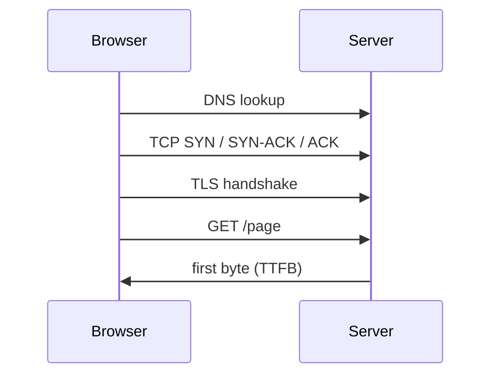

## Before you start

`tcp-ip-udp` is essential — head-of-line blocking, the central idea here, is a direct consequence of how TCP guarantees ordering. `tls-and-certificates` explains the handshake round trips we're about to count.

## In one sentence

**Latency** is how long one round trip takes, **bandwidth** is how much data fits through per second, and most slow web pages are slow because of too many round trips, not too little bandwidth.

## Why it matters

Engineers instinctively optimise the wrong one. Doubling bandwidth barely changes page load time; halving round trips changes it dramatically. Bandwidth has improved enormously over two decades while latency has barely moved, because latency is bounded by the speed of light and no upgrade removes that.

Concretely: London to Sydney is about 17,000km, roughly 85ms one way through fibre, so 170ms per round trip *at the theoretical limit* — real networks land nearer 250ms. Ten sequential round trips is 2.5 seconds before your server does any work.

## The intuition

Think of a water pipe. **Bandwidth** is its width — how much flows per second. **Latency** is its length — how long before the first drop arrives. Downloading a large file is bandwidth-bound, so width matters. Loading a web page is latency-bound: dozens of small exchanges each waiting on the previous one, so length dominates.

The classic illustration: a truck full of hard drives crossing a country has enormous bandwidth and terrible latency. Perfect for a petabyte; useless for a chat message.

## How it actually works



**RTT** (round-trip time) is one there-and-back journey, and every setup step above costs at least one. **TTFB** (time to first byte) measures from request start to the first response byte, bundling DNS, TCP, TLS, and server processing. A high TTFB with a fast server means round trips, not slow code — worth establishing before optimising the wrong layer.

Here's a realistic latency budget for a first visit to a server 100ms away:

| Step | Round trips | Cost at 100ms RTT |
|---|---|---|
| DNS lookup | 1 | 100ms |
| TCP handshake | 1 | 100ms |
| TLS 1.3 handshake | 1 | 100ms |
| HTTP request → first byte | 1 | 100ms + server time |
| **Total before any HTML** | **4** | **~400ms** |

That's before a single stylesheet or script. Each additional resource fetched sequentially adds another round trip — which is why the number of requests, and whether they can run in parallel, dominates page speed.

**HTTP/1.1** allowed roughly six connections per host, so the seventh resource waited. Browsers worked around it by sharding assets across domains, each costing its own DNS, TCP, and TLS setup.

**HTTP/2** introduced **multiplexing**: many requests share one connection as independent streams, plus header compression. But it runs on TCP, and TCP guarantees in-order delivery of the whole byte stream. If one packet is lost, *every* stream stalls until it's retransmitted, even streams whose data already arrived. That's **transport-layer head-of-line blocking** — HTTP/2 removed it at the application layer and left it at the transport layer.

**HTTP/3** solves this by abandoning TCP for **QUIC**, built on UDP. QUIC tracks streams independently, so a lost packet stalls only its own stream. It also folds the transport and TLS handshakes together — a new connection costs one round trip instead of two, and a resumed one can cost zero. Because QUIC connections have an ID independent of IP address, switching from Wi-Fi to mobile data doesn't drop the connection.

**Bufferbloat** is the counterintuitive one: oversized buffers hold packets rather than dropping them, so queues grow and latency balloons under load even though bandwidth looks fine.

## Worked example

```js
const https = require('node:https');

// Measure where the time actually goes on a single request
const start = process.hrtime.bigint();
const marks = {};
const ms = () => Number(process.hrtime.bigint() - start) / 1e6;

const req = https.get('https://example.com/', (res) => {
  res.once('data', () => { marks.firstByte = ms(); });  // this is TTFB
  res.on('end', () => {
    marks.complete = ms();
    console.log(marks);
  });
  res.resume();
});

req.on('socket', (s) => {
  s.on('lookup', () => { marks.dns = ms(); });          // DNS resolved
  s.on('connect', () => { marks.tcp = ms(); });         // TCP handshake done
  s.on('secureConnect', () => { marks.tls = ms(); });   // TLS handshake done
});
```

Typical output:

```
{ dns: 10.5, tcp: 61.4, tls: 96, firstByte: 127.4, complete: 127.8 }
```

Read the *gaps*, not the totals. DNS took 10.5ms, the TCP handshake another 51ms, TLS 35ms, and the request-to-first-byte 31ms — each one a round trip. The body then downloaded in 0.4ms. Almost all of that 127ms is setup, and nothing in it would improve with more bandwidth; only fewer round trips, a reused connection, or a closer server helps.

## A second example — when it gets harder

The naive conclusion from that trace is "make the server faster". Watch it fail.

An API returns 50 items and the client fetches details for each sequentially. On a 100ms link that's 5 seconds, with the server spending 2ms per request — optimising it to 1ms saves 50ms of 5,000. Fetching in parallel drops it to ~100ms; returning details in the original response costs zero extra trips. The fix is the interaction pattern, not the server.

Now a subtler case. You switch to HTTP/2, multiplex all 50 requests over one connection, and it's fast in the office — then mobile users report it's *slower*. On a lossy network one lost packet stalls all 50 streams via TCP head-of-line blocking, whereas HTTP/1.1's six separate connections isolated failures. HTTP/2 concentrates streams onto one TCP connection and so concentrates the blast radius of loss, which is exactly what HTTP/3 was designed to fix.

Finally, `ping` tells you nothing about TLS setup, server processing, or bufferbloat — a network pinging at 20ms idle can behave far worse saturated.

## Quick reference

| Symptom | Likely cause | Fix |
|---|---|---|
| High TTFB, fast server | Round trips (DNS/TCP/TLS) | CDN, connection reuse, HTTP/3 |
| Slow on mobile, fast on Wi-Fi | Packet loss + HOL blocking | HTTP/3 / QUIC |
| Large file slow | Genuinely bandwidth-bound | Compression, smaller payloads |
| Many small requests slow | Sequential round trips | Batch, parallelise, multiplex |
| Latency spikes under load | Bufferbloat / queuing | Rate limiting, better queue management |

| | HTTP/1.1 | HTTP/2 | HTTP/3 |
|---|---|---|---|
| Transport | TCP | TCP | QUIC over UDP |
| Multiplexing | No (~6 connections) | Yes | Yes |
| Transport HOL blocking | Per connection | Yes — affects all streams | No |
| New connection setup | TCP + TLS (2+ RTT) | TCP + TLS (2+ RTT) | 1 RTT, 0 on resume |
| Survives network change | No | No | Yes (connection ID) |

## Common mistakes

- Buying bandwidth to fix a latency problem. Page loads are dominated by round trips, which bandwidth doesn't reduce.
- Believing HTTP/2 eliminated head-of-line blocking. It removed it at the application layer only; TCP still enforces ordering underneath.
- Measuring performance solely on a fast local network, hiding exactly the packet-loss behaviour that hurts real users.
- Treating `ping` as a complete latency measurement, ignoring handshakes, server time, and behaviour under load.

## What interviewers ask

- **What is TTFB and what does a high one tell you?** — Time to first byte, covering DNS, TCP, TLS, and server processing; high TTFB with a fast server points at round trips and distance, not code.
- **Why was HTTP/3 created when HTTP/2 already multiplexed?** — HTTP/2 still rides TCP, so one lost packet stalls every multiplexed stream; QUIC over UDP keeps streams independent and also cuts handshake round trips.
- **Walk me through the latency budget of a first page load.** — Roughly four round trips before any HTML: DNS, TCP handshake, TLS handshake, then the request itself — about 400ms on a 100ms link.
- **Why might HTTP/2 be slower than HTTP/1.1 for some users?** — On lossy networks, concentrating all streams on one TCP connection means a single loss blocks everything, whereas separate connections isolated the damage.

## Practice

1. Run the timing script against a local server and a distant one. Attribute each gap to a specific protocol step and identify which are unavoidable.
2. Compute the latency budget for 30 sequential API calls at 80ms RTT, then batched into 3. Quantify what server-side optimisation would need to achieve to match batching.
3. Explain why a gallery loading 100 thumbnails behaves differently on HTTP/1.1, HTTP/2, and HTTP/3, on clean and 2%-packet-loss networks.

## Where to go next

Continue to `grpc-and-protobuf` — gRPC is built on HTTP/2 and uses a compact binary format, applying these lessons directly to service-to-service communication.
