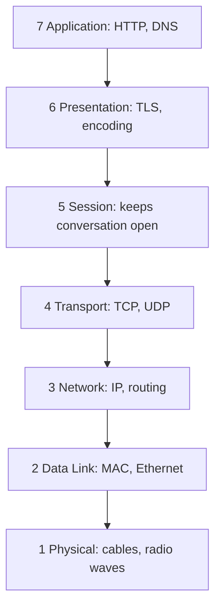

## Before you start

Nothing formal is required — this is the first networking topic, and a good place to start if terms like "packet" or "protocol" feel vague. If you've ever wondered what actually happens between typing a URL and seeing a page load, you're in the right place.

## In one sentence

The **OSI model** is a 7-layer checklist that describes every step data takes to travel from one computer to another, from raw electrical signals up to the app you're using — and expanding that acronym, OSI stands for **Open Systems Interconnection**, a naming standard created so different vendors' hardware and software could actually talk to each other.

## Why it matters

Before shared standards existed, every vendor built its own incompatible way of moving data — a cable maker's plug wouldn't fit a router, and a router wouldn't understand a browser's data. The OSI model gives every engineer a common vocabulary: saying "that's a layer 3 problem" instantly tells a colleague where to look, without a lengthy explanation. It also explains something you rely on daily without noticing — swapping Wi-Fi for Ethernet, or 4G for 5G, doesn't break your banking app, because only the bottom layers changed and everything above kept working exactly the same.

## The intuition

Think about mailing a letter through a company's internal mail system. You write the actual message. You put it in an envelope addressed to a person. You drop it in your building's outgoing mail slot. The mailroom bundles it into a truck bound for another city. That truck drives over physical roads. At the destination, the process reverses: truck to mailroom to building to envelope to your friend reading the message.

Nobody at any step needs to understand what's inside the envelope — the truck driver doesn't read your letter, and you don't care which road the truck takes. Each step only cares about its own job and hands off to the next. Networking works the same way, except instead of 4 or 5 informal steps, it's formalized into exactly 7 layers, each with a name and a precise responsibility.

## How it actually works



Each layer hands data to the one directly below it on the way out, and the one directly above it on the way in — nothing skips a level.

The 7 layers, from bottom (closest to the physical wire) to top (closest to your app):

1. **Physical** — raw bits (0s and 1s) as electrical signals, light pulses, or radio waves.
2. **Data Link** — getting bits to the next device on the *same* local network, using **MAC addresses** (a hardware address burned into your network card).
3. **Network** — routing data across *different* networks, using **IP addresses** (this is where the Internet Protocol lives).
4. **Transport** — chunking data into manageable pieces and making sure it all arrives correctly, in order — this is TCP's job (covered in the next topic).
5. **Session** — keeping a conversation open between two machines across multiple exchanges.
6. **Presentation** — formatting and encrypting data so both ends agree on how to interpret it.
7. **Application** — the actual protocol your app speaks, like HTTP for web pages or SMTP for email.

The rule that makes this useful: **each layer only talks to the layers directly above and below it**. When your browser sends a request, it hands data down through layers 7 to 1 on your machine, the bits travel across the wire or airwaves, and the receiving server hands the data back up through layers 1 to 7. Layer 7 on your machine never has to know anything about layer 2 — it just trusts that the layers below it will deliver the bytes.

## Worked example

```js
// You rarely touch layers 1-3 directly in Node.js, but you can clearly see
// layer 4 (Transport) and layer 7 (Application) in a simple TCP echo server.
const net = require('net');

const server = net.createServer((socket) => {
  // `socket` is a live Transport-layer (TCP) connection — layer 4.
  socket.on('data', (chunk) => {
    console.log('Application layer sees:', chunk.toString()); // layer 7
    socket.write(`echo: ${chunk}`); // Node hands this down to TCP, then IP, then the wire
  });
});

server.listen(4000, () => console.log('Listening on layer 7, riding on layer 4'));
```

Run this, then connect with `nc localhost 4000` and type something. Output:

```
$ nc localhost 4000
hello
echo: hello
```

Your code only ever calls `socket.write()` and reads `chunk` — the entire journey through TCP segments, IP packets, and physical bits happens invisibly underneath, exactly as the layering model promises.

## A second example — when it gets harder

Here's where the model gets less tidy: real internet software doesn't implement all 7 layers separately. TLS (the encryption behind HTTPS) is often taught as layer 6 (Presentation), but in practice it's usually treated as sitting right on top of TCP, blurring the line between layers 4 through 7. Similarly, HTTP itself technically handles some things — like keeping a connection alive for multiple requests — that OSI would assign to the Session layer (5).

This matters for an interview because it reveals whether you understand OSI as a *teaching and troubleshooting reference*, not a literal blueprint every piece of software follows layer-by-layer. The real internet is built on the simpler **TCP/IP model**, which only has 4 layers: Link, Internet, Transport, and Application — it merges OSI's Physical and Data Link into one, and squashes Session, Presentation, and Application into one.

## Quick reference

| Layer | Name | Does what | Example |
|---|---|---|---|
| 7 | Application | Protocol your app speaks | HTTP, DNS, SMTP |
| 6 | Presentation | Formats/encrypts data | TLS, JSON encoding |
| 5 | Session | Keeps a conversation open | Login sessions |
| 4 | Transport | Reliable delivery, ordering | TCP, UDP |
| 3 | Network | Routing between networks | IP, routers |
| 2 | Data Link | Delivery on the same network | Ethernet, MAC address, switches |
| 1 | Physical | Raw bits on the wire/air | Cables, Wi-Fi radio |

## Common mistakes

- Treating OSI as something every real system implements exactly — the actual internet runs on the simpler 4-layer TCP/IP model; OSI is mainly a mental map for discussing problems.
- Mixing up layer 2 and layer 3 addressing — MAC addresses (layer 2) identify a device on its local network; IP addresses (layer 3) identify it globally so routers can find it across networks.
- Assuming higher layers "know about" lower ones — a layer should never need to understand the internals of the layer below it, only that it will deliver what was handed to it.

## What interviewers ask

- **Why do we need 7 layers instead of just sending raw data?** — Splitting responsibilities means each layer can change independently; you can swap Wi-Fi for fiber without rewriting a single line of your app, because only layers 1-2 change and everything above is unaffected.
- **Where does a switch operate vs. a router?** — A switch works at layer 2 using MAC addresses to move data within one local network; a router works at layer 3 using IP addresses to move data between different networks.
- **Which layer does HTTPS live at?** — HTTP itself is layer 7; the TLS encryption underneath it is usually described as layer 6 (Presentation), though real TCP/IP stacks blur layers 5 through 7 together.
- **What's the model actually used in practice, versus OSI?** — The TCP/IP model, which collapses OSI's 7 layers into 4; OSI remains valuable mainly as a shared vocabulary for describing and troubleshooting network issues.

## Practice

1. Pick any website you use daily. Write down, layer by layer from 7 down to 1, what you think happens when you load its homepage — you won't get every detail right, but the exercise builds the mental model.
2. Your Wi-Fi drops but your VPN stays "connected" in its UI. Which OSI layer most likely failed, and why does the VPN software not immediately notice?
3. A teammate says "it's a layer 7 problem" about a bug where a page returns HTML instead of JSON. Explain in one sentence why that's an application-layer issue and not a lower-layer one.

## Where to go next

Layer 4 (Transport) is where the real engineering trade-offs begin — continue to `tcp-ip-udp` to see the two very different philosophies (TCP and UDP) for moving data reliably versus quickly.
