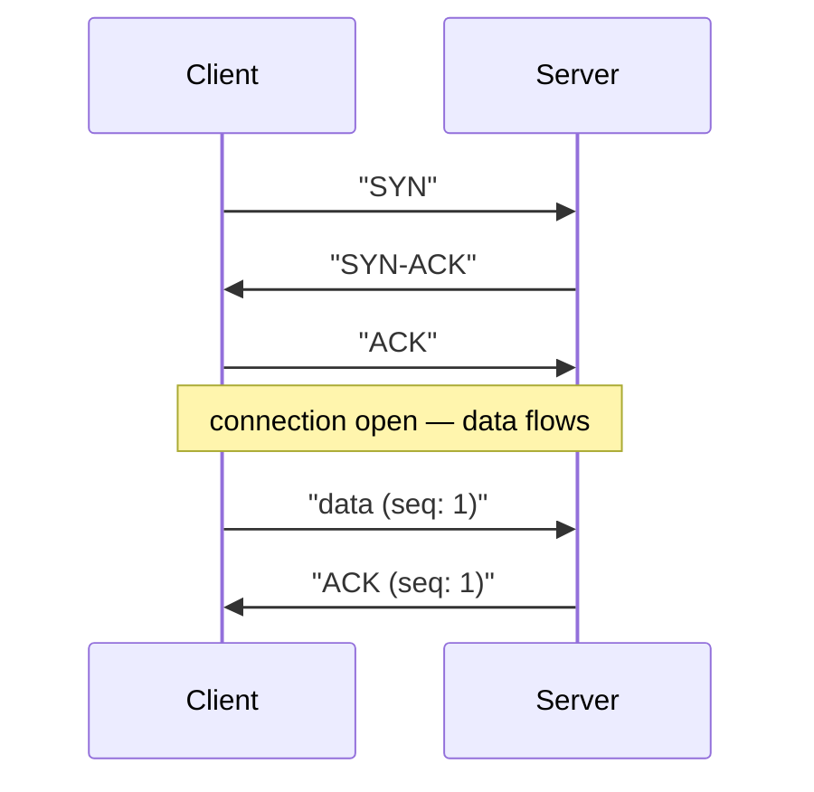

## Before you start

Read `osi-model` first if you haven't — TCP and UDP both live at layer 4 (Transport), and it helps to know what sits above and below them.

## In one sentence

**TCP** (Transmission Control Protocol) and **UDP** (User Datagram Protocol) are the two ways computers send data over the internet — TCP double-checks every piece arrives correctly and in order, while UDP just fires data and moves on, with no guarantees.

## Why it matters

Different applications have fundamentally different needs. A bank transfer must never lose or duplicate a byte — an amount arriving corrupted or twice is a disaster. A video call, on the other hand, would rather drop a frame than freeze the whole call waiting for it to be retransmitted, because by the time it arrives the moment has passed anyway. Picking the wrong protocol either wastes performance chasing guarantees nobody needs, or corrupts data that absolutely needed protection. Nearly every "why does X use UDP but Y uses TCP" interview question comes back to this one trade-off.

## The intuition

Imagine sending something through the postal system. TCP is like registered mail with tracking and signature confirmation: before you send anything, you and the recipient exchange a quick round of "are you ready to receive? — yes, are you ready to send? — yes" (this is the **three-way handshake**). Every package is numbered, so they can be reassembled in the right order even if some arrive out of sequence, and if one goes missing, you get notified and resend it. All that reliability costs time — extra round trips, waiting for confirmations.

UDP is like tossing postcards into a mailbox. No handshake, no numbering, no confirmation of delivery. Most arrive fine, some might get lost or arrive out of order, and nobody automatically notices or fixes it. But it's fast — there's no setup overhead and no waiting for acknowledgments.

## How it actually works



Both TCP and UDP ride on top of **IP** (Internet Protocol), which is just the addressing and routing system that moves a packet from your machine toward the right destination, one hop at a time. IP itself makes no delivery promises either — it's TCP that adds reliability on top of it.

**TCP's three-way handshake**, step by step:
1. Client sends a **SYN** (synchronize) packet — "I want to start a connection."
2. Server replies with **SYN-ACK** — "Got it, and I want to start one too."
3. Client sends **ACK** (acknowledge) — "Confirmed, we're both ready."

Only after this exchange does either side send real application data. Once flowing, TCP numbers every byte with a **sequence number**. The receiver sends back **acknowledgments** confirming what it received; if the sender doesn't get an ACK within a timeout window, it assumes the data was lost and resends it. This is also how TCP reorders packets that arrive out of sequence — each carries its position, so the receiver can put them back in order before handing data to the application.

**UDP** skips all of this. A sender just addresses a packet (called a **datagram**) to a destination IP and port and sends it — no handshake, no sequence numbers, no acknowledgments, no automatic retransmission. If an application needs *some* reliability on top of UDP, it has to build that itself — which is exactly what protocols like QUIC (used by HTTP/3) do, picking and choosing which guarantees they actually need instead of taking TCP's whole package.

TCP is used when correctness matters more than raw speed: web pages (HTTP), email, file transfers, database connections. UDP is used when latency matters more than perfect delivery: video calls, live streaming, DNS lookups, and online games, where a slightly stale position update beats a laggy, backed-up one.

## Worked example

```js
const net = require('net');
const dgram = require('dgram');

// TCP: a persistent, ordered connection — requires a handshake before any data flows
const tcpServer = net.createServer((socket) => {
  socket.write('TCP: reliable, ordered, connection-based\n');
});
tcpServer.listen(5000);

// UDP: fire-and-forget individual packets, no connection setup at all
const udpSocket = dgram.createSocket('udp4');
udpSocket.send('UDP: fast, no delivery guarantee', 5001, 'localhost');
```

Output when a TCP client connects to port 5000:

```
TCP: reliable, ordered, connection-based
```

The UDP send on port 5001 succeeds or silently fails — there's no built-in way for the sender to know which happened, unlike the TCP connection, which would throw an error if it couldn't establish a link in the first place.

## A second example — when it gets harder

The naive view is "TCP good, UDP bad" — but consider a live multiplayer game sending player positions 30 times per second over TCP. If one packet is lost, TCP pauses *everything* behind it until that one packet is retransmitted and confirmed — this is called **head-of-line blocking**. By the time the resend arrives, you have 5 more positions queued up behind it, and the player experiences a visible freeze followed by a jump, which is worse than just losing one position update entirely.

This is precisely why real-time games and video calls choose UDP and build their own lightweight handling on top — for example, only caring about the *latest* position and simply ignoring older, late-arriving packets, something TCP's strict ordering makes impossible to do cheaply.

## Quick reference

| | TCP | UDP |
|---|---|---|
| Connection | Handshake required (SYN, SYN-ACK, ACK) | None |
| Delivery guarantee | Yes (retransmits lost data) | No |
| Order guarantee | Yes (sequence numbers) | No |
| Head-of-line blocking | Yes — one lost packet blocks the rest | No |
| Speed | Slower (handshake + acknowledgment overhead) | Faster |
| Use case | Web, email, file transfer, databases | Video calls, gaming, DNS, live streaming |

## Common mistakes

- Saying "UDP is unreliable so it's bad" — unreliable just means no *automatic* guarantee; many applications handle their own lightweight retries at a higher layer and deliberately prefer UDP's speed.
- Forgetting that TCP's reliability has a real, measurable cost — the handshake, acknowledgments, and retransmissions all add latency, which is exactly why real-time systems avoid it.
- Assuming a "connection" in UDP behaves like a TCP connection — `dgram` sockets don't establish anything; each `send()` is an independent, addressed packet.

## What interviewers ask

- **Walk me through the TCP three-way handshake.** — Client sends SYN, server replies SYN-ACK, client replies ACK; only after this does either side send real data, guaranteeing both sides agree the connection is open before anything important is exchanged.
- **Why would you ever choose UDP over TCP?** — When low latency matters more than occasionally losing data, like live video or gaming — retransmitting a stale frame is pointless because the moment it represents has already passed, and TCP's head-of-line blocking would make the delay worse, not better.
- **How does TCP know a packet was lost?** — Every byte is numbered with a sequence number; the receiver sends acknowledgments back, and if the sender doesn't receive an ACK within a timeout, it resends the unacknowledged data.
- **What is head-of-line blocking, and why does it matter?** — It's when one lost or delayed packet forces every packet behind it (which already arrived) to wait, because TCP must deliver data to the application in order — this is a core reason latency-sensitive apps avoid TCP.

## Practice

1. Write a small Node.js UDP client and server pair, using `dgram`, that sends a message and prints what's received. Then deliberately close the server and observe what happens on the client — nothing errors immediately, which is the point.
2. Explain, in your own words, why DNS (a lookup that fits in one small packet) uses UDP by default but falls back to TCP for large responses.
3. Sketch out how you'd add "at least it arrived once" reliability on top of raw UDP, without reimplementing all of TCP — this is roughly the design problem QUIC and game networking libraries solve.

## Where to go next

Continue to `http-https-websockets` to see how HTTP is built directly on top of TCP, and how WebSockets change the request-response pattern into a persistent, two-way conversation.
