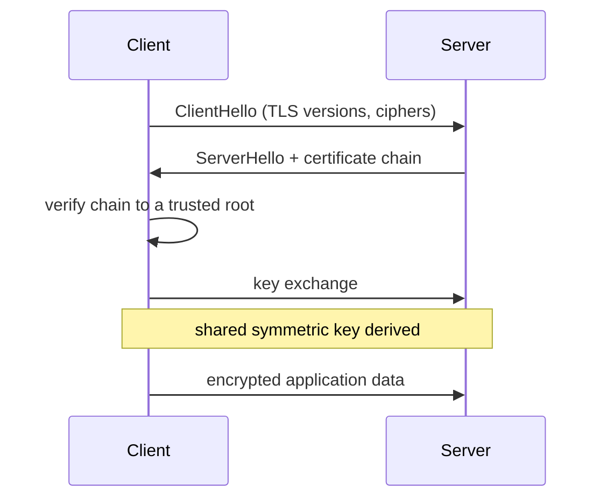

## Before you start

Read `tcp-ip-udp` first — TLS runs *on top of* an established TCP connection, so the handshake you're about to learn happens only after the three-way handshake finishes. `http-https-websockets` helps too.

## In one sentence

**TLS** (Transport Layer Security) is the layer that turns a plain, readable TCP connection into an encrypted one, using a **certificate** — a file that proves a server really is who it claims to be, signed by an authority your computer already trusts.

## Why it matters

Without TLS, every byte you send crosses the network in plain text. Anyone controlling a network hop — a coffee shop router, an ISP, a compromised switch — can read your password and silently rewrite the page you get back. Encryption alone doesn't fix this: if you encrypt to an attacker who is impersonating your bank, you've encrypted your password *to the attacker*. That is why TLS is really two problems at once, and interviewers probe both: **confidentiality** (nobody can read it) and **authentication** (you're talking to who you think).

## The intuition

Think of arriving at an embassy to have a private conversation. Two things must happen before you say anything sensitive.

First, you check identity. The official shows you a passport. You don't personally know them, but you recognise the government that issued the passport, and you trust that government's vetting. That's a **certificate** — the server's ID card, signed by a **Certificate Authority** (CA) your operating system already trusts.

Second, you agree on a private language. You and the official establish a shared secret code that only the two of you know, and you switch to it for the rest of the conversation. That's the **key exchange**, and everything after it is encrypted with a fast **symmetric key**.

The padlock in a browser means both steps succeeded. It does *not* mean the site is honest or safe — a scam site can hold a perfectly valid certificate for its own domain. It only means you are genuinely talking to the domain in the address bar, privately.

## How it actually works



The client opens with a **ClientHello** listing the TLS versions and cipher suites it supports. The server replies with a **ServerHello** picking one, plus its **certificate chain**.

That chain is the part people fumble in interviews. A server rarely holds a certificate signed directly by a root CA. Instead there's a path: your server's **leaf certificate** is signed by an **intermediate certificate**, which is signed by a **root certificate**. Only the root lives in your OS or browser trust store. The client walks the chain upward, checking each signature, until it reaches a root it already trusts. If any link is missing, expired, or signed by an unknown authority, the connection fails.

The client also checks that the certificate's domain actually matches the host it dialled, and that the current date falls inside the certificate's validity window. A valid certificate for `example.com` presented by `evil.com` is rejected — this check is what stops a stolen-but-genuine certificate from being reused elsewhere.

Then comes the key exchange. Modern TLS uses **ephemeral** key exchange: both sides contribute random material and derive a shared symmetric key that is never transmitted and is thrown away when the connection ends. This gives **forward secrecy** — capturing today's traffic and stealing the server's private key next year still doesn't decrypt it.

TLS 1.3 cut the handshake to one round trip, down from two in TLS 1.2, and removed the older cipher suites that caused most misconfigurations.

## Worked example

```js
const tls = require('node:tls');

// Connect to a real HTTPS server and inspect what it presented
const socket = tls.connect({ host: 'example.com', port: 443, servername: 'example.com' }, () => {
  console.log('authorized:', socket.authorized); // did the chain verify to a trusted root?
  const cert = socket.getPeerCertificate();
  console.log('subject:', cert.subject.CN);
  console.log('issuer :', cert.issuer.CN);       // the intermediate that signed it
  console.log('expires:', cert.valid_to);
  console.log('cipher :', socket.getCipher().name);
  socket.end();
});
```

Output looks like this (values change as certificates rotate):

```
authorized: true
subject: example.com
issuer : Cloudflare TLS Issuing ECC CA 3
expires: Oct 27 22:17:21 2026 GMT
cipher : TLS_AES_256_GCM_SHA384
```

`authorized: true` is the whole trust decision in one boolean. The `issuer` is not a root — it's an intermediate, exactly as described above.

## A second example — when it gets harder

The classic production incident: the site works in your browser but your Node.js service fails against the same URL with `UNABLE_TO_VERIFY_LEAF_SIGNATURE`.

The cause is almost always an **incomplete chain**. The server sends only its leaf certificate and forgets the intermediate. Browsers paper over this — they cache intermediates from previous sites and can fetch missing ones — so the padlock looks fine. Node.js does not. It has only the root store, cannot bridge the gap from leaf to root, and correctly refuses.

The wrong fix, which people reach for under pressure, is `rejectUnauthorized: false`. That disables verification entirely and turns your encrypted connection into one any attacker can impersonate — you keep confidentiality against passive eavesdroppers and lose all authentication. The right fix is to configure the server to send the full chain (leaf + intermediates, root omitted since the client already has it).

The same lesson explains expiry outages. A certificate expiring at 3am takes down every client at once, because expiry is checked per-connection by each client, not by the server.

## Quick reference

| Concept | What it does | Failure symptom |
|---|---|---|
| Leaf certificate | Identifies this specific domain | `CERT_HAS_EXPIRED`, hostname mismatch |
| Intermediate | Links leaf to root | `UNABLE_TO_VERIFY_LEAF_SIGNATURE` |
| Root CA | Pre-trusted by OS/browser | `SELF_SIGNED_CERT_IN_CHAIN` |
| Key exchange | Derives the shared symmetric key | Handshake failure, no cipher overlap |
| Forward secrecy | Past traffic stays safe if key leaks | Absent with old, non-ephemeral ciphers |
| TLS 1.3 | 1 round trip, fewer weak ciphers | Very old clients cannot connect |

## Common mistakes

- Saying "HTTPS means the site is safe" — it means the connection is private and the domain is verified, nothing about the site's intentions.
- Thinking the certificate encrypts the traffic. It doesn't; it proves identity and bootstraps a key exchange. The bulk data is encrypted with a fast symmetric key derived during the handshake.
- Setting `rejectUnauthorized: false` to make an error go away, which removes the protection you were trying to have.
- Forgetting that expiry is enforced by every client independently, so a lapsed certificate is an instant, total outage rather than a gradual degradation.

## What interviewers ask

- **What happens when you type an HTTPS URL and press enter?** — DNS resolves the host, TCP's three-way handshake opens a connection, then the TLS handshake exchanges hellos, validates the certificate chain to a trusted root, and derives a symmetric key; only then does the encrypted HTTP request go out.
- **How does your browser know a certificate is legitimate?** — It walks the chain from the server's leaf certificate through intermediates until it reaches a root CA already in the local trust store, verifying each signature, plus the hostname match and validity dates.
- **What is forward secrecy and why does it matter?** — Ephemeral key exchange means the session key is never transmitted and is discarded afterwards, so an attacker who records traffic today and steals the server's private key later still cannot decrypt it.
- **Site loads in the browser but your server-side HTTP client rejects it — why?** — Usually an incomplete chain: the server omits the intermediate, and browsers compensate by caching or fetching intermediates while stricter clients cannot.

## Practice

1. Run the `node:tls` snippet above against three different sites and compare the `issuer` fields. Note how few distinct CAs appear across the whole web.
2. Use `openssl s_client -connect example.com:443 -showcerts` and count how many certificates the server actually sends. Decide whether the chain is complete.
3. Generate a self-signed certificate, serve it with `node:https`, and connect with a plain client. Explain precisely which check fails and why trusting it manually is different from disabling verification.

## Where to go next

Continue to `cdn-and-edge-caching` — CDNs terminate TLS at the edge on your behalf, which is both the main reason they cut latency and a subtle place certificate problems appear.
