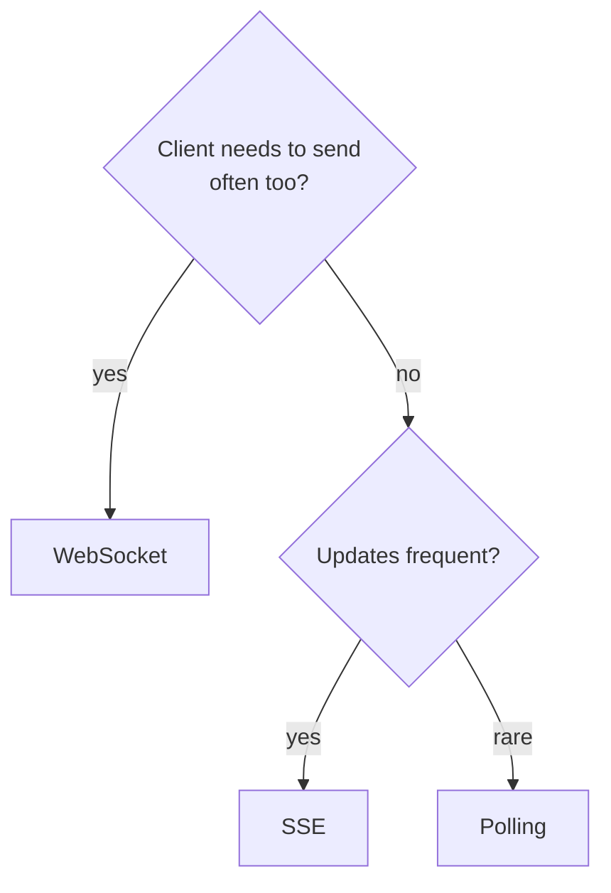

## Before you start

`http-https-websockets` introduces the WebSocket upgrade; this topic is about *choosing* between the three real-time options and running them at scale. `api-gateways-and-proxies` explains the intermediaries that complicate persistent connections.

## In one sentence

**Polling** means the client repeatedly asks "anything new?", **SSE** (Server-Sent Events) means the server holds one connection open and pushes updates down it, and **WebSockets** means both sides keep a connection open and can send at any time.

## Why it matters

HTTP was built around the client asking first. Every real-time feature — a chat message, a live price, a notification, a streaming AI response — has to work around that assumption, and the three options differ enormously in cost.

Picking wrong is expensive in a specific way: polling every second with 100,000 users is 100,000 requests per second of mostly-empty responses, while the same feature over SSE is 100,000 idle connections costing almost no CPU. Interviewers use this question to see whether you reason about direction of data flow and connection cost, or just reach for WebSockets reflexively.

## The intuition

Three ways to find out when a parcel arrives.

**Polling** is phoning the depot every five minutes. Most calls waste everyone's time, you learn nothing new, and you still find out up to five minutes late. Call more often and you get fresher news at proportionally higher cost.

**Long polling** is phoning and staying on the line until there's news. One call, answered the moment something happens — then you immediately call back and wait again.

**SSE** is a radio the depot broadcasts on. You tune in once and listen; they talk, you don't. Perfect when information flows one way.

**WebSockets** is an open phone line where both of you can speak whenever you like. Necessary for a conversation — and wasteful if only one side ever talks.

The decisive question is direction. If only the server has news, you don't need a two-way channel.

## How it actually works



**Polling** is ordinary HTTP on a timer. Simple, works everywhere, caches and proxies understand it. Its cost is a full request — headers, and possibly a TLS handshake — per attempt, and average latency of half the interval.

**Long polling** improves on this: the server holds the request open until data exists or a timeout fires, then the client reconnects. Delivery is near-instant, but every message costs a fresh request cycle, and you hold a server connection per waiting client anyway.

**SSE** is one HTTP response that never ends, streamed as `text/event-stream`. Because it's plain HTTP, it passes through proxies and gateways normally. The browser's `EventSource` reconnects automatically after a drop, and — the feature people miss — it sends a `Last-Event-ID` header on reconnect, so a server that assigns IDs can replay missed events. It is server-to-client only.

**WebSockets** start as an HTTP request with `Upgrade: websocket`, then switch the TCP connection to a bidirectional frame protocol. After that it isn't HTTP any more, which is exactly why intermediaries need explicit configuration.

Scaling differs sharply. Polling is stateless, so any server can answer any request and load balancing is trivial. SSE and WebSockets are **stateful**: the connection lives on one specific server, so to broadcast a message you must reach the server holding each recipient's connection. That's why production deployments put a pub/sub layer (commonly Redis) behind them — a server receiving a message publishes it, and every server pushes to its own connected clients.

Both persistent options also need **heartbeats**. Proxies and load balancers close idle connections, often after 60 seconds, so a periodic ping keeps the path open and detects dead peers.

## Worked example

```js
const http = require('node:http');

http.createServer((req, res) => {
  if (req.url !== '/events') return res.writeHead(404).end();

  res.writeHead(200, {
    'Content-Type': 'text/event-stream',  // the header that makes this SSE
    'Cache-Control': 'no-cache',
    'Connection': 'keep-alive'
  });

  let id = Number(req.headers['last-event-id'] || 0); // resume after a drop
  const timer = setInterval(() => {
    id += 1;
    res.write(`id: ${id}\ndata: {"price":${(100 + Math.random() * 5).toFixed(2)}}\n\n`);
  }, 1000);

  req.on('close', () => clearInterval(timer)); // always clean up, or you leak timers
}).listen(3000);
```

Consume it with curl and the stream never ends:

```
$ curl -N localhost:3000/events
id: 1
data: {"price":102.41}

id: 2
data: {"price":100.87}
```

Note the wire format: `id:` and `data:` lines, each event ended by a blank line. Send `Last-Event-ID: 5` on reconnect and this server resumes from 6 rather than restarting.

## A second example — when it gets harder

Everything above works on one server. Add a second and a chat app silently half-breaks.

Alice's WebSocket lands on server A; Bob's on server B. Alice sends a message, server A pushes it to its own connected sockets, and Bob never receives it — because his connection lives in a different process's memory. The bug is invisible in development with one server and appears the moment you scale out.

The fix is not sticky sessions. It's a pub/sub layer: server A publishes to a channel, both servers subscribe, and each delivers to the clients it holds. Connection state stays local; *routing* becomes shared.

The second hard problem is reconnection. Persistent connections drop constantly — phones change networks, laptops sleep, proxies time out. If every client reconnects the instant a server restarts, 50,000 simultaneous reconnections form a **thundering herd** that knocks the server over again. Production clients need exponential backoff with **jitter** (randomised delay), so reconnections spread out.

Third, messages sent while disconnected are simply gone unless you plan for it. SSE gives you `Last-Event-ID` for free; WebSockets require you to build sequence numbers and replay yourself.

Finally, polling isn't obsolete. For a status check every 30 seconds, polling is stateless, trivially cacheable, survives any proxy, and needs none of the above machinery.

## Quick reference

| | Polling | Long polling | SSE | WebSocket |
|---|---|---|---|---|
| Direction | Client pulls | Client pulls | Server → client | Both ways |
| Protocol | HTTP | HTTP | HTTP | Upgraded TCP |
| Latency | Half the interval | Near-instant | Near-instant | Near-instant |
| Auto-reconnect | N/A | Manual | Built in | Manual |
| Missed-message replay | N/A | Manual | `Last-Event-ID` | Manual |
| Proxy friendliness | Perfect | Good | Good | Needs config |
| Scaling | Stateless, easy | Connection-bound | Needs pub/sub | Needs pub/sub |
| Good for | Rare updates, status | Legacy fallback | Feeds, notifications, token streaming | Chat, games, collaborative editing |

## Tools & frameworks

| Tool | What it's for | Reach for it when |
|---|---|---|
| [ws](https://github.com/websockets/ws) | Raw WebSocket server in Node | You genuinely need bidirectional messaging, not just server push |
| [MDN WebSockets API](https://developer.mozilla.org/en-US/docs/Web/API/WebSockets_API) | Reference for the push option you are comparing against | You are deciding between WebSockets, SSE and polling on the facts |
| [Centrifugo](https://centrifugal.dev/docs/getting-started/introduction) | Standalone realtime messaging server | You want fan-out to many clients without building the hub yourself |
| [Ably](https://ably.com/docs) | Managed realtime pub/sub | You want global presence and delivery guarantees you don't have to operate |

The usual right answer is SSE unless you need client-to-server push, so do not read this table as "always WebSockets".

## Common mistakes

- Reaching for WebSockets when data only flows one way. SSE is simpler, reconnects itself, and passes through infrastructure without special handling.
- Forgetting heartbeats, then blaming random disconnects on the client when an idle proxy timeout is closing the connection.
- Testing on one server and shipping to many, so broadcasts reach only the users connected to the sending server.
- Reconnecting immediately with no backoff or jitter, turning a brief restart into a self-inflicted stampede.
- Assuming a delivered message is a received message. Without acknowledgements or event IDs, anything sent during a disconnect is lost.

## What interviewers ask

- **WebSockets or SSE for a live notification feed?** — SSE: data flows only server-to-client, it's plain HTTP so infrastructure handles it normally, and it reconnects and replays via `Last-Event-ID` for free.
- **How do you scale WebSockets across multiple servers?** — Connections are pinned to one server, so broadcasting requires a shared pub/sub layer that every server subscribes to and fans out to its own local connections.
- **Why does long polling still exist?** — It gives near-instant delivery over ordinary HTTP, so it works in restrictive environments where upgrades are blocked, making it a compatibility fallback.
- **How do you handle messages sent while a client is disconnected?** — Give every event a sequence ID, have the client send its last seen ID on reconnect, and replay from a buffer; SSE standardises this with `Last-Event-ID`.
- **What's the risk when many clients reconnect at once?** — A thundering herd overwhelms the server just as it recovers; exponential backoff with jitter spreads reconnections out.

## Practice

1. Run the SSE server above, connect with `curl -N`, kill it, and restart. Observe the browser `EventSource` reconnecting on its own and inspect the `Last-Event-ID` header it sends.
2. Add a heartbeat comment (`: ping\n\n`) every 15 seconds and explain which failure it prevents.
3. Design presence ("who's online") for 100,000 users across 10 servers. Specify where connection state lives, how a status change reaches everyone, and what happens when one server dies.

## Where to go next

Continue to `network-performance` — round trips, head-of-line blocking, and HTTP/2 versus HTTP/3 explain much of *why* these options perform so differently.
