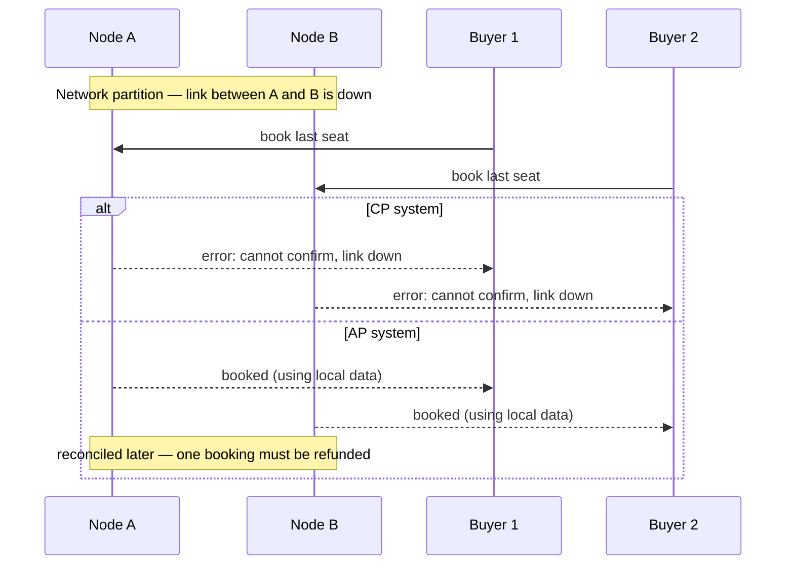

## Before you start

You should know `indexing-and-transactions` — CAP theorem is what happens to those same correctness guarantees once a single database becomes several databases on separate machines, connected by a network that can fail.

## In one sentence

The **CAP theorem** says that when the network connecting parts of a distributed database breaks, it must choose between staying perfectly correct (**C**onsistency) or staying available to answer requests (**A**vailability) — it cannot fully guarantee both at the same time, because "**P**" (**P**artition tolerance, surviving that broken network) isn't really optional.

## Why it matters

Every system that spreads data across multiple machines will eventually face a network hiccup between them — a cable gets cut, a router misbehaves, a data center loses connectivity for thirty seconds. What the system does in that exact moment defines its entire real-world behavior. Understanding CAP means you can predict how a database will behave during an outage *before* it happens in production, instead of being blindsided when it does.

## The intuition

Picture a concert venue selling tickets from two separate box offices, each keeping its own copy of "seats remaining," normally kept in sync by a phone line between them. The phone line goes dead. Box office A still has customers wanting to buy the last seat. It has two choices: refuse to sell anything until the phone line is back (guaranteeing it never oversells, but turning away paying customers who'd have been fine), or keep selling based on its last-known count (staying open for business, but risking that box office B sells that same "last seat" to someone else at the same time).

## How it actually works



CAP stands for three properties: **Consistency** (every read gets the most recent write, or an error — everyone sees the same data, as if there were only one copy), **Availability** (every request gets *some* response, even if it might not reflect the very latest write), and **Partition tolerance** (the system keeps working even when network messages between its own servers are lost or delayed).

The key insight: **network partitions will happen** to any real distributed system — cables get cut, servers lose connectivity, cloud regions have outages. So partition tolerance isn't a genuine design choice; it's a fact of life you must accept. That leaves the real, forced choice as only between Consistency and Availability, and only *during* an actual partition. A **CP** system (like a traditional bank ledger) will refuse to answer, or will block, rather than risk returning stale or conflicting data. An **AP** system (like a shopping cart) will keep responding using whatever data it has locally, accepting that two servers might briefly disagree, and reconciling the difference afterward.

## Worked example

```js
// A tiny simulation of the CP vs AP decision during a network partition
function handleBooking(nodeIsReachable, seatsRemaining, mode) {
  if (!nodeIsReachable) {
    if (mode === 'CP') {
      throw new Error('Refusing to book: cannot confirm the latest seat count'); // consistency wins
    }
    if (mode === 'AP') {
      return seatsRemaining > 0
        ? { status: 'booked', stale: true } // availability wins, flagged as possibly outdated
        : { status: 'sold out' };
    }
  }
  return seatsRemaining > 0 ? { status: 'booked' } : { status: 'sold out' };
}

console.log(handleBooking(false, 1, 'CP')); // throws — refuses rather than risk overselling
console.log(handleBooking(false, 1, 'AP')); // { status: 'booked', stale: true }
```

The exact same partition and the exact same local data produce two completely different outcomes, depending entirely on which guarantee the system was designed to protect when it can't have both.

## A second example — when it gets harder

The naive reading of CAP is "pick two of three, forever" — but that's wrong, and it's a common interview trap. Outside of an actual partition, a well-built system can offer *both* strong consistency and full availability simultaneously; the trade-off only bites during the partition itself. The subtlety that trips people up further: even an AP system doesn't mean "no consistency ever" — most AP systems still converge to a consistent state once the partition heals, they just don't guarantee it *instantly*. That's the specific idea behind **eventual consistency**, covered in the next topic: temporary disagreement is allowed, but permanent disagreement is not.

A second subtlety: **CA** (Consistency + Availability, no partition tolerance) is sometimes listed as a third option, but it's not realistic for a genuinely distributed system — you can only claim CA by assuming partitions never happen, which is really just describing a single machine with no network to partition in the first place.

## Quick reference

| System type | Chooses | Behavior during a network partition | Example |
|---|---|---|---|
| CP | Consistency over Availability | Refuses or blocks requests it can't guarantee are correct | Traditional relational DBs in cluster mode, ZooKeeper |
| AP | Availability over Consistency | Keeps responding, may serve stale data | DNS, many NoSQL stores (Cassandra, DynamoDB) |
| CA | Both, but only without partitions | Not realistic for a real distributed system | A single-node database (no partition possible) |

## Common mistakes

- Treating CAP as a permanent, always-on choice — it only actually forces a trade-off *during* a network partition; outside of one, a well-designed system can offer both consistency and availability.
- Assuming AP means "no consistency at all" — AP systems usually still converge to a consistent state eventually, they just don't guarantee it instantly, which is a very different claim.
- Forgetting that "partition tolerance" is not optional for a real distributed system — treating it as a genuine third choice, rather than an unavoidable fact you design around.

## What interviewers ask

- **Explain CAP theorem in your own words.** — During a network partition, a distributed system must choose between guaranteeing every read is fully up to date (Consistency) or guaranteeing it always responds (Availability); it can't fully do both at once, since answering with local data risks staleness and waiting to confirm correctness risks not answering at all.
- **Is CA a real option?** — Not for a genuinely distributed system, because partitions are a fact of networking; CA only makes sense for a single machine with no network to partition, which defeats the point of being distributed in the first place.
- **Give a real example of a CP system and an AP system.** — A banking ledger is typically CP — it would rather reject a transaction than risk double-spending; a DNS system or shopping cart is typically AP — it would rather show a slightly stale cart than refuse to load the page at all.
- **Walk through the 'two buyers, one seat' scenario for both CP and AP.** — In a CP system, at least one buyer's request is rejected or blocked during the partition so the seat is never oversold; in an AP system, both requests can succeed locally during the partition, and the conflict — an oversold seat — has to be detected and resolved afterward.

## Practice

1. Classify each as more CP or more AP, with reasoning: a stock trading order book, a "likes" counter on a social post, a DNS lookup, an inventory count for the very last item of a product.
2. Design (on paper) how an AP shopping cart system would reconcile two conflicting carts after a partition heals — what rule would you use to decide which items survive?
3. Explain why adding more replicas to a CP system generally makes it *more* likely to briefly refuse requests during a partition, not less.

## Where to go next

Continue to `consistency-models` to go deeper into exactly what "eventually consistent" means in practice, and the spectrum of guarantees between strict correctness and full availability.
