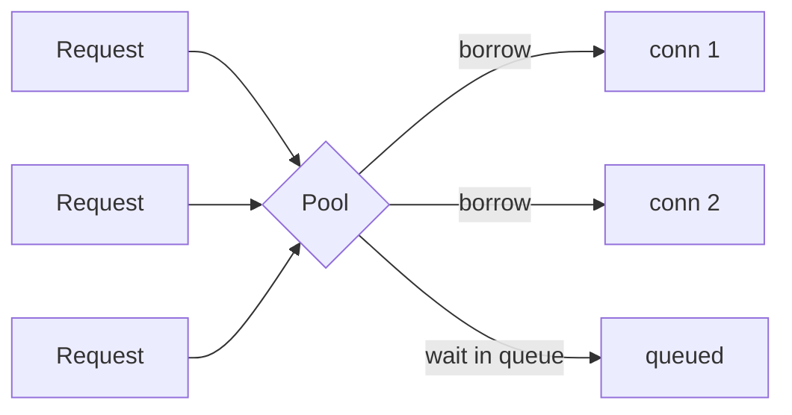

## Before you start

`event-loop-and-async-io` helps, because pool exhaustion in Node.js is a concurrency problem, not a database problem. `indexing-and-transactions` explains why slow queries hold connections.

## In one sentence

A **connection pool** is a small set of already-open database connections that your application borrows and returns, instead of opening a new one for every query.

## Why it matters

Opening a database connection is expensive — a TCP handshake, TLS negotiation, authentication, and on PostgreSQL an entire new server-side process costing several megabytes. Doing that per query adds tens of milliseconds to work that should take one.

Worse, databases cap concurrent connections (PostgreSQL defaults to 100). An application opening them freely hits the ceiling, and every subsequent connection is *refused* — including the ones your monitoring and admin tools need. Pool misconfiguration causes many outages that look like database failures but are entirely application-side.

## The intuition

A restaurant with ten tables. Without pooling, every guest builds their own table on arrival, eats, and demolishes it — the building work dwarfs the meal. With pooling, ten tables stand permanently: a guest is seated, eats, leaves, and the table is reused, so setup cost is paid once.

Now the critical part: when all ten are occupied, the eleventh guest **waits in the lobby**. That's correct — the queue protects the kitchen from being overwhelmed. Two failure modes follow. If a guest does paperwork at a table for an hour (a slow query, or a connection you forgot to release), tables stop turning over and the lobby fills. And if the lobby has a time limit, guests leave angry — that's your **pool timeout** error.

The counterintuitive lesson: adding more tables than the kitchen can cook for makes things *worse*.

## How it actually works



A pool keeps N open connections. A query borrows one, runs, and returns it. If all are busy, the request queues until one frees or a timeout fires.

**Sizing is the part people get wrong**, and the instinct "more connections, more throughput" is backwards. Queries execute on CPU cores and disks; once every core is busy, extra connections add context switching, lock contention, and memory pressure, so *everything* slows. A common starting point of roughly `(cores × 2)` lands most workloads at 10-30 connections — far fewer than expected.

The arithmetic that catches teams out is multiplication across instances. Twenty application pods each with a pool of 20 is 400 connections against a database allowing 100. It works in staging with one pod and fails the moment you scale out. **Total connections = pods × pool size**, and that total must sit comfortably below the server limit with headroom for migrations, admin sessions, and monitoring.

When many instances make that impossible, add an external pooler like **PgBouncer**, which multiplexes many client connections onto few server ones. Its `transaction` mode assigns a server connection only for a transaction's duration, giving high multiplexing but breaking anything relying on session state, such as session-level `SET` statements or advisory locks.

**Exhaustion symptoms** are distinctive: request latency climbs while the database's CPU sits low and individual queries stay fast. The queue is the bottleneck, not the database, which is why "our database is slow" is so often wrong. The tells are `timeout exceeded when trying to connect` errors and a rising count of pending acquisitions.

The most common root cause isn't traffic but a **leak** — a code path that borrows a connection and never returns it, usually an error path that skipped the release. Each leak permanently shrinks the pool.

## Worked example

```js
const { Pool } = require('pg');

const pool = new Pool({
  max: 20,                       // total = this × number of app instances
  connectionTimeoutMillis: 5000  // fail fast instead of queueing forever
});

async function getUser(id) {
  const client = await pool.connect();
  try {
    const res = await client.query('SELECT name FROM users WHERE id = $1', [id]);
    return res.rows[0];
  } finally {
    client.release();  // in finally: omit this and each error leaks a connection
  }
}

setInterval(() => {  // the three numbers that diagnose exhaustion
  console.log({ total: pool.totalCount, idle: pool.idleCount, waiting: pool.waitingCount });
}, 1000);
```

Healthy, then exhausted:

```
{ total: 20, idle: 18, waiting: 0 }
{ total: 20, idle: 0, waiting: 47 }
```

`waiting: 47` is the diagnosis. Forty-seven requests are queued for a connection — the application is the bottleneck, and adding database CPU would change nothing.

## A second example — when it gets harder

The subtle production failure: a pool that is large enough, leaking slowly.

```js
// BROKEN: the connection is never released when the query throws
async function getUserBroken(id) {
  const client = await pool.connect();
  const res = await client.query('SELECT name FROM users WHERE id = $1', [id]);
  client.release();              // unreachable if query() rejects
  return res.rows[0];
}
```

If one query in a thousand fails — a deadlock, a timeout, bad input — that path leaks a connection permanently. With a pool of 20 and a 0.1% error rate at 100 requests per second, you lose one every ten seconds and the service dies in about three minutes. It recovers on restart, which is exactly what makes it look like a memory leak. The tell is `totalCount` pinned at max while `idleCount` sits at zero with no traffic.

The second hard case is a transaction held across an external call:

```js
await client.query('BEGIN');
await client.query('UPDATE orders SET status = $1 WHERE id = $2', ['paid', id]);
await chargeCreditCard(order);   // 2 seconds — holding a connection AND a row lock
await client.query('COMMIT');
```

This holds a connection *and* row locks for the network call's duration. Twenty concurrent checkouts exhaust a pool of 20, and every other query in the application stalls behind a payment API. The fix is to keep transactions short: do the external call outside the transaction, then open a brief transaction to record the result.

Serverless breaks the model differently: each instance holds its own pool and instances scale independently, so connection count explodes with no coordination — hence the pooler or proxy in front.

## Quick reference

| Symptom | Meaning | Fix |
|---|---|---|
| `waiting` high, DB CPU low | Pool too small or connections held too long | Shorten queries/transactions before growing pool |
| `total` at max, `idle` 0 at rest | Connection leak | Release in `finally` |
| `too many connections` | pods × pool > server limit | Reduce pool size or add PgBouncer |

| Setting | Purpose |
|---|---|
| `max` | Connections per instance — multiply by instance count |

## Tools & frameworks

| Tool | What it's for | Reach for it when |
|---|---|---|
| [node-postgres (`pg.Pool`)](https://node-postgres.com/) | In-process Postgres pool for Node | A single long-lived Node process owns its own connections |
| [PgBouncer](https://www.pgbouncer.org/usage.html) | External Postgres connection pooler | Many processes, or serverless functions, would each open a pool of their own |
| [postgres.js](https://github.com/porsager/postgres) | Modern Postgres client with pooling built in | You want tagged-template SQL and pooling without adopting an ORM |
| [Prisma](https://www.prisma.io/docs) | ORM with its own connection management | You already use Prisma — its pool settings, not `pg`'s, are the ones in effect |

The classic production bug is transaction-pooling mode breaking prepared statements and session state; PgBouncer's usage doc covers all three pooling modes.

## Common mistakes

- Increasing pool size to fix slowness, which usually worsens it by pushing the database past its concurrency sweet spot.
- Releasing outside a `finally`, so any thrown error leaks a connection permanently.
- Sizing per instance and forgetting to multiply by the number of running instances.
- Holding a transaction open across an HTTP call, tying up a connection and locks for seconds.
- Blaming the database when latency rises but its CPU is idle and queries are fast.

## What interviewers ask

- **How would you diagnose pool exhaustion?** — Look for high waiting counts with low database CPU and fast individual queries; that combination means requests are queuing for connections rather than the database being slow.
- **What causes a pool to slowly die until restart?** — A connection leak on an error path, usually releasing outside a `finally`, which permanently shrinks the pool with each failed query.
- **How do you size a pool?** — Start from the database's parallelism (roughly cores × 2), then check that pool size × instance count stays under the server limit with headroom; bigger is not better.
- **Why are serverless functions hard on databases?** — Each instance keeps its own pool and instances scale independently, so total connections grow without coordination, which is why an external pooler is normally required.

## Practice

1. Run the pool with `max: 2` and fire ten concurrent slow queries. Watch `waitingCount` rise and confirm total time is set by the queue, not the query.
2. Introduce the broken release, force 10% of queries to throw, and observe `idleCount` fall to zero permanently. Fix it with `finally` and confirm recovery.
3. With 30 pods and a database allowing 200 connections, choose a pool size, show the arithmetic including headroom, and say when you'd add PgBouncer instead.

## Where to go next

Continue to `database-migrations` — schema changes take locks that block every connection in your pool, which is how a small migration becomes a total outage.
