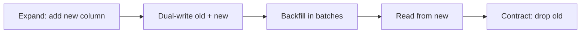

## Before you start

`connection-pooling` matters here — a migration holding a lock blocks every pooled connection at once. `indexing-and-transactions` explains the locks involved.

## In one sentence

A **zero-downtime migration** changes your schema while the application keeps serving traffic, by making every change backward-compatible so old and new versions of your code both run against the same database.

## Why it matters

The naive migration — change the schema and deploy the matching code together — assumes both happen instantly. Neither does. A rolling deploy runs old and new code side by side for minutes, so if the schema only suits the new code, every request still hitting old code fails.

The sharper danger is locks. Some `ALTER TABLE` statements take an exclusive lock, and a lock request *queues behind* running queries while blocking everything arriving after it. A migration taking 50ms on an idle table can freeze a busy one for minutes, and because every pooled connection stalls, the whole application stops.

## The intuition

Replacing a bridge that traffic is still crossing. You cannot demolish it and build the new one, because traffic must never stop. Instead: build the new bridge alongside the old, open both, move traffic gradually, confirm nothing still uses the old one, then demolish it.

That's **expand-contract**, and it maps exactly:

- **Expand** — add the new column or table. Nothing is removed, so old code is unaffected.
- **Migrate** — write to both, backfill history, then move reads to the new shape.
- **Contract** — once nothing reads the old shape, remove it.

Each phase is a separate deploy, and at every instant the database supports both the currently-running code and the version being rolled out. The instinct to do it in one step is what causes the outage.

## How it actually works



Take renaming `users.name` to `users.full_name`. A single `ALTER TABLE ... RENAME` instantly breaks every running instance of the old code. Expand-contract turns it into four deploys:

1. **Add** `full_name` as nullable — a `NOT NULL` column without a default must validate every row, taking a long lock.
2. **Dual-write.** New code writes both columns and reads `name`; old code writes only `name`, fine since nothing reads `full_name` yet.
3. **Backfill** in batches, then switch reads to `full_name`.
4. **Contract.** Once no code references `name`, drop it.

**Backfilling is where people cause the outage they were avoiding.** A single `UPDATE` over ten million rows locks every row for the whole transaction, blocks concurrent writes, and generates enormous replication lag. Batch it instead:

```sql
UPDATE users SET full_name = name
WHERE id IN (SELECT id FROM users WHERE full_name IS NULL LIMIT 1000);
```

Run repeatedly with a pause between batches: each transaction is short, locks release promptly, and replicas keep up. The `IS NULL` predicate makes it **idempotent**, so a job that dies halfway can restart safely.

Index creation has the same shape — `CREATE INDEX` locks the table against writes for the whole build, while `CREATE INDEX CONCURRENTLY` does not, at the cost of being slower. Knowing which operations are cheap is the practical core:

| Operation | Lock impact |
|---|---|
| Add nullable column | Cheap — metadata only |
| Add column with a constant default | Cheap on modern PostgreSQL |
| Add `NOT NULL` to existing column | Expensive — full table validation |
| Add index (plain) | Blocks writes for the whole build |
| Add index `CONCURRENTLY` | Safe online, slower |
| Rename or drop column | Instant lock, but breaks running code |
| Change column type | Usually a full table rewrite |

## Worked example

A safe, resumable backfill:

```js
const { Pool } = require('pg');
const pool = new Pool({ max: 2 }); // small: never starve the app's own pool

async function backfill() {
  let total = 0;
  for (;;) {
    // Small batch, short transaction, idempotent via the IS NULL predicate
    const res = await pool.query(`
      UPDATE users SET full_name = name
      WHERE id IN (SELECT id FROM users WHERE full_name IS NULL LIMIT 1000)
    `);
    if (res.rowCount === 0) break;              // no rows left: done
    total += res.rowCount;
    console.log(`backfilled ${total}`);
    await new Promise(r => setTimeout(r, 100)); // breathe: let replicas catch up
  }
}
backfill();
```

Output ends when no rows remain:

```
backfilled 1000
backfilled 2000
...
backfilled 9847
```

Two details carry the safety. The 100ms pause bounds replication lag, since a tight loop can push replicas minutes behind. And `max: 2` stops the backfill consuming connections that serve users.

## A second example — when it gets harder

The destructive migration that looks harmless.

You drop a column the new code no longer uses. The migration succeeds in milliseconds. Thirty seconds later errors flood in, because the rolling deploy hadn't finished and old instances were still issuing `SELECT name FROM users`. Dropping is instant and *irreversible*.

The rule that prevents this: **contract is a separate deploy, days after nothing references the old column.** Verify with query logs before dropping, and treat a long gap between expand and contract as normal.

The second trap is the lock queue. Adding a `NOT NULL` constraint requests an exclusive lock; if a long analytics query is already reading the table the `ALTER` waits, and every query arriving *behind* it waits too, even simple reads. One slow query plus one migration freezes the application. Mitigate with a short `lock_timeout`:

```sql
SET lock_timeout = '3s';
ALTER TABLE users ALTER COLUMN full_name SET NOT NULL;
```

Failing quickly and retrying later beats blocking every connection. Adding a column is reversible; dropping one is not, and that asymmetry is why expand-contract front-loads the safe operations and defers the destructive one until it is provably unnecessary.

## Quick reference

| Phase | Deploy | Safe because |
|---|---|---|
| Expand | Add nullable column | Old code ignores it |
| Dual-write | Write both shapes | Neither version breaks |
| Backfill | Batched, idempotent updates | Short locks, bounded lag |
| Switch reads | Read new column | Data already complete |
| Contract | Drop old column | Nothing references it |

| Rule | Reason |
|---|---|
| Batch every backfill | Avoids long locks and replica lag |
| `CREATE INDEX CONCURRENTLY` | Doesn't block writes |
| Set `lock_timeout` | Fail fast instead of queueing |
| Delay destructive steps | Dropping is irreversible |

## Common mistakes


## What interviewers ask

- **Why can a fast migration still cause an outage?** — It requests a lock that queues behind a running query, and every request arriving after it queues too, so the application freezes even though the `ALTER` itself is instant.
- **Why is dropping a column the riskiest step?** — It's instant but irreversible and breaks any code still referencing it, so it must be a separate, delayed deploy once logs prove nothing uses it.

## Practice

1. Write the four-deploy plan to split `full_name` into `first_name` and `last_name`, stating what old and new code do at each stage.
2. Write a 5-million-row backfill as a batched, resumable loop. Explain what happens if it's killed at batch 900 and why restarting is safe.
3. Explain why `ADD COLUMN x int NOT NULL` behaves differently from `ADD COLUMN x int` on a large busy table, and give a safe sequence reaching the same end state.

## Where to go next

Continue to `redis-and-caching-patterns` — caching is the usual response to load that migrations alone cannot fix, and stale caches after a schema change are their own class of bug.
