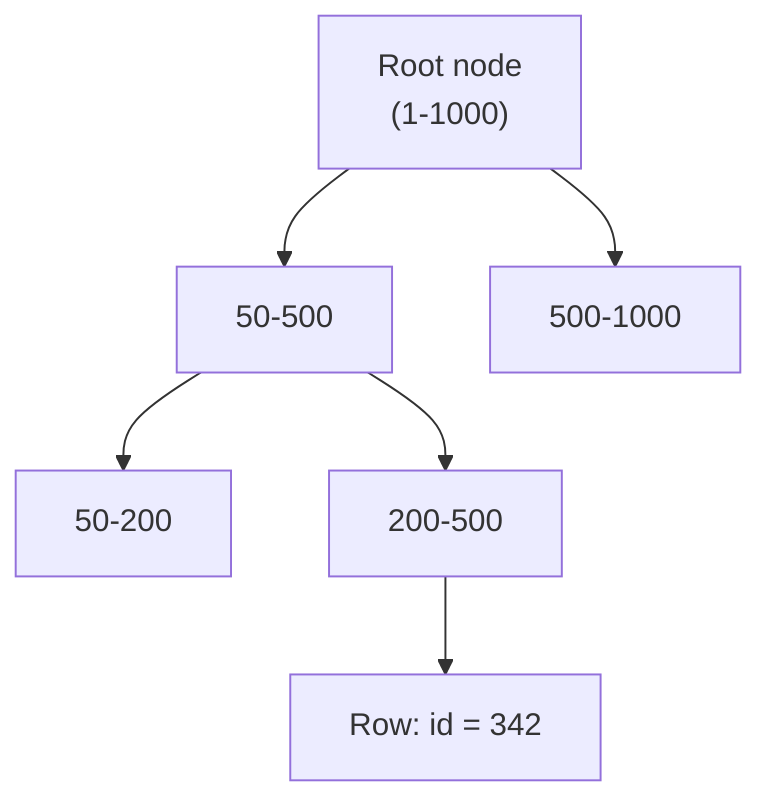

## Before you start

`sql-queries-and-joins` helps — indexes exist specifically to make the filtering and joining you just learned fast at scale, instead of scanning every row every time.

## In one sentence

An **index** is a shortcut structure that lets a database find rows fast instead of scanning every single one, and a **transaction** is a group of database operations that either all succeed together or all fail together, with nothing in between.

## Why it matters

Without an index, looking up one row in a million-row table means checking every single row — like reading an entire book cover to cover to find one sentence. Without transactions, a crash halfway through transferring money between two accounts could deduct from one account and never credit the other, silently losing money with no way to detect it happened. Both are foundational to why real databases can be simultaneously fast and trustworthy — most interview questions about "why is my query slow" or "how do you keep data safe" trace back to one of these two ideas.

## The intuition

An index is like the index at the back of a textbook: instead of reading every page to find every mention of "mitosis," you flip to "M" in the index, see exactly which pages mention it, and jump straight there. A transaction is like an ATM withdrawal: the machine must both dispense your cash *and* deduct it from your balance — if the power fails after dispensing but before deducting, that's a serious bug, not an acceptable partial outcome. A transaction is the database's promise that "dispense cash" and "deduct balance" either both happen, or neither does.

## How it actually works



Most database indexes use a **B-tree**, a structure that keeps values sorted in a way that lets the database jump straight toward the range it needs — at each node, it compares the value it's looking for and picks one of a handful of branches, discarding the rest, similar to how you'd flip directly to the "M" section of a phone book instead of reading from "A." Finding one row among a million takes only a handful of comparisons this way, not a million.

An index is usually built on one or more columns you frequently filter or sort by. It speeds up reads significantly, but it isn't free: every `INSERT`, `UPDATE`, or `DELETE` must also update every index built on that table, so writes get slightly slower for each index you add.

A **transaction** wraps multiple operations — like "debit account A" and "credit account B" — so the database guarantees **atomicity**: if any step fails partway through, everything rolls back as if none of it happened. This is one piece of **ACID**: Atomicity, Consistency, Isolation, Durability.

**Isolation levels** control how much concurrent transactions are allowed to see of each other's in-progress, uncommitted changes. At the loosest level, **Read Uncommitted**, you might see another transaction's changes before they're even confirmed — a "dirty read" that could vanish if that other transaction rolls back. **Read Committed** only ever shows data that has actually been committed. **Repeatable Read** guarantees that if you run the same query twice within one transaction, you get the same rows both times. **Serializable** is the strictest: transactions behave exactly as if they ran one after another with zero overlap, at the cost of the most coordination and the worst performance under heavy concurrency.

## Worked example

```sql
-- A transaction: both updates succeed together, or neither happens
BEGIN;

UPDATE accounts SET balance = balance - 100 WHERE id = 1; -- debit
UPDATE accounts SET balance = balance + 100 WHERE id = 2; -- credit

COMMIT; -- only now are both changes made permanent
-- if anything failed above, you would run ROLLBACK instead of COMMIT
```

If the server crashed between the two `UPDATE` statements without a transaction wrapping them, account 1 would lose money that account 2 never received — a real, silent loss. Wrapping both in `BEGIN` / `COMMIT` guarantees that scenario cannot happen: on crash recovery, the database sees the transaction never committed and discards both partial changes.

## A second example — when it gets harder

Here's where isolation levels stop being abstract. Two people try to book the last seat on a flight at nearly the same instant. Both transactions run:

```sql
BEGIN;
SELECT seats_remaining FROM flights WHERE id = 42; -- both read: 1
-- both application processes see "1 seat left" and decide to proceed
UPDATE flights SET seats_remaining = seats_remaining - 1 WHERE id = 42;
COMMIT;
```

Under **Read Committed** (a common default), both transactions can read `1` before either commits, because reading doesn't block anyone — both proceed to book, and the flight oversells by one seat. Under **Serializable**, the database detects that these two transactions conflict and forces one to fail with a serialization error, which the application must catch and retry — the correct behavior, but it requires your code to actually handle that retry instead of assuming every `COMMIT` succeeds.

This is why picking an isolation level isn't just a performance knob — it changes what bugs are even *possible*, and the stricter levels shift real complexity from "database internals" to "your application must handle rejected transactions."

## Quick reference

| Isolation level | Prevents dirty read | Prevents non-repeatable read | Prevents phantom read |
|---|---|---|---|
| Read Uncommitted | No | No | No |
| Read Committed | Yes | No | No |
| Repeatable Read | Yes | Yes | No |
| Serializable | Yes | Yes | Yes |

## Common mistakes

- Adding an index to every column "just in case" — this bloats storage and slows down every write without necessarily speeding up the reads you actually run.
- Forgetting to wrap multiple related writes in a transaction, leaving a real risk of partial updates if something fails midway.
- Assuming a stricter isolation level is always "safer to just use everywhere" — Serializable can cause otherwise-successful transactions to fail with conflicts under load, and your application must be written to retry them.

## What interviewers ask

- **Why would adding an index ever be a bad idea?** — Every index speeds up reads that filter or sort on that column but slows down every write, since the index itself must be updated too; over-indexing a write-heavy table can hurt overall performance more than it helps.
- **What does the 'A' in ACID actually guarantee, with an example?** — Atomicity means a transaction is all-or-nothing; in a money transfer, either both the debit and credit happen, or neither does — you never end up with only one side applied.
- **What's a dirty read, and which isolation level prevents it?** — A dirty read is seeing another transaction's uncommitted changes, which might later be rolled back and never actually happen; Read Committed (and stricter levels) prevent this by only ever showing already-committed data.
- **Explain the 'two people booking the last seat' problem and how isolation levels relate to it.** — Under a weak isolation level like Read Committed, both transactions can read the same "1 seat left" before either writes, so both proceed and the seat gets oversold; Serializable prevents this by detecting the conflict and forcing one transaction to fail and retry.

## Practice

1. Create a small `accounts` table and simulate a crash mid-transfer by running the debit `UPDATE` alone (no `COMMIT`) in one session, then check the balance from a second session — observe that it hasn't changed, and explain why.
2. Explain why a B-tree index on a column with only two distinct values (like a boolean) is usually much less useful than one on a column with many unique values, like an email address.
3. Look up how PostgreSQL's default isolation level (Read Committed) differs from MySQL InnoDB's default (Repeatable Read), and describe one scenario where that difference would produce different application behavior.

## Where to go next

Continue to `cap-theorem` to see what happens to these same guarantees — consistency, availability — once a single database becomes multiple databases spread across different machines.
