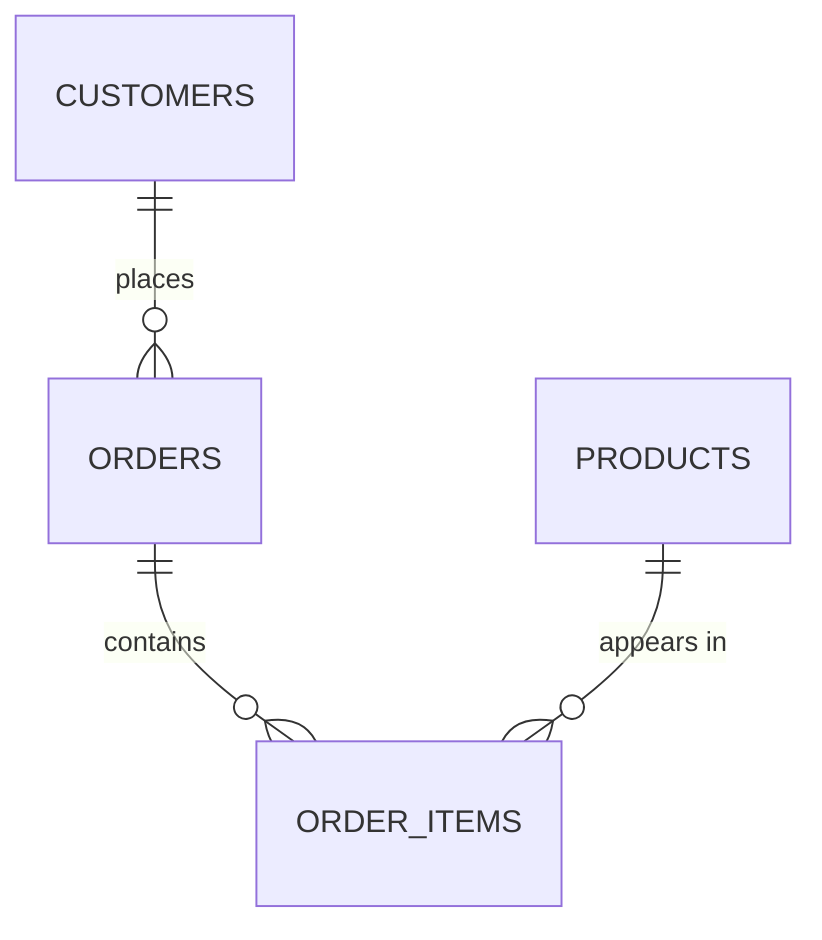

## Before you start

`sql-queries-and-joins` — normalisation splits data across tables, and joins are how you put it back together. Nothing else is required.

## In one sentence

**Normalisation** is organising tables so every fact lives in exactly one place, which stops the same information from disagreeing with itself.

## Why it matters

Storing a fact twice means eventually storing it differently in the two places. A customer changes address, one of the four tables holding it gets updated, and the database now has two answers to one question with nothing to say which is right.

These are **anomalies**. An *update* anomaly: you change one row and other copies go stale. An *insertion* anomaly: you cannot record a new department because no employee works there yet. A *deletion* anomaly: removing the last employee erases the department entirely. Normalisation is the systematic cure, and interviewers use it to see whether you can design a schema or only query one.

## The intuition

Imagine a spreadsheet of orders where each row carries the customer's name, email, and address alongside the product. A customer with 50 orders has their address written 50 times — when they move you must change all 50, and missing one makes the database contradict itself. You also cannot add a customer who hasn't ordered yet, because a row only exists when there's an order.

Normalisation says: **one fact, one place**. Customer details live in a `customers` table, once, and orders reference the customer by ID. Changing an address becomes one update, and two rows cannot disagree because there's only one row.

The trade is that answering "show orders with customer names" now requires a join. Normalisation optimises for *correctness of writes*; denormalisation trades some of that back for *speed of reads*.

## How it actually works



The normal forms are cumulative — each assumes the previous.

**First normal form (1NF): one value per cell.** No comma-separated lists, no repeating columns like `phone1, phone2, phone3`. A cell holding `"red,green,blue"` can't be indexed or constrained; you end up with `LIKE '%green%'`, which also matches "greenish". Move repeated values into their own rows.

**Second normal form (2NF): no partial dependencies.** Only relevant with a composite key: every non-key column must depend on the *whole* key. In `order_items(order_id, product_id, quantity, product_name)`, `product_name` depends only on `product_id`, so it repeats in every order containing that product. Move it to `products`.

**Third normal form (3NF): no transitive dependencies.** No non-key column may depend on another non-key column. In `employees(id, name, department_id, department_name)`, `department_name` depends on `department_id`, which depends on `id` — an indirect chain. Rename a department and every employee row needs updating. Move it to `departments`.

The informal summary, worth memorising: **every non-key column depends on the key, the whole key, and nothing but the key.**

3NF is the practical target for transactional systems. Higher forms exist (BCNF, 4NF, 5NF) but rarely change a real design.

**Denormalisation** is deliberately reintroducing duplication for read speed — and it is a legitimate engineering decision, not a failure, provided it's chosen rather than stumbled into. The cost is that you now own the job of keeping copies consistent.

One case isn't denormalisation at all, and interviewers like it: an order must store the price *at the time of purchase*. That looks duplicated from `products.price`, but it's a genuinely different fact — the historical price paid, which must not change when the product's price does. Copying values that must be frozen in time is correct design.

## Worked example

```sql
-- Unnormalised: every fact repeated on every row
CREATE TABLE orders_bad (
  order_id     int,
  customer_name  text,
  customer_email text,   -- repeated for every order this customer places
  product_name   text,
  product_price  numeric -- repeated for every order of this product
);
```

Change one customer's email and you must find every row:

```sql
UPDATE orders_bad SET customer_email = 'new@example.com'
WHERE customer_email = 'old@example.com';  -- misses nothing only if you're lucky
```

Normalised to 3NF, each fact lives once:

```sql
CREATE TABLE customers (
  id    serial PRIMARY KEY,
  name  text NOT NULL,
  email text NOT NULL UNIQUE        -- the constraint makes duplicates impossible
);

CREATE TABLE products (
  id serial PRIMARY KEY, name text NOT NULL, price numeric NOT NULL
);

CREATE TABLE orders (
  id          serial PRIMARY KEY,
  customer_id int NOT NULL REFERENCES customers(id),
  created_at  timestamptz NOT NULL DEFAULT now()
);

CREATE TABLE order_items (
  order_id   int NOT NULL REFERENCES orders(id),
  product_id int NOT NULL REFERENCES products(id),
  quantity   int NOT NULL CHECK (quantity > 0),
  price_at_purchase numeric NOT NULL,   -- NOT duplication: a historical fact
  PRIMARY KEY (order_id, product_id)
);
```

The email update is now one row:

```sql
UPDATE customers SET email = 'new@example.com' WHERE id = 42;
```

The `UNIQUE` constraint means the database itself refuses to store a contradiction — enforcement lives in the schema, not in application code that someone might forget to run.

## A second example — when it gets harder

Now the case that breaks "always normalise".

A social feed shows each post with its author's name and like count. Fully normalised, rendering 50 posts means joining `posts` to `users` plus `COUNT(*)` over a `likes` table with 500 million rows. That count is the killer: counting is O(n) in matching rows and no index makes it free, so at scale the query takes seconds.

The deliberate denormalisation is a `like_count` column on `posts`, incremented on each like, turning the feed into a single indexed read. You've accepted a real cost: two places now encode likes, and if an increment fails or a like is deleted without decrementing, the count drifts. Production systems update the counter in the same transaction as the like and reconcile periodically.

Denormalise when the read is frequent and expensive, the write comparatively rare, and you have a concrete sync plan. Doing it without measuring first is how schemas rot. The opposite failure is over-normalising into schemas needing eight joins per screen.

## Quick reference

| Form | Rule | Violation looks like |
|---|---|---|
| 1NF | One value per cell | `tags: "a,b,c"` in one column |
| 2NF | No partial key dependency | `product_name` in `order_items` |
| 3NF | No transitive dependency | `department_name` in `employees` |

| Choose | When |
|---|---|
| Normalise | Writes frequent, correctness critical |
| Denormalise | Read-heavy, expensive aggregate, sync plan exists |
| Copy the value | It's a historical fact (price paid) |

## Common mistakes

- Enforcing uniqueness only in application code. Without a database constraint, concurrent requests will eventually create duplicates.

## What interviewers ask

- **When would you deliberately denormalise?** — When a read is frequent and expensive (typically a large aggregate), writes are rarer, and you have a concrete mechanism to keep the duplicate in sync, such as updating it transactionally plus periodic reconciliation.
- **Why store the price on the order line when products already have a price?** — Because it's a different fact: the price actually paid, which must stay frozen when the product's current price changes.
- **How do you keep a denormalised counter correct?** — Update it in the same transaction as the underlying change so both commit or neither does, and reconcile periodically against the source of truth to correct drift.

## Practice

1. Take a spreadsheet-style table of orders with repeated customer and product columns and normalise it to 3NF. Name the specific anomaly each split prevents.
2. Design a schema for a blog with posts, authors, tags, and comments. Explain why many-to-many tags need a junction table and what 1NF violation you'd otherwise have.
3. Given a feed query counting likes over a huge table, write the normalised and denormalised versions, and say how you'd keep the counter accurate under concurrent likes and unlikes.

## Where to go next

Continue to `connection-pooling` — a well-designed schema still falls over if the application cannot get a connection to run its queries.
