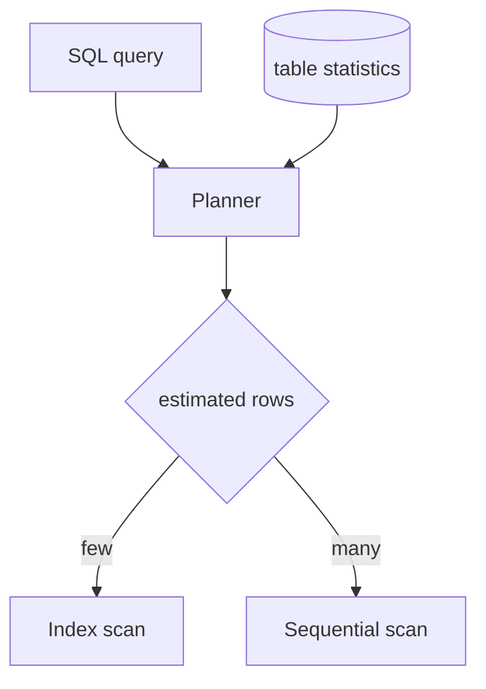

## Before you start

`indexing-and-transactions` is essential — a query plan is largely the story of whether the database used an index. `sql-queries-and-joins` covers the joins whose costs you're about to read.

## In one sentence

A **query plan** is the step-by-step strategy the database chose for running your query, and `EXPLAIN` shows it to you — turning "this query is slow" from a guess into something you can read.

## Why it matters

Query optimisation is where guessing wastes the most time. Engineers add indexes hoping something sticks, rewrite working SQL on instinct, and cache results to hide a problem a one-line fix would remove.

The plan ends the guessing. It tells you whether the database read every row or jumped straight to the ones it needed, whether it used the index you expected, and — most valuable — where its *estimate* diverged from reality. "Show me the query plan" is the expected first move in any slow-query question.

## The intuition

You've asked someone to find every book by one author in a library.

The **sequential scan** approach walks every shelf and checks each book — slow for a big library, but genuinely fastest if the library has thirty books, since consulting the catalogue and walking to each shelf costs more than a quick sweep.

The **index scan** approach looks the author up in the catalogue and fetches only the listed positions. Enormously faster for a large library and few matches. But if the author wrote a third of the books, you'd make thousands of separate trips, and the sweep wins again.

That's the planner's entire job: estimate how many rows match, then pick the strategy suiting that number. A sequential scan is not a bug; a sequential scan over ten million rows to return three is.

## How it actually works



The planner is cost-based, using **statistics** collected by `ANALYZE` — histograms of each column's value distribution — to estimate how many rows each step returns, then costing the alternatives and picking the cheapest. Read a plan **inside out and bottom up**: the innermost, most-indented nodes run first and feed their parents.

Two numbers per node matter most: `cost=0.00..8.27`, the estimated startup and total cost in arbitrary units useful only for comparing alternatives, and `rows=1`, the estimated row count.

Run `EXPLAIN ANALYZE` instead and the database actually executes the query, adding `actual time` and `actual rows`. **The gap between estimated and actual rows is the single most diagnostic thing in a plan.** If it estimated 10 rows and got 400,000, it likely chose a strategy suited to 10 — a nested loop where a hash join was needed — and everything downstream is wrong. That usually means stale statistics or a correlation the planner cannot see.

Common node types, worst to best for selective queries: **Seq Scan** reads the whole table, fine when it's small or most rows match. **Index Scan** walks the index and fetches matching rows one at a time. **Index Only Scan** answers from the index alone without touching the table — the fastest case, and the payoff of a **covering index**. **Bitmap Heap Scan** gathers index matches, sorts them by physical location, and reads in one pass, the compromise for medium selectivity.

For joins: **Nested Loop** suits a small outer side with an indexed inner side; **Hash Join** builds a hash table and suits large unsorted inputs; **Merge Join** suits inputs already sorted on the join key.

## Worked example

```sql
-- Setup: 500,000 users, no index yet
EXPLAIN ANALYZE SELECT * FROM users WHERE email = 'ada@example.com';
```

```
Seq Scan on users  (cost=0.00..10834.00 rows=1 width=72)
                   (actual time=0.021..84.113 rows=1 loops=1)
  Filter: (email = 'ada@example.com'::text)
  Rows Removed by Filter: 499999
Execution Time: 84.150 ms
```


`Rows Removed by Filter: 499999` is the smell — half a million rows read to return one. Note it *correctly estimated* `rows=1`; it had no index to exploit, not a bad estimate.

```sql
CREATE INDEX idx_users_email ON users(email);
ANALYZE users;  -- refresh statistics so the planner sees the new index fairly
```

```
Index Scan using idx_users_email on users
    (cost=0.42..8.44 rows=1 width=72) (actual time=0.038..0.040 rows=1 loops=1)
  Index Cond: (email = 'ada@example.com'::text)
Execution Time: 0.061 ms
```

84ms to 0.061ms — about 1,300× — by changing nothing but the access path. The `Filter` line became an `Index Cond`, which is the distinction to look for: a filter discards rows after reading them, a condition avoids reading them.

## A second example — when it gets harder

The hardest slow-query problem often isn't visible in any single plan, because each query is fast. This is the **N+1 problem**: code fetches 100 blog posts, then loops and fetches each post's author.

```js
const posts = await db.query('SELECT id, author_id FROM posts LIMIT 100');
for (const post of posts.rows) {
  // 100 separate round trips — each "fast", together a disaster
  await db.query('SELECT name FROM users WHERE id = $1', [post.author_id]);
}
```

That's 101 queries. Each `EXPLAIN` shows a clean 0.05ms index scan, so the database dashboard reports excellent query performance — while the endpoint takes 300ms, because 100 network round trips at 3ms each dominate completely. The profiler blames the network; the database looks innocent; the cause is the loop.

The fix is one query:

```sql
SELECT p.id, u.name FROM posts p JOIN users u ON u.id = p.author_id LIMIT 100;
```

One round trip, one plan, typically a hash join. This is why ORMs offer eager loading, and why spotting an N+1 means counting queries per request rather than reading query times.

A second trap: an index the planner refuses to use. `WHERE lower(email) = '...'` cannot use a plain index on `email`, because the index stores raw values. Any function wrapping the column does this — `WHERE date(created_at) = '2026-01-01'` breaks an index on `created_at` too. Fix with an expression index or a range rewrite.

Composite column order matters the same way: an index on `(status, created_at)` serves `WHERE status = 'x' ORDER BY created_at`, but does little when filtering only on `created_at` — a **leftmost prefix** must be usable.

## Quick reference

| Plan node | Meaning | Concerning when |
|---|---|---|
| Seq Scan | Reads every row | Table is large and few rows match |
| Index Scan | Uses index, fetches rows | Rarely — usually good |
| Index Only Scan | Answered from index alone | Never — the ideal |
| Bitmap Heap Scan | Batches index matches | Normal for medium selectivity |
| Nested Loop | Row-by-row join | Outer side is unexpectedly large |
| Rows Removed by Filter | Rows read then discarded | Number is large |

| Symptom | Likely cause | Fix |
|---|---|---|
| Estimated 10, actual 400k | Stale statistics | `ANALYZE` |
| Index exists but unused | Function on the column | Expression index or rewrite |
| Each query fast, endpoint slow | N+1 | Join or batch the queries |

## Common mistakes

- Treating every Seq Scan as a bug. On a small table, or when most rows match, it's the correct choice.
- Reading `cost` as milliseconds — it's a relative unit for comparing plans, not a time.
- Using `EXPLAIN` without `ANALYZE`, so you see estimates only and miss the estimate-versus-actual gap.
- Wrapping an indexed column in a function, then concluding the index "doesn't work".
- Optimising one query when the real problem is running it a hundred times in a loop.

## What interviewers ask

- **A query got slow in production — what's your first step?** — Run `EXPLAIN ANALYZE` and compare estimated to actual rows; a large divergence points at stale statistics, while a Seq Scan with many rows removed by filter points at a missing index.
- **What is the N+1 problem and how do you detect it?** — One query fetches a list and then one query runs per row; individual queries look fast, so you detect it by counting queries per request rather than by inspecting query times.
- **You added an index and nothing improved — why?** — Common causes are a function wrapping the column, a composite index whose leftmost column isn't in the predicate, stale statistics, or a query matching too many rows to benefit.

## Practice

1. Create a table with 100,000 rows, query an unindexed column with `EXPLAIN ANALYZE`, add an index, and compare both plans. Identify where `Filter` became `Index Cond`.
2. Write a deliberate N+1 against that table, measure total endpoint time, then rewrite as a single join. Note that per-query time barely changed.
3. Build a composite index on `(status, created_at)` and test filtering on `status` alone, `created_at` alone, and both. Explain from the plans why one ignores the index.

## Where to go next

Continue to `normalization-and-schema-design` — many unfixable query problems come from a schema that forces expensive joins, and the cheapest optimisation is a table designed correctly in the first place.
