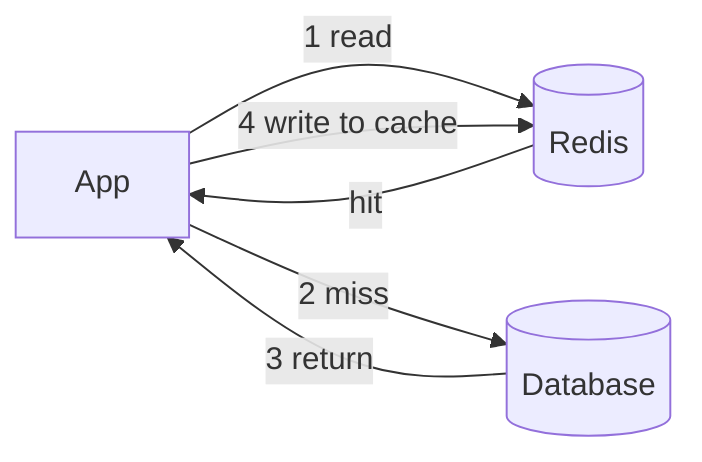

## Before you start

`caching-strategies` covers caching broadly; this is the database-side detail — Redis specifics, TTLs, eviction, and failure modes.

## In one sentence

**Redis** is an in-memory key-value store used as a cache in front of your database, and the **caching pattern** you pick decides who writes to it, when it's invalidated, and what breaks when it's wrong.

## Why it matters

A database read hitting disk costs milliseconds; a Redis read costs microseconds, so caching a hot query can cut load by 95% and turn a struggling database into an idle one.

The catch is a second copy of your data, and two copies can disagree. Every hard caching bug is a variation on that: stale data after an update, a cache that empties and stampedes the database, or one that quietly becomes a single point of failure.

## The intuition

Think of a chef and a pantry. The **database** is the supermarket — everything, far away, slow. **Redis** is the pantry beside the stove: small, instant, holding only what's used often.

Three decisions follow. *What goes in?* Only frequently used items, since the pantry is small. *How long do you trust it?* Milk has a date — that's a **TTL** (time to live), after which you return to the supermarket. *What when it's full?* You throw something out, a policy choice called **eviction**.

The failure that matters: if the pantry empties exactly when fifty chefs need flour, all fifty run to the supermarket at once. That's a **stampede**, and it can be worse than no pantry at all.

## How it actually works



**Cache-aside** (lazy loading) is the default and the one to name first. The application checks Redis; on a miss it reads the database, writes the result back with a TTL, and returns it. The cache fills on demand with only what's requested, and if Redis dies the app still works, just slower. Its weakness is that every miss costs a database read.

**Write-through** writes to cache and database together, keeping the cache fresh but paying both costs per write. **Write-behind** writes to cache immediately and the database asynchronously — fastest, but if Redis dies before the flush those writes are gone.

**Invalidation** is the other half. On update you either delete the key, so the next read repopulates, or overwrite it, which avoids a miss but risks writing a stale value if two updates race. Deleting is the safer default.

**TTL strategy** matters more than people expect. A fixed TTL on keys written together means they expire together and stampede at once; **jitter**, a random spread of say 300 seconds ± 60, desynchronises expiry. The TTL *is* your maximum staleness, so pick it from how wrong the data may be.

**Eviction policies** apply when memory fills. `allkeys-lru` discards least recently used keys, the standard choice for a pure cache; `allkeys-lfu` discards least *frequently* used, resisting a burst of one-off keys flushing hot data. `noeviction` rejects writes when full — right for data you cannot lose, dangerous for a cache, since writes fail instead of making room.

## Worked example

Runs as-is on plain Node.js; `cache` has a Redis client's `get`/`set`/`del` shape, so swapping in the real one changes only those calls.

```js
const store = new Map();                       // stand-in for Redis
const cache = {
  async get(k) {
    const e = store.get(k);
    if (!e) return null;
    if (Date.now() > e.expiresAt) { store.delete(k); return null; } // TTL expiry
    return e.value;
  },
  async set(k, value, ttl) { store.set(k, { value, expiresAt: Date.now() + ttl * 1000 }); },
  async del(k) { store.delete(k); }
};

let dbReads = 0;                               // stand-in for a slow database
const rows = { 7: { id: 7, name: 'Ada' } };
const db = { async query(id) {
  dbReads++;
  await new Promise(r => setTimeout(r, 12));
  return rows[id];
} };

async function getUser(id) {
  const cached = await cache.get(`user:${id}`);
  if (cached) return JSON.parse(cached);              // hit
  const row = await db.query(id);                     // miss: fall through to db
  const ttl = 300 + Math.floor(Math.random() * 120);  // jitter desynchronises expiry
  await cache.set(`user:${id}`, JSON.stringify(row), ttl);
  return row;
}

async function updateUser(id, name) {
  rows[id].name = name;
  await cache.del(`user:${id}`); // DELETE, not overwrite — a racing writer can't win
}

(async () => {
  const t = async (l, fn) => { const s = Date.now(); await fn();
    console.log(`${l} ${Date.now() - s}ms, dbReads=${dbReads}`); };
  await t('cold        ', () => getUser(7));
  await t('warm        ', () => getUser(7));
  await updateUser(7, 'Ada L.');
  await t('after update', () => getUser(7));
})();
```

Output:

```
cold         13ms, dbReads=1
warm         0ms, dbReads=1
after update 12ms, dbReads=2
```

The middle call never touches the database — `dbReads` stays at 1. After the update deletes the key, the next read misses and repopulates. Delete-on-write is the important choice: overwriting invites a race where a slow update writes an older value after a newer one, leaving the cache wrong until the TTL rescues it.

## A second example — when it gets harder

The naive cache works until a popular key expires.

A homepage query is requested 5,000 times per second. Its entry expires, all 5,000 concurrent requests miss at once and hit the database with the same expensive query, and the database — comfortable a moment ago — collapses. That's a **cache stampede**, worse than no cache, since without one the database would have been sized for the real load.

Two fixes. A **lock**: the first request to miss acquires a short-lived lock (`SET key NX EX 10`) and refreshes while others wait or serve stale. Or **early recomputation**: refresh slightly before expiry so the entry is never absent.

Two related failures are worth naming. **Cache penetration** is repeated requests for a key absent from the database too, so every request reaches it; the fix is caching the negative result. **Cache avalanche** is many keys expiring together, which jitter prevents.

The deepest trap is a cache that stops being optional. If the database only survives at a 95% hit rate, Redis is load-bearing and a restart takes production down cold.

## Quick reference

| Pattern | Write cost | Freshness | Risk |
|---|---|---|---|
| Cache-aside | Cheap | Stale up to TTL | Miss storms; first read always misses |

| Problem | Cause | Fix |
|---|---|---|
| Stampede | Hot key expires under load | Lock, or refresh before expiry |

## Tools & frameworks

| Tool | What it's for | Reach for it when |
|---|---|---|
| [Redis docs](https://redis.io/docs/latest/) | Data structures, eviction, persistence | You need the reference for TTLs, `maxmemory-policy` and structure choice |
| [ioredis](https://github.com/redis/ioredis) | Node client with cluster and Lua support | You need Redis Cluster, pipelines or scripted atomic operations |
| [node-redis](https://redis.io/docs/latest/develop/clients/nodejs/) | Official Node client | You are starting fresh and want the vendor-maintained client |
| [BullMQ](https://docs.bullmq.io/) | Redis-backed job queues | You are about to build a queue on raw `LPUSH`/`BRPOP` — don't |
| [Memcached](https://memcached.org/) | Pure LRU key-value cache | You want *only* a cache, and value operational simplicity over features |

## Common mistakes

- Updating the cache on write instead of deleting it, creating a race where a stale value persists.
- Using identical TTLs everywhere, synchronising expiry into an avalanche.
- Forgetting to cache negative results, so lookups for missing keys always reach the database.
- Running a cache with `noeviction`, turning full memory into failed writes.

## What interviewers ask

- **What is a cache stampede and how do you prevent it?** — A hot key expires and every concurrent request misses at once, all hitting the database together; prevent it with a lock so one request refreshes while others wait, or by refreshing before expiry.
- **On update, do you delete the cache key or overwrite it?** — Delete: concurrent updates can write values out of order and leave the cache stale, whereas a deleted key is repopulated correctly by the next read.
- **Which eviction policy for a pure cache, and why not `noeviction`?** — `allkeys-lru` or `allkeys-lfu`, so full memory discards cold keys; `noeviction` makes writes fail instead, converting a capacity issue into an outage.
- **How do you decide a TTL?** — From how stale the data may acceptably be, since the TTL is your maximum staleness, then add jitter so keys don't expire in lockstep.

## Practice

1. Implement cache-aside for a slow query, log hit and miss timings, then add jitter and say which failure it prevents.
2. Simulate a stampede by expiring a hot key under load, count the database queries fired, then add a lock and compare.
3. Decide caching for a rarely-edited user profile, a live stock price, and a search returning no results. Give each a pattern, TTL, and invalidation rule.

## Where to go next

Continue to `time-series-and-analytics-databases` — when caching can no longer hide the load, the answer is a database designed for a different workload shape.
