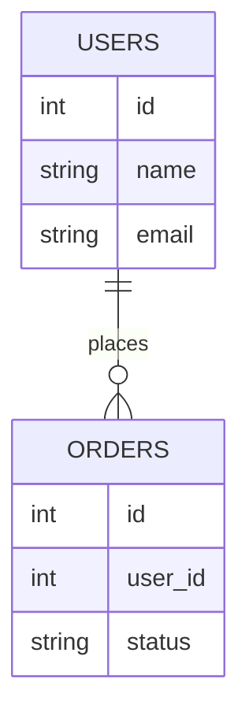

## Before you start

Nothing from earlier chapters is required. If you've completed the networking chapter, that's a nice bonus — databases are what a server usually talks to after it receives a request — but this topic stands on its own.

## In one sentence

A **relational database** stores data in strict tables with fixed columns and strong guarantees about correctness, while a **NoSQL database** stores data more flexibly — as documents, key-value pairs, or graphs — trading some of those guarantees for speed and easier scaling.

## Why it matters

Picking the wrong type of database is expensive to undo later. Force naturally varied data into a rigid schema and you'll spend your career fighting migrations; use a flexible schema for data that actually needs strict guarantees — like a bank balance that must never accidentally go negative — and you risk losing the data integrity your business depends on. This is one of the first real architecture decisions on almost any new project, and it shapes everything built on top of it.

## The intuition

A relational database is like a paper form with fixed fields: every person fills in the same boxes — name, date of birth, address — in the same order, and the form is rejected if a required box is empty. A NoSQL document store is like a folder of sticky notes: each note can say whatever it needs to, some notes have five details, others have fifteen completely different ones, and nobody enforces a shared template. Both are useful — the form is trustworthy and easy to process in bulk, the sticky notes are easy to write quickly and adapt on the fly.

## How it actually works



That's the relational shape: two separate tables joined by `user_id`, each row obeying the exact same columns. A document database instead embeds the relationship directly — a `users` document might carry an `orders` array inline, trading the join for duplicated, harder-to-update data.

A **relational database** (PostgreSQL, MySQL) organizes data into tables with predefined columns, and every row must fit that shape — you cannot insert a row missing a required column, and the database enforces this itself. Relational databases guarantee **ACID** properties: **Atomicity** (a transaction fully happens or not at all), **Consistency** (data always follows your defined rules, like foreign keys), **Isolation** (concurrent transactions don't corrupt each other's in-progress work), and **Durability** (once a transaction is confirmed, it survives even a crash). This makes relational databases the safe default for anything involving money, inventory counts, or data with real, enforced relationships between tables.

**NoSQL** is an umbrella term — "Not Only SQL" — covering several different models that don't use the rigid table structure. A **document database** like MongoDB stores flexible, JSON-like documents where different records in the same collection can have entirely different fields. A **key-value store** like Redis just maps a key to a value, extremely fast for caching or simple lookups. A **graph database** like Neo4j is built around relationships themselves being first-class data, ideal for social networks or recommendation engines. These systems often follow **BASE** instead of ACID: **B**asically **A**vailable, **S**oft state, **E**ventually consistent — meaning they favor staying responsive and fast over guaranteeing every read instantly reflects the absolute latest write.

The actual decision isn't "NoSQL is faster" or "SQL is safer" as blanket rules — those are oversimplifications. It's about whether your data has a fixed, relational shape that genuinely benefits from strict, enforced rules, or a flexible, high-volume shape where a brief window of staleness is an acceptable trade for raw speed and easier horizontal scaling.

## Worked example

```js
// Relational: rigid shape, enforced by the schema itself
const userRow = { id: 1, name: 'Asha', email: 'asha@example.com' };
// Every row in the `users` table MUST have exactly these columns — the database refuses anything else.

// NoSQL (document-style): flexible shape, enforced only by your application code, if at all
const userDoc = { _id: 1, name: 'Asha', email: 'asha@example.com' };
const userDoc2 = { _id: 2, name: 'Ravi', phone: '555-1234', tags: ['vip'] };
// userDoc2 has completely different fields — the database doesn't complain or even notice.

console.log(Object.keys(userDoc));  // ['_id', 'name', 'email']
console.log(Object.keys(userDoc2)); // ['_id', 'name', 'phone', 'tags']
```

The relational row is guaranteed to always match its table's columns exactly; the two NoSQL documents happily coexist in the same collection despite having entirely different shapes — nothing in the database itself would stop a third document from having yet another shape.

## A second example — when it gets harder

The naive take is "NoSQL scales, SQL doesn't" — but consider a social app storing posts and comments. In a relational model, fetching a post with its 50 comments and each commenter's profile picture needs a join across three tables — well within what a relational database is built for, and it's fast with the right indexes. Model the same thing badly in a document database — say, embedding all 50 comments *inside* the post document — and every time someone edits their profile picture, you'd need to update it inside every post they ever commented on, since the copy is duplicated everywhere.

The real lesson: NoSQL's flexibility doesn't remove the need for data modeling — it just moves the responsibility from the database's schema enforcement to your own application design. A relational schema forces you to think about relationships up front; a NoSQL schema lets you skip that thinking initially, but the cost shows up later, often in a way that's much harder to fix because there's no `ALTER TABLE` to lean on.

## Quick reference

| | Relational (SQL) | NoSQL |
|---|---|---|
| Schema | Fixed, enforced upfront | Flexible, defined by your application |
| Guarantees | ACID (strong consistency) | Often BASE (eventual consistency) |
| Scaling style | Mostly vertical (bigger machine) | Mostly horizontal (more machines) |
| Relationships | Native, via joins and foreign keys | Usually modeled manually (embedding or references) |
| Best for | Money, strict relationships, complex queries | High-volume, flexible, fast-changing data |
| Examples | PostgreSQL, MySQL | MongoDB, Redis, Cassandra, Neo4j |

## Tools & frameworks

| Tool | What it's for | Reach for it when |
|---|---|---|
| [PostgreSQL](https://www.postgresql.org/docs/current/) | Relational, with JSONB and extensions | The default — it does documents, vectors and time-series adequately |
| [MongoDB](https://www.mongodb.com/docs/) | Document database | Your access pattern really is "fetch one aggregate by id" |
| [DynamoDB](https://docs.aws.amazon.com/dynamodb/) | Managed key-value with predictable latency | Access patterns are known, scale is huge, and you accept designing around them |
| [Cassandra](https://cassandra.apache.org/doc/latest/) | Wide-column store with multi-datacentre writes | Writes dominate, you are multi-region, and eventual reads are acceptable |
| [CockroachDB](https://docs.cockroachlabs.com/docs/) | Distributed SQL with serializable transactions | You want horizontal scale but refuse to give up transactions |

The honest interview answer stays "Postgres until you can name the specific property it lacks".

## Common mistakes

- Believing NoSQL means "no rules at all" — it just means the *database* doesn't enforce a schema; your application code still needs to keep data consistent, or you end up with inconsistent documents that are painful to query reliably.
- Choosing NoSQL purely because it sounds more scalable, without checking whether the data actually has relationships that a relational database would model far more simply and safely using joins.
- Assuming ACID and BASE are opposites in every respect — many NoSQL databases now offer some transactional guarantees too; the real spectrum is more nuanced than a strict either/or.

## What interviewers ask

- **When would you choose NoSQL over a relational database?** — When your data doesn't naturally fit a fixed schema, when you need to scale horizontally across many cheap servers rather than one large one, or when brief staleness is acceptable in exchange for speed — like a social media feed or a product catalog with wildly varying attributes per item.
- **What does ACID actually guarantee?** — Atomicity means a transaction is all-or-nothing; Consistency means it never leaves data violating your defined rules; Isolation means concurrent transactions can't see each other's half-finished work; Durability means a committed change survives a crash.
- **Is NoSQL always faster than SQL?** — No — it's faster for the specific access patterns it's optimized for, like key lookups, but a well-indexed relational query can outperform a poorly modeled NoSQL one; the real difference is what guarantees and flexibility you're trading away, not raw speed.
- **How do you handle relationships in a document database if there are no joins?** — Either by embedding related data directly inside a document (fast reads, but duplicated data that must be kept in sync), or by storing a reference (like an ID) and doing a second lookup — a trade-off you must design deliberately, unlike a relational database that handles it natively.

## Practice

1. Design the schema for a simple blog — posts and comments — once as relational tables and once as MongoDB-style documents. Identify one operation that's easier in each model.
2. Explain why a banking system storing account balances would almost always choose a relational database over a document store, referencing a specific ACID guarantee.
3. You're told a NoSQL database "doesn't need a schema." Write two sentences explaining what's actually true and what's misleading about that claim.

## Where to go next

Continue to `sql-queries-and-joins` to see exactly how relational databases combine data across tables — the mechanism that document databases have to reinvent by hand.
