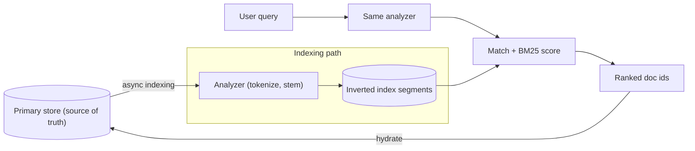
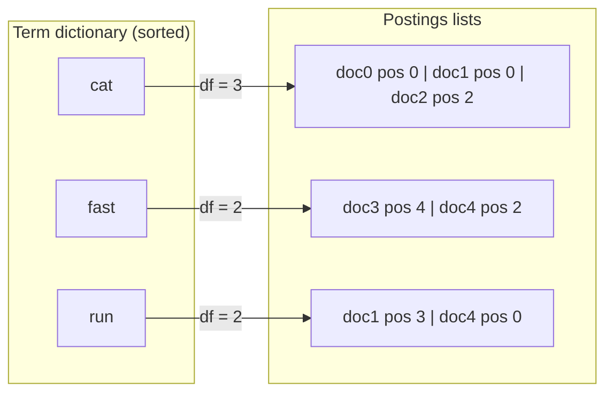

## Before you start

Read `indexing-and-transactions` first — you need to know what a B-tree does and why it speeds reads and taxes writes, because this topic builds on what a B-tree *cannot* do. `query-optimization` helps, since "why is this a full scan" is what leads people here. If you have read `tries`, keep it separate: that answers prefix questions, this answers "which documents contain this word, and which matters most".

## In one sentence

An **inverted index** flips the natural direction of your data — instead of storing each document with the words it contains, it stores each word with the documents containing it — which is what lets a search engine find and *rank* matches across millions of documents in milliseconds.

## Why it matters

Start with what people try first:

```sql
SELECT * FROM articles WHERE body LIKE '%database%';
```

This fails three ways at once.

It cannot use an index. A B-tree is sorted by the *beginning* of the value, so it finds everything starting with `data` but cannot jump to values with `database` in the middle. The leading wildcard forces a full scan: every row, every byte, every time.

It matches text you did not mean and misses text you did. `%database%` hits the middle of unrelated words, while a search for `databases` misses a document saying only `database` — string matching cannot know those are the same word.

Worst of all, **it cannot rank**. It returns 40,000 rows in scan order, so a document titled "Database Design" and one mentioning databases in a footnote come back indistinguishable. For search, ordering is not a nicety, it is the entire product.

An inverted index plus a scoring function fixes all three.

## The intuition

Look at the index at the back of a textbook. It does not list chapters and their contents — it lists terms alphabetically, and beside each the pages where it appears:

```
caching ............ 112, 118, 240
indexing ........... 44, 47, 203
sharding ........... 251
```

To find everything about indexing you do not read the book. You look up one word and get the page list directly. That is an inverted index, and the flip is the whole idea: the *content* became the key, the *location* became the value.

Two consequences follow, both structural rather than clever. Intersection becomes cheap — for "indexing and caching" you walk two sorted page lists together instead of comparing everything to everything. And ranking becomes possible: the index knows how many pages mention a term, so `sharding` on one page is a stronger signal than `caching` on twenty. That count — how rare a word is across the corpus — seeds every relevance score in the field.



## How it actually works

### Analysis: deciding what a word is

Before indexing, text passes through an **analyzer**: a pipeline turning a string into the terms actually stored.

**Tokenization** splits text into tokens — harder than splitting on spaces once you meet hyphens, apostrophes, URLs and languages without spaces. **Lowercasing** makes `Database` and `database` one term. **Stop words** like `the` and `on` appear in nearly every document and carry almost no information, so dropping them shrinks the index — though engines often keep them because phrase queries need them.

Then the interesting one. **Stemming** chops words to a crude root by rule: `running` → `run`, `databases` → `databas`. It is fast and its stems are often not real words, which is fine because both sides apply the same rules. **Lemmatization** instead uses a dictionary and part-of-speech analysis for the true base form: `ran` → `run`, `better` → `good` — more accurate, much more expensive. Most systems stem. **Synonyms** are then expanded at index or query time, mapping `laptop` onto `notebook`.

Now the single most important rule here. **The same analyzer must run at index time and at query time.** The index holds not your document's words but the *analyzer's output*. If documents were stemmed to `databas` and your query only lowercased to `databases`, the query term is absent from the index and you get zero results while the word sits plainly in the document. It is the most confusing class of search bug there is, because both the data and the query look correct.

### The structure

An inverted index has two parts. The **term dictionary** is the sorted list of distinct terms, so lookup is a binary search, not a scan. Each entry points at a **postings list**: the document IDs containing that term.



Postings carry more than IDs. **Term frequency** — occurrences in that document — feeds scoring. **Positions** record where each occurrence sits, making phrase and proximity queries possible: the phrase `"machine learning"` needs `learning` exactly one position after `machine`. Without positions you can only ask whether both words appear, which also matches an article on servicing a washing machine. Positions roughly double index size, so they are sometimes disabled on fields that never need phrase search.

### Relevance: TF-IDF and BM25

Two intuitions combine. **Term frequency**: a document mentioning `sharding` twelve times is probably more about sharding than one mentioning it once. **Inverse document frequency**: a term in nearly every document tells you almost nothing, while a term in three documents out of a million is enormously informative — so IDF weights each term by its rarity. Together: *a rare word appearing often in this document is a strong signal.* That is TF-IDF, and it is genuinely most of relevance ranking.

**BM25** is the modern default — in Lucene, so in Elasticsearch and OpenSearch — fixing two flaws. **Saturation**: the tenth occurrence should add far less than the second, so term frequency passes through a flattening curve tuned by `k1`. **Length normalisation**: a 10,000-word document naturally contains any word more often than a 100-word one without being more relevant, so BM25 divides by document length relative to the corpus average, with `b` controlling how strongly.

### Filters versus queries

A **query** scores: "how well does this match `wireless headphones`?" A **filter** decides: "is `price < 100` true?" — yes or no, no score.

That distinction is a performance lever. A filter's answer does not depend on the query text, so its result set caches and is reused across every search using it, and cheap filters run first to shrink the set expensive scoring must touch. Putting `category = shoes` in the scoring part computes a score for a condition that was never a matter of degree.

### Shards, and the surprising thing about scores

At scale the index splits into **shards**, each an independent inverted index, with **replicas** for availability and read throughput. A search fans out, each shard returns its top results, and a coordinator merges them.

Here is the fact that catches people out: **each shard scores using its own local statistics.** IDF depends on how many documents contain a term, and a shard knows only its own. The same document could score differently depending on which shard it landed on, and scores from different shards are not strictly comparable — yet they are merged as if they were.

This is invisible with large, evenly distributed shards, whose statistics approximate the whole. It becomes visible exactly when you are most likely to be debugging: a small index, an uneven distribution, or a twenty-document test corpus that orders strangely with nothing wrong in the query. Engines expose a mode gathering global statistics first at the cost of a round trip — a diagnostic tool, not a default.

### Search is not a system of record

Your search index is a **secondary index over a primary store**, in exactly the sense of the two-store split in `time-series-and-analytics-databases`. Indexing is asynchronous, so results lag writes — a newly created document is genuinely missing from search for a while.

Two rules follow. Never make the index the only copy — it must be rebuildable from the primary, because you *will* rebuild it: every analyzer or mapping change requires reindexing, since the stored terms came from the old analyzer. And never read authoritative data from it: search returns document IDs and a ranking, and anything the user relies on gets hydrated from the primary store.

## Worked example

```js
const docs = [
  'The cat sat on the mat',
  'Cats are sitting on mats and running',
  'A dog ran past the cat',
  'Database indexes make queries fast',
  'The running dogs are fast',
];

const STOP = new Set(['the', 'a', 'on', 'and', 'are', 'past']);
// Stem-lite: crude suffix stripping so "cats"/"cat" collapse to one term.
function stem(w) {
  if (w.endsWith('ning')) return w.slice(0, -4); // running -> run
  if (w.endsWith('ing'))  return w.slice(0, -3); // sitting -> sitt
  if (w.endsWith('es'))  return w.slice(0, -2);
  if (w.endsWith('s') && !w.endsWith('ss')) return w.slice(0, -1);
  return w;
}
// ONE analyzer. Index time and query time must both call this exact function.
function analyze(text) {
  return text.toLowerCase().match(/[a-z]+/g)
    .filter(w => !STOP.has(w))
    .map(stem);
}

// The inverted index: term -> postings list of {doc, positions}
const index = new Map();
const docLen = [];
docs.forEach((text, id) => {
  const terms = analyze(text);
  docLen[id] = terms.length;
  terms.forEach((t, pos) => {
    if (!index.has(t)) index.set(t, new Map());
    const postings = index.get(t);
    if (!postings.has(id)) postings.set(id, []);
    postings.get(id).push(pos);
  });
});

console.log('postings for "cat" :', [...index.get('cat')].map(([d, p]) => `doc${d}@${p}`).join(' '));
console.log('postings for "run" :', [...index.get('run')].map(([d, p]) => `doc${d}@${p}`).join(' '));
console.log('postings for "fast":', [...index.get('fast')].map(([d, p]) => `doc${d}@${p}`).join(' '));
console.log('vocabulary size    :', index.size);

// BM25. k1 saturates term frequency; b controls length normalisation.
const N = docs.length, avgdl = docLen.reduce((a, b) => a + b) / N, k1 = 1.2, b = 0.75;
function bm25(query) {
  const scores = new Map();
  for (const term of analyze(query)) {
    const postings = index.get(term);
    if (!postings) continue;
    const idf = Math.log(1 + (N - postings.size + 0.5) / (postings.size + 0.5));
    for (const [id, pos] of postings) {
      const tf = pos.length;
      const norm = tf * (k1 + 1) / (tf + k1 * (1 - b + b * docLen[id] / avgdl));
      scores.set(id, (scores.get(id) || 0) + idf * norm);
    }
  }
  return [...scores].sort((x, y) => y[1] - x[1]);
}

for (const q of ['cats running', 'fast']) {
  console.log(`\nquery "${q}"`);
  for (const [id, s] of bm25(q)) console.log(`  ${s.toFixed(3)}  doc${id}: ${docs[id]}`);
}
```

Output:

```
postings for "cat" : doc0@0 doc1@0 doc2@2
postings for "run" : doc1@3 doc4@0
postings for "fast": doc3@4 doc4@2
vocabulary size    : 12

query "cats running"
  1.353  doc1: Cats are sitting on mats and running
  0.940  doc4: The running dogs are fast
  0.578  doc0: The cat sat on the mat
  0.578  doc2: A dog ran past the cat
```
```
query "fast"
  0.940  doc4: The running dogs are fast
  0.755  doc3: Database indexes make queries fast
```

Read the postings first: `cat` appears in three documents though only one contains the literal string `cat` — `Cats` was lowercased and stemmed to the same term. That is the analyzer working, and why `LIKE` could never have matched.

Then the ranking for `cats running`. Doc1 wins by matching *both* terms and accumulating both contributions. Doc4 matches only `run`. Docs 0 and 2 match only `cat`, whose document frequency of 3 gives a lower IDF than `run` at 2 — the rarer term contributes more, exactly as the intuition predicted. Nothing was hand-tuned; the ordering falls out of corpus statistics. Notice too that `ran` in doc2 did *not* stem to `run`: a rule-based stemmer cannot handle irregular verbs, and the gap is visible right there in the output.

## A second example — when it gets harder

The naive assumption is that if the word is in the document, searching for it finds it. Here is that assumption breaking.

```js
const doc = 'Running Databases';
const indexAnalyzer = t => t.toLowerCase().match(/[a-z]+/g).map(w =>
  w.endsWith('ning') ? w.slice(0, -4) : w.endsWith('es') ? w.slice(0, -2) : w);
// The query side was written later, by someone who only lowercased.
const naiveQueryAnalyzer = t => t.toLowerCase().match(/[a-z]+/g);

const terms = new Set(indexAnalyzer(doc));
console.log('indexed terms   :', [...terms]);
for (const q of ['Running', 'Databases', 'run', 'databas']) {
  const naive = naiveQueryAnalyzer(q).every(t => terms.has(t));
  const same  = indexAnalyzer(q).every(t => terms.has(t));
  console.log(`query ${q.padEnd(10)} mismatched=${naive}  same-analyzer=${same}`);
}
```

Output:

```
indexed terms   : [ 'run', 'databas' ]
query Running    mismatched=false  same-analyzer=true
query Databases  mismatched=false  same-analyzer=true
query run        mismatched=true  same-analyzer=true
query databas    mismatched=true  same-analyzer=true
```

The document says "Running Databases". Searching `Running` returns nothing because the index holds `run`, while the mangled stem `databas` — a word no human would type — succeeds. Every diagnostic instinct fails: the document is present, the field is populated, the query has no typo, and the engine reports zero results without an error.

So stop reasoning and ask the engine what it stored. Every serious search engine exposes an endpoint that runs text through an analyzer and returns the tokens, plus a way to list the index's actual terms. Compare the two lists; when they differ you have found it. The fix is one authoritative analyzer for both sides — and since the index holds the old analyzer's output, changing it means reindexing.

### Where vector search fits

Everything above is **lexical** retrieval: it matches terms. Ask for `laptop` and a document saying only `notebook computer` scores zero, because the terms do not overlap. That is the ceiling of the inverted index, and where `vector-databases` begins — embeddings place semantically similar text near each other, so meaning matches without shared words.

Neither replaces the other. Lexical search is unbeatable on exact terms — product codes, error strings, names, quoted phrases — where a semantically similar answer is a wrong answer. Vector search handles paraphrase and intent. **Hybrid search** runs both and fuses the rankings, the usual production answer; embeddings and approximate nearest-neighbour indexes belong to `vector-databases` and `embeddings-and-vector-math`.

## Quick reference

| Need | Structure | Why |
|---|---|---|
| Exact value or range | B-tree (`indexing-and-transactions`) | Sorted by whole value; `=` and ranges are cheap |
| Substring with leading `%` | Nothing helps | Full scan, and no ranking |
| Which documents contain this word | Inverted index | Term is the key; postings list is the answer |
| Ranked full-text results | Inverted index + BM25 | Scores by term rarity, frequency and document length |
| Exact phrase | Postings with positions | Requires adjacent positions, not just co-occurrence |
| Yes/no narrowing | Filter, not query | No score to compute, and the result set caches |
| Prefix / typeahead | Trie (`tries`) | Optimised for walking a prefix, not for ranking |
| Meaning without shared words | Vectors (`vector-databases`) | Similarity in embedding space, not term overlap |

| Concept | One line |
|---|---|
| Term dictionary | Sorted distinct terms, so lookup is a binary search |
| Postings list | Document IDs for one term, with frequencies and positions |
| Document frequency | How many documents contain the term — the basis of IDF |
| `k1` | Saturation: how fast repeated occurrences stop helping |
| `b` | Length normalisation: how much long documents are penalised |
| Shard-local scoring | IDF is per shard, so scores are not globally comparable |

## Tools & frameworks

| Tool | What it's for | Reach for it when |
|---|---|---|
| [PostgreSQL docs (FTS)](https://www.postgresql.org/docs/current/) | `tsvector` and GIN inverted indexes in-database | The corpus is modest and you want one datastore, not two |
| [Elasticsearch](https://www.elastic.co/docs) | Distributed search and analytics engine | You need relevance tuning, aggregations and scale beyond one node |
| [OpenSearch](https://docs.opensearch.org/latest/) | Apache-2.0 fork of Elasticsearch | You need an open licence, or AWS-managed search |
| [Apache Solr](https://solr.apache.org/guide/solr/latest/index.html) | A server built directly on the Lucene index library | You want to see what an inverted index actually is beneath the API |
| [Typesense](https://typesense.org/docs/) | Typo-tolerant search server | You want instant-search UX on a small dataset without Elasticsearch's operations |

Elasticsearch relicensed away from Apache-2.0 in 2021, which is why OpenSearch exists; know the fork exists rather than trusting a study note for current licensing.

## Common mistakes

- **Different analyzers at index and query time.** The most common cause of "the word is right there but search returns nothing". One definition, both sides.
- **Expecting `LIKE '%term%'` to scale or rank.** It scans, cannot use a B-tree, and has no concept of relevance.
- **Treating the search index as a system of record.** It lags, it is derived, and a reindex must always be possible from the primary — which also means an analyzer change requires reindexing, since changing the mapping does not retroactively re-analyze anything.
- **Scoring a query where a filter belongs.** `status = active` is not a matter of degree; scoring it wastes work and forfeits the cache.
- **Comparing raw scores across queries or shards.** A BM25 score is meaningful only as an ordering within one result set; no threshold means "good match".
- **Reaching for vector search because lexical search returned nothing.** Check the analyzer first — a stemming mismatch is regularly misdiagnosed as a semantic gap.

## What interviewers ask

- **Why doesn't `LIKE '%term%'` work for search?** — A leading wildcard cannot use a B-tree, so every query is a full scan; it matches string fragments rather than words; and it produces no ranking, which for search is the actual requirement.
- **What is an inverted index?** — A mapping from term to the documents containing it: a sorted term dictionary pointing at postings lists that also hold frequencies and positions. It makes lookup and intersection cheap and supplies the statistics ranking needs.
- **Why don't my results match even though the word is in the document?** — Almost always an analyzer mismatch: the index stores analyzer output, not original words, so if the query side stems differently the term is absent from the index. Ask the engine for the tokens from both sides and compare. They are testing whether you debug by inspecting stored terms rather than guessing.
- **Explain TF-IDF and why BM25 replaced it.** — A rare term appearing often in a document is a strong signal: term frequency times inverse document frequency. BM25 adds saturation, so repeated occurrences give diminishing returns, and length normalisation, so long documents are not favoured merely for being long.
- **Why do results order oddly on a small index?** — Relevance is scored per shard from shard-local document frequencies, so merged scores are not strictly comparable. It disappears at scale with even distribution and appears in small or skewed indexes.
- **Search or a vector database?** — Lexical for exact terms, codes and phrases; vectors for meaning and paraphrase; hybrid, fusing both rankings, for most real product search.

## Practice

1. Extend the index above to support phrase queries using the positions already stored: `"running dogs"` should match doc4 and not doc1, even though doc1 contains both terms. Then add a proximity query accepting the terms within N positions.
2. Add a filter stage that narrows candidates before scoring, and measure how many BM25 computations each ordering performs over 50,000 generated documents. Explain what that says about filter caching.
3. Split the corpus into two shards, compute IDF per shard, and merge top results by local score. Construct a distribution where the merged ordering is demonstrably wrong against global scoring, and say what you would change in production.

## Where to go next

Continue to `vector-databases` — you have the lexical half of retrieval, and that topic supplies the semantic half plus the hybrid approach most production search ships. To see these ideas in a full design, `design-search-autocomplete` builds a complete read path and shows how a purpose-built prefix structure differs from the general engine you just built.
