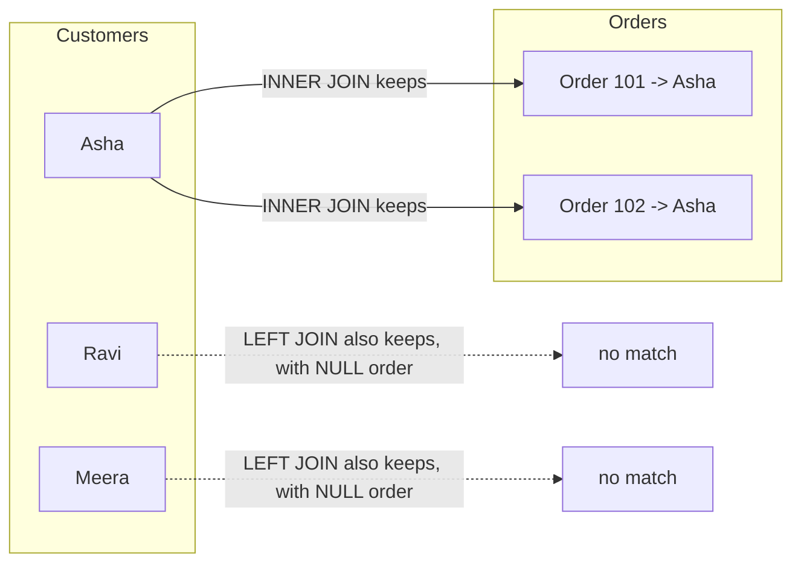

## Before you start

You should know `relational-vs-nosql` — joins are the mechanism relational databases give you for free, which is exactly what you'd otherwise have to reimplement by hand in a document database.

## In one sentence

**SQL** (Structured Query Language) is how you ask a relational database for exactly the data you want, and a **join** is how you combine rows from two or more tables based on a shared value between them.

## Why it matters

Real data almost never lives in one table — a store has separate tables for customers, orders, and products, and nearly every useful business question ("which customers bought this product last month?") requires combining them. Without joins, you'd have to fetch everything separately and stitch it together in application code, which is slower, harder to get right, and pushes work onto every single service that needs the data instead of solving it once, in the database.

## The intuition

Picture two spreadsheets: one lists customers with an ID, the other lists orders with a customer ID column pointing back to the first sheet. A **join** is the act of laying both sheets side by side and matching rows wherever those ID columns agree — like matching two guest lists by name to see who appears on both, who's only on one, or building a combined list either way.

## How it actually works



An `INNER JOIN` only follows the solid lines — Ravi and Meera vanish entirely because they have no matching order. A `LEFT JOIN` keeps every customer, filling in a `NULL` wherever there's no match on the right.

A basic query starts with `SELECT` (which columns you want), `FROM` (which table), and `WHERE` (which rows to keep). `GROUP BY` collapses many rows into summary rows — for example, counting orders per customer — almost always paired with an **aggregate function** like `COUNT`, `SUM`, or `AVG`, since the database needs to know how to combine the multiple underlying values into one.

A **join** connects two tables using a shared column, usually a **foreign key** — a column in one table that references the primary key of another. An `INNER JOIN` returns only rows that match in *both* tables; if a customer has placed no orders, that customer disappears from the result entirely. A `LEFT JOIN` returns every row from the left table regardless of a match, filling in `NULL` for any missing values from the right — so every customer shows up, even ones with zero orders. A `RIGHT JOIN` is the mirror image (every row from the right table, matched or not). A `FULL OUTER JOIN` keeps everything from both sides, matched wherever possible.

## Worked example

```sql
-- Every customer and their order count, including customers with zero orders
SELECT
  customers.name,
  COUNT(orders.id) AS order_count
FROM customers
LEFT JOIN orders
  ON orders.customer_id = customers.id   -- the shared key linking the two tables
GROUP BY customers.name
ORDER BY order_count DESC;
```

Sample output:

```
   name   | order_count
----------+-------------
 Asha     |           2
 Ravi     |           0
 Meera    |           0
```

The `LEFT JOIN` guarantees every customer appears even with no matching orders; if this query used `INNER JOIN` instead, Ravi and Meera would silently vanish from the results — no error, just a report that's quietly missing rows.

## A second example — when it gets harder

The naive understanding breaks down once you need to find customers with *no* orders at all — a common real request ("who have we not sold to?"). The instinct is often to write a `WHERE orders.id != NULL`, which silently returns nothing, because SQL's `NULL` doesn't compare equal to anything, not even itself — you must use `IS NULL` instead.

```sql
-- Customers who have never placed an order
SELECT customers.name
FROM customers
LEFT JOIN orders
  ON orders.customer_id = customers.id
WHERE orders.id IS NULL;   -- catches only the rows LEFT JOIN filled with NULL
```

This pattern — a `LEFT JOIN` followed by filtering for `IS NULL` on the right side's key — is one of the most common real interview and real-world SQL idioms, precisely because "find things with no match" comes up constantly and isn't obvious the first time you meet it.

## Quick reference

| Join type | Returns |
|---|---|
| INNER JOIN | Only rows matching in both tables |
| LEFT JOIN | All rows from the left table, matched rows from the right (or NULL) |
| RIGHT JOIN | All rows from the right table, matched rows from the left (or NULL) |
| FULL OUTER JOIN | All rows from both tables, matched where possible |
| CROSS JOIN | Every row from one table paired with every row from the other |

## Common mistakes

- Using an `INNER JOIN` when you actually need every row from one side — this silently drops data (like customers with zero orders) without any error, producing a report that looks correct but is quietly missing rows.
- Joining on the wrong column, like matching by name instead of ID — names can collide or differ in casing and spacing, while a foreign key ID is guaranteed unique and stable.
- Writing `WHERE column = NULL` instead of `WHERE column IS NULL` — SQL's three-valued logic means this comparison never matches, so the query silently returns the wrong thing.

## What interviewers ask

- **What's the difference between INNER JOIN and LEFT JOIN?** — INNER JOIN only keeps rows where both tables have a match, dropping unmatched rows entirely; LEFT JOIN keeps all rows from the left table regardless of a match, filling in NULLs where the right table has nothing.
- **What does GROUP BY do, and why does it need aggregate functions?** — It collapses multiple rows sharing a value into one summary row; any selected column that isn't part of the grouping must go through an aggregate function like COUNT or SUM, since the database needs a rule for combining the multiple underlying values into a single one.
- **How would you find customers with no orders using a join?** — Use a LEFT JOIN from customers to orders, then filter `WHERE orders.id IS NULL`, which isolates exactly the customers that had no matching row on the right.
- **Why doesn't `WHERE column != NULL` work as expected?** — NULL represents "unknown," and SQL's logic means no value — not even NULL itself — is considered equal or unequal to NULL; you must use `IS NULL` or `IS NOT NULL` instead of `=` or `!=`.

## Practice

1. Given `customers`, `orders`, and `products` tables, write a query that lists every product name alongside the total quantity ever ordered, including products that have never been ordered.
2. Explain, without running it, what a `CROSS JOIN` between a 5-row table and a 3-row table would produce, and why you'd rarely want this by accident.
3. Rewrite the "customers with no orders" query using a `NOT IN` subquery instead of a `LEFT JOIN` / `IS NULL`, then explain one scenario where the subquery version behaves unexpectedly if the subquery's column can contain NULL.

## Where to go next

Continue to `indexing-and-transactions` to see how a database makes these joins and filters fast at scale, and how it protects correctness when multiple queries run at the same time.
